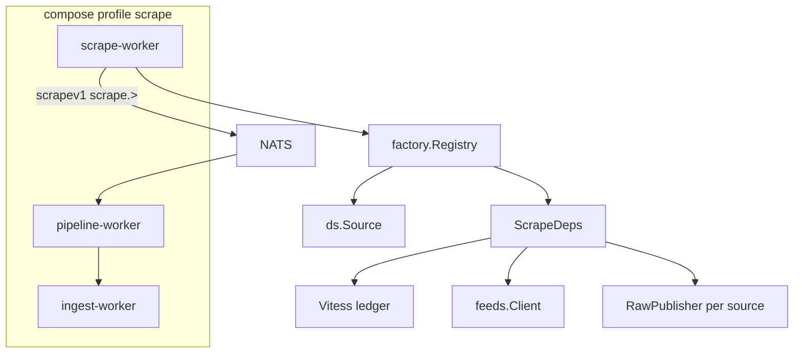

# Scrape factory + scrape-worker (пилот DS)

## Контекст

По [veil_3-context_refactor](.cursor/plans/veil_3-context_refactor_7f434363.plan.md) уже сделано (фаза A): `pkg/scrapev1`, [`scrapers/scrapepub`](scrapers/scrapepub/publish.go), [`ingest/pipeline-worker`](ingest/pipeline-worker/cmd/main.go), DS публикует только raw. **Не сделано:** todo `scraper-factory` — [`ingest/scrape/factory/source.go`](ingest/scrape/factory/source.go) есть, но **ни один scraper её не вызывает**; 7 compose-сервисов дублируют NATS/ledger/cache wiring.

Вы выбрали **один бинарь `scrape-worker`** с `SCRAPE_SOURCES` ([recovery plan Track 1](.cursor/plans/veil-recovery-plan_8b20589a.plan.md)).



**Вне scope этого PR:** Vitess для всех feeds, перенос normalize из TI, удаление `ingestv1` из scrape payloads, объединение `proxypool` ×4, полная миграция vuln/lola/ti/AppSec, релиз v0.3.1.

---

## Цель первого PR

1. **Фабрика создаёт и запускает источники** — не наоборот.
2. **Один `scrape-worker`** в compose вместо сервиса `ds` (пилот).
3. **DRY для publish** — убрать копипасту `publish(ctx, kind, contentKey, payload)` в 4× `internal/scrapepub`.
4. Сохранить совместимость: `pipeline-worker` и subjects **без изменений** (`scrape.ds.events` и т.д.).

---

## 1. Расширить контракт фабрики

Файл: [`ingest/scrape/factory/source.go`](ingest/scrape/factory/source.go)

Добавить:

```go
// RawPublisher — publish scrapev1 для одного Source + subject.
type RawPublisher interface {
    Publish(ctx context.Context, kind, contentKey string, payload any) error
}

type ScrapeDeps struct {
    Ledger    *ledger.Store
    Feeds     *feeds.Client
    Log       *slog.Logger
    Publishers map[string]RawPublisher // key = source name, e.g. "ds"
}
```

Новый файл `ingest/scrape/factory/runner.go`:

- `Run(ctx, opts RunOptions) error` — единая точка входа для `scrape-worker`
- `RunOptions`: `Sources []string` (из `SCRAPE_SOURCES`), `NATSURL`, registry `[]Source`
- Один раз: `scrapepub.ConnectJetStreamAndStream`, `feeds.OpenLedgerFromEnv`, `feeds.NewClient` (cache root из `SCRAPE_CACHE_DIR` или per-source env позже)
- Для каждого зарегистрированного `Source` — свой `RawPublisher` (subject из env, см. ниже)
- `Registry.RunAll(ctx, deps)` — как сейчас, но с реальными deps
- SIGINT/SIGTERM + `errgroup` ([docs/coding-style.md](docs/coding-style.md))

**Регистрация источников** — `factory.RegisterAll() []Source` или `factory.SourcesFor(names []string)`:

| Имя в `SCRAPE_SOURCES` | Реализация (этот PR) | Subject env |
|------------------------|----------------------|-------------|
| `ds` | **да** — новый adapter | `DS_SCRAPE_SUBJECT` |
| `vuln`, `lola`, `ti`, `sbom`, `coderules`, `nuclei` | **нет** — log warn + skip или fatal если явно запрошен без реализации |

Так можно поднять `scrape-worker` с `SCRAPE_SOURCES=ds`, а остальные сервисы в compose **временно оставить** до следующих срезов.

---

## 2. DRY: общий domain publisher

Файл: [`scrapers/scrapepub/domain.go`](scrapers/scrapepub/domain.go) (новый)

```go
type DomainPublisher struct {
    Source  scrapev1.Source
    Pub     *JetStreamPublisher
    Subject string
}
func (p *DomainPublisher) Publish(ctx, kind, contentKey string, payload any) error { ... }
```

Рефактор **только DS** в этом PR:

- [`scrapers/ds/internal/scrapepub/publisher.go`](scrapers/ds/internal/scrapepub/publisher.go) — тонкая обёртка над `DomainPublisher` + методы `UpsertSigmaRaw` и т.д. (без дублирования `NewEnvelope` + `PublishJSON`)
- `ds.Source` в factory получает `RawPublisher` = `DomainPublisher{SourceDS, ...}`

**Следующий срез (не этот PR):** перевести vuln/lola/ti на тот же helper.

---

## 3. DS как `factory.Source`

Новый пакет: `ingest/scrape/sources/ds` (отдельный модуль в `go.work`)

```go
type Source struct{}
func (s *Source) Name() string { return "ds" }
func (s *Source) Policy() factory.FetchPolicy { return factory.PolicyPeriodic }
func (s *Source) Run(ctx context.Context, deps *factory.ScrapeDeps) error {
    pub := deps.Publishers["ds"] // или helper deps.Publisher("ds")
    repo := dsscrapepub.NewFromRaw(pub) // адаптер graphStore → RawPublisher
    ing := usecase.NewIngestor(repo, deps.Log, cacheFromEnv())
    return ing.Run(ctx)
}
```

- Логику fetch **не переписывать** — переиспользовать [`scrapers/ds/internal/usecase/ingest.go`](scrapers/ds/internal/usecase/ingest.go)
- `dsscrapepub.NewFromRaw` реализует существующий `graphStore` поверх `RawPublisher` + domain methods

---

## 4. Бинарь `scrape-worker`

- `ingest/scrape/cmd/main.go` — парсит `SCRAPE_SOURCES` (default `ds` для локалки), вызывает `factory.Run`
- `ingest/scrape/cmd/go.mod` + запись в [`go.work`](go.work)
- [`docker/scrape-worker.Dockerfile`](docker/scrape-worker.Dockerfile) — multi-stage, как [`docker/ds.Dockerfile`](docker/ds.Dockerfile)

**Compose** ([`docker-compose.yml`](docker-compose.yml)):

- Добавить сервис `scrape-worker` (profile `scrape`): env `SCRAPE_SOURCES=ds`, перенести env/volumes с `ds`
- **Закомментировать или удалить** сервис `ds` (чтобы не было двойного scrape DS)
- `pipeline-worker.depends_on` — заменить `ds` на `scrape-worker` (если есть)
- Остальные: `vuln`, `ti`, `lola`, `sbom`, `coderules`, `nuclei` — **без изменений** до среза 2

---

## 5. Тесты и проверка

- Unit: `factory.Registry` — mock `Source`, проверка порядка и проброса ошибки
- Unit: `scrapepub.DomainPublisher` — `NewEnvelope` + subject
- `go test ./ingest/scrape/... ./scrapers/scrapepub/... ./scrapers/ds/...`
- Ручной smoke:

```bash
docker compose --profile scrape up -d scrape-worker pipeline-worker ingest-worker nats neo4j
# lag scrape.> → 0, ingest.> → 0; в Neo4j появились ds-узлы
```

---

## 6. Документация (минимум)

- [`ingest/discovery/README.md`](ingest/discovery/README.md) — `SCRAPE_SOURCES`, `scrape-worker`
- [`docs/threatintel-runtime.md`](docs/threatintel-runtime.md) — env `SCRAPE_SOURCES`, сервис `scrape-worker`
- [`scrapers/README.md`](scrapers/README.md) — пометка: DS через `scrape-worker`; legacy `ds` cmd оставить как thin wrapper **или** удалить после миграции (предпочтительно thin wrapper 5 строк → `factory.Run` для локальных `go run`)

---

## Порядок коммитов внутри ветки

1. `scrapepub.DomainPublisher` + рефактор `ds/internal/scrapepub`
2. `factory` — `RawPublisher`, `Runner`, тесты
3. `ingest/scrape/sources/ds` + `scrape-worker` cmd
4. Dockerfile + compose
5. Docs

---

## Срез 2 (следующий PR, кратко)

- Зарегистрировать `vuln`, `lola`, `ti`, AppSec в `factory.RegisterAll`
- Убрать из compose отдельные сервисы по мере регистрации; `SCRAPE_SOURCES=vuln,lola,ti,ds,sbom,coderules,nuclei`
- DRY: `components.InitComponents` → `factory.Run`; общий `proxypool` в `ingest/scrape/feeds`
- Убрать `ingestv1` из scrape payloads (vuln `MergeExploit`, lola STIX) — только в pipeline

---

## Критерии готовности этого PR

- [ ] `scrape-worker` — единственный producer для DS в compose profile `scrape`
- [ ] `factory.Run` вызывается из `cmd`; registry реально запускает `ds.Source`
- [ ] Нет дублирования `publish()` в ds scrapepub (используется `DomainPublisher`)
- [ ] `go test` зелёный для затронутых модулей
- [ ] E2E: DS данные проходят pipeline → ingest-worker → Neo4j
