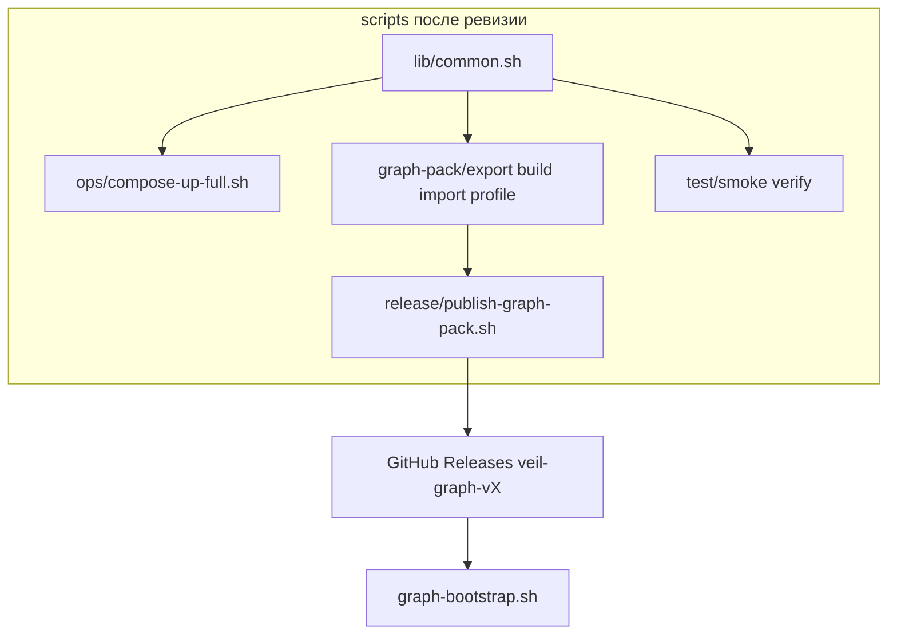

# Ревизия scripts, graph pack releases и deploy

## Текущее состояние

| Область | Проблема |
|---------|----------|
| [scripts/](scripts/) | 9 плоских скриптов; дубли `ROOT`, `COMPOSE_FILES`, `compose()`, `log` в каждом файле |
| Graph pack | ZIP `threat-intel-graph-${VERSION}.zip`, schema `threat-intelligence.graph-pack/1`, тег `v0.3.2-graph-pack` |
| Профиль fast-rich | Зашит в [scripts/graph-pack-run-v032.sh](scripts/graph-pack-run-v032.sh) (имя привязано к v0.3.2) |
| Тесты | Go `*_test.go` рядом с кодом (норма для Go); shell smoke/QA в `scripts/` вперемешку с ops |
| Deploy | Дубли: [deploy/README.md](deploy/README.md) + [docs/threatintel-runtime.md](docs/threatintel-runtime.md); [deploy/graph/compose.full.yml](deploy/graph/compose.full.yml) почти не используется |

Выбранная схема релизов: **ZIP `veil-graph-v0.4.0.zip`**, **GitHub tag `veil-graph-v0.4.0`**.



---

## Целевая структура `scripts/`

```
scripts/
  lib/common.sh              # COMPOSE_FILES, compose(), sha256_file, neo4j_cypher, log
  ops/compose-up-full.sh
  graph-pack/
    export-cypher.sh         # бывший export-graph-cypher.sh
    build.sh                 # бывший build-graph-pack.sh
    import.sh
    profile-fast-rich.sh     # бывший graph-pack-run-v032.sh (без v032 в имени)
  test/
    smoke-scrape-e2e.sh
    verify-nvd-enrichment.sh
  housekeeping/graph-dedup-cleanup.sh
  release/publish-graph-pack.sh   # build + gh release create + подсказка URL
  README.md
```

**Обратная совместимость (1 PR):** тонкие wrapper’ы в корне `scripts/*.sh` → `exec` новых путей (deprecation comment), удалить в последнем PR фазы scripts.

**Go unit-тесты** (`*_test.go`) **не переносим** — это ломает идиому Go и даёт огромный diff. «Отдельная категория» = только **shell integration / smoke / QA**.

---

## Фаза A — Конвенции veil-graph (малые PR)

### A1. Константы и schema

- [scripts/lib/common.sh](scripts/lib/common.sh) (новый): `PACK_BASENAME=veil-graph`, `pack_zip_name(version) → veil-graph-v${version}.zip`
- [docs/graph-pack-manifest.schema.json](docs/graph-pack-manifest.schema.json): `schema` const → `veil.graph-pack/1` (breaking; import поддерживает **оба** schema на 1 релиз — см. A3)
- [scripts/graph-pack/build.sh](scripts/build-graph-pack.sh): ZIP/manifest schema, notes

### A2. Bootstrap и testpack

- [deploy/graph/docker/graph-bootstrap.sh](deploy/graph/docker/graph-bootstrap.sh): `DEFAULT_PACK_URL` → `.../releases/download/veil-graph-v0.4.0/veil-graph-v0.4.0.zip` (после первого релиза) или env-only до релиза
- [docker-compose.testpack.yml](docker-compose.testpack.yml): mount `veil-graph-v0.4.0.zip`

### A3. Import backward-compat

- [scripts/graph-pack/import.sh](scripts/import-graph-pack.sh): принимать ZIP с `veil-graph-v*.zip` и legacy `threat-intel-graph-*.zip`; manifest schema `veil.graph-pack/1` | `threat-intelligence.graph-pack/1`

### A4. Документация (только ссылки/имена)

- [README.md](README.md), [deploy/README.md](deploy/README.md), [docs/threatintel-runtime.md](docs/threatintel-runtime.md) — veil-graph-v*, тег `veil-graph-v0.4.0`

---

## Фаза B — scripts/lib + дедупликация (PR за PR)

### B1. `scripts/lib/common.sh`

Вынести из [compose-up-full.sh](scripts/compose-up-full.sh), [smoke_scrape_e2e.sh](scripts/smoke_scrape_e2e.sh), [build-graph-pack.sh](scripts/build-graph-pack.sh), [import-graph-pack.sh](scripts/import-graph-pack.sh):

```bash
# COMPOSE_FILES, compose(), log(), sha256_file(), pack paths
source "$(dirname "$0")/../lib/common.sh"
```

### B2. Перенос без смены имён (wrappers)

По одному скрипту на PR:

1. `graph-pack/export-cypher.sh` + wrapper `export-graph-cypher.sh`
2. `graph-pack/build.sh` + wrapper
3. `graph-pack/import.sh` + wrapper
4. `ops/compose-up-full.sh` + wrapper
5. `graph-pack/profile-fast-rich.sh` + wrapper `graph-pack-run-v032.sh`
6. `housekeeping/graph-dedup-cleanup.sh` + wrapper
7. `test/smoke-scrape-e2e.sh` + wrapper `smoke_scrape_e2e.sh`
8. `test/verify-nvd-enrichment.sh` + wrapper

### B3. Удалить wrappers + обновить README

- [scripts/README.md](scripts/README.md) — таблица по категориям; один блок «Graph pack workflow»
- Grep `scripts/` по репо → новые пути

---

## Фаза C — Release automation

### C1. `scripts/release/publish-graph-pack.sh`

```bash
# GRAPH_PACK_VERSION=v0.4.0 ./scripts/release/publish-graph-pack.sh [--draft]
# 1. EXPORT_FIRST=1 graph-pack/build.sh
# 2. gh release create veil-graph-v0.4.0 --title "..." assets/veil-graph-v0.4.0.zip
# 3. echo GRAPH_PACK_DEFAULT_URL=...
```

### C2. Makefile targets

```makefile
graph-pack-export:
graph-pack-build:
graph-pack-publish:  # optional, needs gh
test-smoke:
```

### C3. Первый релиз veil-graph-v0.4.0

- Прогон `profile-fast-rich` → export → build → publish (ручной gate: Neo4j counts + `verify-nvd-enrichment`)
- Обновить `DEFAULT_PACK_URL` на опубликованный asset

---

## Фаза D — Deploy revision (отдельные малые PR)

### D1. Единый compose entrypoint

- Зафиксировать в `lib/common.sh`: `VEIL_COMPOSE_FILES` (3 файла layer)
- [deploy/graph/compose.full.yml](deploy/graph/compose.full.yml): либо удалить, либо документировать как альтернативу `include` (сейчас дублирует `compose-up-full`)

### D2. Профили env вместо hardcode

- Новый [deploy/profiles/fast-rich.env](deploy/profiles/) — env из `profile-fast-rich.sh`
- [deploy/profiles/smoke-minimal.env](deploy/profiles/) — env из smoke `--up`
- Скрипты: `set -a; source deploy/profiles/fast-rich.env; set +a`

### D3. Scaling — один источник правды

- Вся логика scale/partition только в [deploy/README.md](deploy/README.md#worker-scaling-parallel-nats-consumers)
- [docs/threatintel-runtime.md](docs/threatintel-runtime.md): ссылка на deploy/README, убрать дублирующие bash-блоки (оставить env-таблицы сервисов)
- Проверить [deploy/compose.scale.yml](deploy/compose.scale.yml): `depends_on` + health для `scrape_worker_*`

### D4. Docker / bootstrap

- Сверить Dockerfiles с путями `harvest/`, `ned/`, `ingest/` (уже после refactor)
- [graph-bootstrap.sh](deploy/graph/docker/graph-bootstrap.sh): читать версию pack из `GRAPH_PACK_VERSION` default

---

## Фаза E — Документация (после scripts)

- [docs/coding-style.md](docs/coding-style.md): граница scripts vs pipeline NED (уже есть — дополнить структурой каталогов)
- Новый короткий [docs/graph-pack.md](docs/graph-pack.md) — workflow export → build → release → import (вынести из threatintel-runtime)
- [docs/threatintel-runtime.md](docs/threatintel-runtime.md) — только runtime compose/ports/env

---

## Порядок и размер diff

| PR | Содержание | ~файлов |
|----|------------|---------|
| 1 | lib/common.sh + pack naming constants | 2–3 |
| 2 | build.sh veil-graph + schema | 3–4 |
| 3 | import backward-compat + bootstrap URL placeholder | 3 |
| 4 | docs URLs veil-graph | 5 |
| 5–12 | по одному переносу script + wrapper | 2 each |
| 13 | remove wrappers, scripts/README | 10 |
| 14 | release/publish-graph-pack.sh + Makefile | 3 |
| 15 | deploy profiles fast-rich + smoke | 4 |
| 16 | deploy docs dedup | 3 |
| 17 | docs/graph-pack.md extract | 2 |
| 18 | gh release v0.4.0 (опционально отдельно) | assets |

**Не в scope:** перенос Go `*_test.go`; CI GitHub Actions (если нет — отдельная задача); переименование старых GitHub releases v0.3.2 (редирект URL сохранится).

---

## Критерии готовности

- `grep -r threat-intel-graph` в scripts/deploy/docs → 0 (кроме legacy import compat и archive plans)
- `make test-scrape test-pipeline test-graph` зелёные после каждой фазы B
- `./scripts/test/smoke-scrape-e2e.sh --up` проходит
- `./scripts/graph-pack/build.sh v0.4.0` → `data/.../veil-graph-v0.4.0.zip` с schema `veil.graph-pack/1`
- `publish-graph-pack.sh` создаёт release `veil-graph-v0.4.0`
