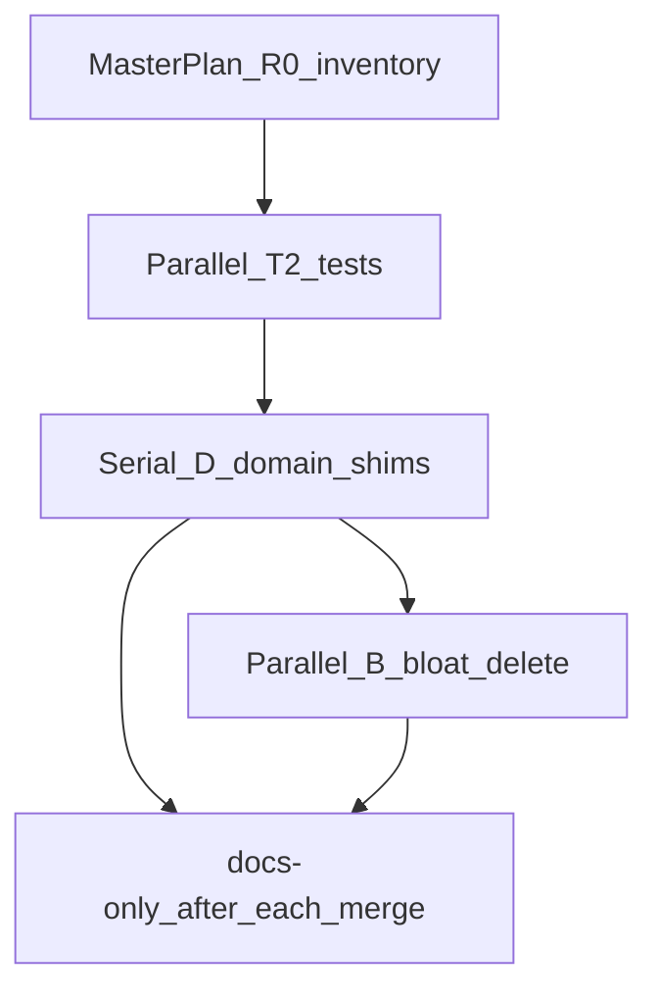

# Veil cleanup: domain в pkg, тесты, legacy и bloat

## Контекст и ограничения

| Правило | Как соблюдаем |
|---------|----------------|
| [AGENTS.md](AGENTS.md) + [veil-agent-parallel-branches.mdc](.cursor/rules/veil-agent-parallel-branches.mdc) | Master plan в `.cursor/plans/`, ветка `feat/cleanup-phase-NN-slug` / `docs/cleanup-…`, **один коммит на срез**, merge в `main` после critic APPROVE |
| [veil-agent-critic.mdc](.cursor/rules/veil-agent-critic.mdc) | Orchestrator = critic; implementer не мержит |
| [docs/coding-style.md](docs/coding-style.md) + [domain-contour.md](docs/domain-contour.md) | Domain SOT уже в `pkg/*/domain`; слои — только adapters |
| `.external/` | **Не трогать** |
| Deprecated MCP tools (`ti_list_kinds`, …) | **Оставить** (ваш выбор); только warn в логах |
| Активные Engage-треки | [engage_mcp_client_native_execution_master.plan.md](.cursor/plans/engage_mcp_client_native_execution_master.plan.md), [engage_tools_full_coverage.plan.md](.cursor/plans/engage_tools_full_coverage.plan.md) — cleanup-ветки **не меняют** catalog/router/`tools.yaml` без отдельного согласования |

**Уже сделано ранее:** P6/P7 domain в `pkg`, rename `harvest`/`commit` ([archive/pkg_rename_and_audit](.cursor/plans/archive/pkg_rename_and_audit_f5fedb76.plan.md)), doc hub [engage-lab-pentest.md](docs/engage-lab-pentest.md). **Не повторять** полный `pkg_dry_refactor` (scrapev1/ingestv1) — он устарел; актуальные имена `pkg/harvest`, `pkg/commit`.



---

## Артефакты оркестратора (фаза 0, `main` или `docs/`)

1. Создать **[`.cursor/plans/veil_cleanup_domain_pkg_master.plan.md`](.cursor/plans/veil_cleanup_domain_pkg_master.plan.md)** — таблица фаз (id, branch, owner, status, deps, DoD commands).
2. Добавить в [`.cursor/agents/manifest.yaml`](.cursor/agents/manifest.yaml) агента **`cleanup-implementer`** (`branch_prefix: feat/cleanup-`) по образцу `scrape-pipeline-implementer`.
3. Зафиксировать **baseline** на `main`: `make test-platform-p7`, `make test-discovery`, `make test-pipeline`, `make test-knowledge`, `make test-engage`.

---

## Фаза R0 — Inventory (read-only + отчёт, без удалений)

**Ветка:** `feat/cleanup-r0-inventory`  
**Subagent:** `cleanup-implementer` или `generalPurpose`  
**Diff:** только markdown/скрипт-аудит (опционально `scripts/housekeeping/audit-repo-refs.sh`).

| Категория | Метод | Выход |
|-----------|--------|-------|
| Go dead code | `go test` + `staticcheck`/`unused` по слоям; `rg` на `deprecated`, `moved to`, пустые `main` | Список файлов-кандидатов |
| Scripts | `rg scripts/` из `Makefile`, [`.github/workflows/`](.github/workflows/), [scripts/README.md](scripts/README.md) | **KEEP** / **CI** / **MAKE** / **ORPHAN** |
| Docs | `lint-markdown-dir-links.sh` + `rg` битых путей; дубли с [archive/commit_and_docs_cleanup](.cursor/plans/archive/commit_and_docs_cleanup_fd2c052d.plan.md) | Таблица merge/delete |
| Bloat | `eval/results/` (часть в git: `veil-pentest*`), `scripts/benchmark/results/` | Политика хранения |

**Известные кандидаты (подтвердить в R0):**

- [`engage/serve/cmd/browser-agent/main.go`](engage/serve/cmd/browser-agent/main.go) — stub exit 1, browser в `discovery/cmd/browser-agent`
- [`pipeline/pkg/ti/normalize/`](pipeline/pkg/ti/normalize/) — thin forwarder → [`pkg/ti/normalize`](pkg/ti/normalize/) ([domain-contour.md](docs/domain-contour.md#deprecations))
- [`pkg/exec/sandbox.go`](pkg/exec/sandbox.go) — deprecated, не в дефолтном профиле ([engage_mcp master](.cursor/plans/engage_mcp_client_native_execution_master.plan.md))
- Makefile aliases: `test-scrape` → `test-discovery`, [`scripts/test/smoke-scrape-e2e.sh`](scripts/test/smoke-scrape-e2e.sh) → `smoke-discovery-e2e.sh`

**DoD:** отчёт в master plan; **0** удалений кода; critic APPROVE → merge.

---

## Фаза T2 — Тесты перед удалением (параллельные ветки)

Принцип: **сначала зелёные тесты на поведение, потом delete** в фазах B/D.

| Phase | Branch | Scope | Команды DoD |
|-------|--------|-------|-------------|
| **T2a** | `feat/cleanup-t2a-discovery` | Пробелы в `discovery/harvest/internal/sources/*` (сравнить с уже покрытыми ti/lola/ds) | `make test-discovery`, `make test-discovery-p7c` |
| **T2b** | `feat/cleanup-t2b-pipeline` | `pipeline/ned/internal/sources/*` — transform/envelope для appsec aggregate; убрать зависимость тестов только от forwarder | `make test-pipeline`, `make test-pipeline-p7d` |
| **T2c** | `feat/cleanup-t2c-knowledge` | [`knowledge/ingest/internal/appsec/`](knowledge/ingest/internal/appsec/) (`sbom`, `nuclei`, `coderules` stores), `sources/ds|lola` envelope `apply_test.go` по образцу vuln/ti | `make test-knowledge`, `make test-graph-ingest-p7e` |
| **T2d** | `feat/cleanup-t2d-pkg` | Доменные пакеты без `_test.go` или слабое покрытие в `pkg/` (если R0 найдёт) | `make test-pkg-domain`, `make test-platform-p7` |

**Параллельность:** T2a/T2b/T2c независимы → **3 subagent’а одновременно**; T2d после merge T2a–c или параллельно если только `pkg/`.

**Engage:** не расширять (уже ~64 `*_test.go` в `engage/serve`); не трогать executable matrix.

---

## Фаза D — Domain / pkg и шины (серийные merge, малый diff)

| Phase | Branch | Изменения | DoD |
|-------|--------|-----------|-----|
| **D1** | `feat/cleanup-d1-normalize-shim` | Удалить `pipeline/pkg/ti/normalize`; импорты → `pkg/ti/normalize`; обновить `pipeline/ned/README.md` | `make test-pipeline` |
| **D2** | `feat/cleanup-d2-domain-audit` | Пройти transform/ingest adapters: убедиться, что entity types только из `pkg/*/domain` (не дублировать structs); зафиксировать в [domain-contour.md](docs/domain-contour.md) если найдены исключения | `make test-platform-p7` |
| **D3** | `feat/cleanup-d3-engage-stubs` | Удалить `engage/serve/cmd/browser-agent`; `rg` ссылок; **не** трогать catalog | `make test-engage` |
| **D4** | `feat/cleanup-d4-exec-sandbox` | Удалить или вынести в `pkg/exec/legacy/` неиспользуемый sandbox (только если R0 + `rg` = 0 prod imports); согласовать с engage client-native master | `make test-pkg-shared`, `make test-engage` |

**D1–D2** можно отдать **`scrape-pipeline-implementer`**; **D3–D4** — только когда нет конфликтующего engage PR.

---

## Фаза B — Bloat и legacy delete (после T2 + D)

| Phase | Branch | Действия |
|-------|--------|----------|
| **B1** | `feat/cleanup-b1-eval-results` | Сузить tracked артефакты в [`eval/results/`](eval/results/): оставить `*-latest.md` / stamp; убрать старые `.json` из git; уточнить [`.gitignore`](eval/results/.gitignore) |
| **B2** | `feat/cleanup-b2-makefile-aliases` | Удалить deprecated Makefile targets (`test-scrape`, `test-scrape-p7c`) и wrapper `smoke-scrape-e2e.sh` после обновления docs/CI ссылок |
| **B3** | `feat/cleanup-b3-scripts-orphan` | Удалить только **ORPHAN** из R0 (по одной категории за PR: e.g. неиспользуемые crawl/benchmark, если не в Makefile/CI) |
| **B4** | `feat/cleanup-b4-docs-slim` | Второй проход docs: слить остатки `engage-client-*` (5–10 строк + ссылка), убрать устаревшие ссылки на `scrapev1`/`ingestv1` в archive-only prose; **не** удалять canonical: runtime, ingest-contract, engage-tools, platform-unified-access |
| **B5** | `feat/cleanup-b5-plans-root` | Перенести завершённые одноразовые планы из корня `.cursor/plans/` в `archive/` (кроме 2 active + новый master) |

**Scripts — явно KEEP (не удалять без замены):** `graph-pack/*`, `release/*`, `ops/compose-*`, `engage/preflight*`, `engage/extract-legacy-catalog.py`, `engage/check-*`, `test/smoke-*` из workflows, `mcp/run-veil-*`, `housekeeping/*`, `agents/*`, `eval/gaia/*`, `terraform-veil-stack.sh`.

---

## Фаза DOC — после каждого merge (subagent `docs-only`)

По [veil-agent-documentation.mdc](.cursor/rules/veil-agent-documentation.mdc):

- Обновить master plan (status `done`, merge SHA)
- [README.md](README.md) / [CONTRIBUTING.md](CONTRIBUTING.md) — test matrix, удалённые `make` targets
- [scripts/README.md](scripts/README.md) — таблица layout
- [domain-contour.md](docs/domain-contour.md) — убрать deprecation `pipeline/pkg/ti/normalize` после D1
- `make sync-github-metadata` если меняется [.github/repo-description.txt](.github/repo-description.txt)

---

## Critic gate (каждая фаза)

```markdown
## Critic — cleanup Phase NN

Verdict: APPROVE | REQUEST_CHANGES

- [ ] Scope = phase plan only; .external/ untouched
- [ ] No cross-layer Go imports broken
- [ ] Tests: (listed in phase)
- [ ] No catalog/tools.yaml change (unless engage phase)
- [ ] graph version: N/A or bump if ingest paths touched
```

**Merge discipline:** не более **2** unmerged cleanup-веток; после merge — `git pull origin main` перед следующей фазой ([veil-agent-parallel-branches.mdc](.cursor/rules/veil-agent-parallel-branches.mdc) § Merge discipline).

---

## Рекомендуемый порядок волн (минимальный drift)

| Wave | Phases | Параллель subagents |
|------|--------|---------------------|
| 0 | R0 | 1 |
| 1 | T2a, T2b, T2c | до 3 |
| 2 | T2d (если нужен) | 1 |
| 3 | D1 → D2 | 1 (serial) |
| 4 | D3, D4 | 1–2 (serial если engage busy) |
| 5 | B1 → B2 → B3 → B4 → B5 | B1+B4 docs параллельно осторожно |
| each | DOC | `docs-only` |

**Оценка:** ~12–15 PR; каждый diff целевой (<500 LOC удаления где возможно).

---

## Вне scope (явно)

- `.external/**`
- Удаление deprecated MCP tools в knowledge/serve
- Изменение Engage 158/158 / `tools.live.yaml` / P9f matrix
- Переименование `discovery`→`Discovery` в путях (отдельный P8 track в [platform-architecture.md](docs/platform-architecture.md))
- Root `go.work`

---

## Definition of done (программа)

- Master plan: все фазы `done` с merge SHA
- `make test-platform-p7` + layer tests green на `main`
- `rg` не находит удалённые shim-пути (`pipeline/pkg/ti/normalize`, `engage/serve/cmd/browser-agent`)
- `scripts/README.md` и docs без битых ссылок (`lint-markdown-dir-links.sh`)
- В корне `.cursor/plans/` только активные engage-планы + `veil_cleanup_domain_pkg_master.plan.md` + `archive/`
