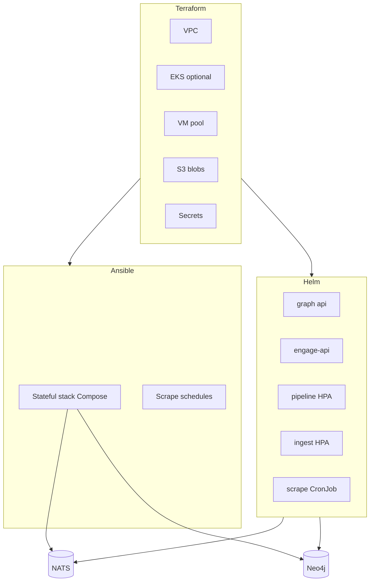

# Veil Platform P5 — Hybrid deploy (Terraform + Ansible + Helm)

## Prerequisite gate (completed)

| Check | Result |
|-------|--------|
| Engage phases 24–30 | **done** on `main` ([engage_master_post-audit_ec180f8b.plan.md](engage_master_post-audit_ec180f8b.plan.md)) |
| Route parity | **0 unexplained missing** (`make test-engage-route-parity`) |
| Catalog parity | **150 tools** (`make test-engage-parity`) |
| Domain refactor P29 | Router split `router_*.go`; usecase bounded contexts; `pkg/engage` contracts only |
| Phase 30 sign-off | [engage-audit-report.md](../../docs/engage/engage-audit-report.md) R148–R150 |
| Unit tests | `engage/serve` **PASS** (2026-05-16 verification) |

**Not blocking P5:** line-by-line Python port; README 24× KPI; optional `.external/` for extract-only.

## Design principles

1. **Single source of app config:** `deploy/profiles/<name>.env` + `versions.env` — consumed by Compose, Ansible templates, Helm values generator.
2. **One tool per layer:** TF provisions; Ansible configures hosts; Helm runs K8s workloads; Compose remains dev/CI truth.
3. **Workload placement by shape:**

| Workload | Runtime | Why |
|----------|---------|-----|
| `api`, `engage-api`, nginx (secure) | **Helm** Deployment | HTTP scale, rolling updates, ingress |
| `pipeline_worker`, `ingest_worker` | **Helm** Deployment + HPA | JetStream competing consumers |
| `scrape_worker` | **Helm CronJob** or **Ansible** scheduled compose | Batch exit 0, not Deployment |
| `neo4j`, `nats`, `crawl-db` | **Ansible+Compose** or managed cloud | Stateful, disks, ops familiarity |
| `engage-runner` | **Isolated** VM/Ansible or dedicated K8s node pool | Toolbox / privileged boundary |

## Phases

| Phase | Branch | Deliverable | DoD |
|-------|--------|-------------|-----|
| P5b | `platform/p5b-tf-foundation` | `modules/foundation`, `environments/stage|prod` | `terraform validate`; no compose on apply in CI |
| P5c | `platform/p5c-ansible-dataplane` | `deploy/ansible/roles/*`, `playbooks/site.yml` | idempotent deploy on stage VM; `make test-scrape-e2e` against stage |
| P5d | `platform/p5d-helm-controlplane` | `deploy/helm/veil/` | `helm template` CI; dev cluster install smoke |
| P5e | `platform/p5e-observability` | `deploy/observability/`, runbooks | alerts documented |
| P5f | `platform/p5f-deploy-ci` | `.github/workflows/deploy.yml` | PR plan-only; tag → stage |

## Environment matrix

| Env | TF | Ansible | Helm | Profile |
|-----|----|---------|------|---------|
| local | `environments/local` | optional | optional (kind) | `smoke-minimal` |
| stage | `environments/stage` | required | partial (api+engage) | `fast-rich` or custom |
| prod | `environments/prod` | required | full control plane | `secure-graph` + engage secure |

## Agent chain

Implement via [manifest.yaml](../agents/manifest.yaml) `platform-implementer`; critic gate per [veil-agent-critic.mdc](../rules/veil-agent-critic.mdc). Document in [deploy-platform-hybrid.md](../../docs/deploy/deploy-platform-hybrid.md).

## Dependencies

- Platform v4 P4b merged (`1d865ee`) — Terraform compose wrapper exists
- Engage master v2 complete — no HexStrike runtime dependency
