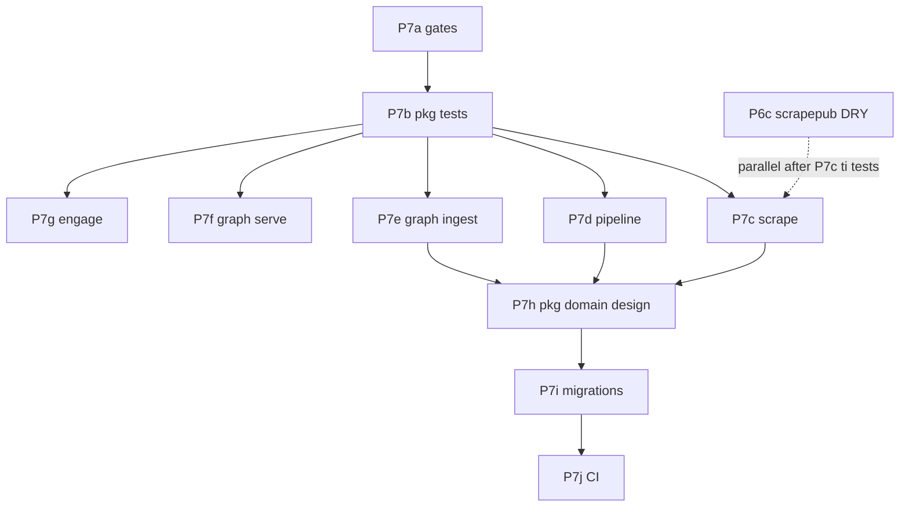

# Veil Platform P7 — modular tests, then `pkg/domain` contour

## Цель

1. **Фаза A (тесты):** каждый пакет контура Veil покрыт **модульными** тестами (без обязательного Docker), с чёткими границами mock/port.
2. **Фаза B (domain):** общие сущности и правила валидации — **единый SOT** в `pkg/`, слои держат только source-specific расширения и адаптеры I/O.

**Контур Veil** = всё, что пересекает слои или является публичным контрактом:

| Зона | Сейчас | Целевой SOT |
|------|--------|-------------|
| Scrape → Pipeline wire | `pkg/harvest` | без изменений + тесты round-trip |
| Pipeline → Graph wire | `pkg/commit` | без изменений + engage envelope tests |
| TI сущности (IOC, Actor, …) | `pkg/ti/domain` + дубли в `*/domain/` | **`pkg/ti/domain`** (+ `pkg/ti/ids` при необходимости) |
| Engage API DTO | `pkg/engage/contract` | **`pkg/engage/contract`** + validation tests |
| Engage events | `pkg/engage/events` | без изменений |
| Auth / NATS | `pkg/auth`, `pkg/natsjet` | тесты на пробелы (httpmiddleware, streams) |
| Platform IDs / host norm | `pkg/engage/toolid`, `hostnorm` | остаются в `pkg/engage/*` |

**Не в pkg/domain (остаётся в слое):** HTTP fetch, Vitess ledger, Neo4j MERGE, runner/sandbox, MCP transport, catalog YAML.

## Жёсткие ограничения (не менять)

- Нет cross-import `scrape` / `pipeline` / `graph` / `engage`.
- Интеграция слоёв: NATS + JSON schemas; engage → graph только HTTP.
- `cmd/` — только wiring.
- Domain-пакеты **без I/O** (нет Neo4j, NATS, `http.Client`).

## Текущее состояние (baseline)

| Область | ~файлов с тестами | Главные дыры |
|---------|-------------------|--------------|
| `pkg/*` | частично | `ti/domain`, `engage/contract`, `auth/httpmiddleware` |
| scrape | ~15% | `ti/feeds/runner.go`, `feeds/github.go`, lola/ds usecase |
| pipeline | ~23% | `ds/transform`, `ti/normalize`, `nvd/map` |
| knowledge/ingest | ~7% | Neo4j stores, appsec stores |
| knowledge/serve+connector | ~23% | `connector/query/service.go` (430 LOC) |
| engage | ~33% | `intelligence/*`, audit stores, components |

Завершённые программы для few-shot: **v3 P0–P3** (`make test-platform-p0`), **P6a–b** (`pkg/engage/events`, `pkg/auth/httpmiddleware`).

---

## Фаза A — модульные тесты

### P7a — Test gates & harness

**Ветка:** `platform/p7a-test-gates`

**Сделать:**

- `make test-platform-p7` = `test-pkg-shared` + `test-pkg-domain` + layer unit targets (без full-loop Docker).
- `scripts/test/lib/unit.sh` — общие хелперы: `assertJSON`, `readFixture`, `skipNoGo`.
- Baseline JSON в `eval/fixtures/` или `*/testdata/` для envelope round-trip (не дублировать GAIA).
- В `CONTRIBUTING.md` / `docs/agents/coding-style.md` — правило: новый `pkg/*` или `domain/*` → `*_test.go` в том же PR.

**DoD:**

```bash
make test-platform-p7   # green на main до начала миграций
```

---

### P7b — `pkg/*` contract tests (высокий ROI)

**Ветка:** `platform/p7b-pkg-contracts`

| Пакет | Тесты |
|-------|--------|
| `pkg/ti/domain` | `NodeID()`, validation IOC type/value, JSON round-trip, zero-value guards |
| `pkg/ti/domain/id.go` | table-driven ID stability (как в graph ingest) |
| `pkg/harvest` | расширить `envelope_test` — все `source` enum из ingest-contract |
| `pkg/commit` | расширить `envelope_test` — engage + ti_node edge cases |
| `pkg/engage/contract` | decode ToolRun*, Analyze*; required fields |
| `pkg/engage/toolid` | category mapping table |
| `pkg/auth/httpmiddleware` | Enabled/disabled, strict health bypass, 401/403 |
| `pkg/natsjet` | `streams.go` subject names; mock JS publish |

**DoD:** `make test-pkg-shared && make test-pkg-domain` (новый phony).

---

### P7c — Scrape

**Ветка:** `platform/p7c-scrape-tests`

**Порядок по источникам** (шаблон v3 — table tests + fixtures):

1. `internal/sources/ti/internal/domain` — align assertions с будущим `pkg/ti/domain`.
2. `ti/internal/feeds/runner.go` — extract pure functions → test без сети; HTTP через `httptest.Server`.
3. `internal/feeds/github.go` — rate-limit / etag logic отдельно от HTTP.
4. `vuln`, `ds`, `lola`, `sbom`, `nuclei`, `coderules` — domain + usecase/scrape по одному коммиту на source.
5. `discovery/pkg/proxypool`, `githubraw` — unit tests.

**Паттерн:** `domain` + `usecase` тестируются без NATS; connector — отдельный тонкий test с `nats.Server` (как P0).

**DoD:** `make test-scrape`; coverage файлов domain/usecase ≥ 70% (line, необязательно CI gate сразу).

---

### P7d — Pipeline (NED)

**Ветка:** `platform/p7d-pipeline-tests`

| Пакет | Фокус |
|-------|--------|
| `internal/sources/ti/transform` | уже есть — расширить edge cases |
| `internal/sources/vuln/transform` + `domain` | CVE id, dedup keys via `pkg/commit` |
| `internal/sources/ds/transform` | 209 LOC — table tests |
| `internal/sources/lola/transform` | STIX snippets fixtures |
| `pipeline/pkg/ti/normalize` | **новые** tests — SOT перед выносом в pkg |
| `pipeline/pkg/nvd/map` | map → commit nodes |
| `internal/consumer` | уже есть — добавить ds/lola subjects |
| `pipeline/engage-events` | FindingEvent → ingest subject |

**DoD:** `make test-pipeline`; `make test-platform-p0` still green.

---

### P7e — Graph ingest

**Ветка:** `platform/p7e-graph-ingest-tests`

**Стратегия storage без тяжёлого Neo4j в unit:**

- Интерфейсы `repository` / `storage` уже есть — **fake in-memory** implementations в `*_test.go`.
- Cypher strings — golden-file или substring asserts (не live Bolt в unit).
- `internal/ingest/consumer` — расширить P0 tests (все `source` + malformed).
- Per-source: `ti/usecase`, `vuln/envelope`, `lola/domain`, `appsec/sbom/store` logic extracted to pure functions.

**DoD:** `make test-graph`; ingest `domain/` + `usecase/` ≥ 60% line.

---

### P7f — Graph serve + connector

**Ветка:** `platform/p7f-graph-serve-tests`

| Компонент | Тесты |
|-----------|--------|
| `knowledge/connector/query/service.go` | разбить на pure query builders + test; HTTP через mock Neo4j driver interface |
| `internal/usecase/read.go` | TargetGraphState, categories, auth context |
| `internal/transport/httpserver` | route table parity (есть частично) |
| MCP read tools | mock usecase |

**DoD:** `make test-graph-serve`; `make test-graph-read-smoke` optional nightly.

---

### P7g — Engage gaps

**Ветка:** `platform/p7g-engage-tests`

| Компонент | Тесты |
|-----------|--------|
| `usecase/tools/run.go` | target guard **before** catalog (регрессия P7 pentest) |
| `security/target_guard.go` | уже есть — связать с run tests |
| `usecase/intelligence/*` | разрезать `parameter.go` на pure helpers + table tests |
| `runner/executor.go` | allowlist / sandbox env — table only |
| `audit/store` | interface + fake |
| `components/api.go` | InitAPI validation matrix (AUTH+RBAC) |

Параллельно (не блокирует P7h): **engage Phase 29** R145–R147 (`IntelProvider`, catalog gate).

**DoD:** `make test-engage`; `make test-engage-hardening`.

---

## Фаза B — `pkg/domain` contour

> **Старт только после P7b + хотя бы один полный source-path (ti) зелёный в P7c–P7e.**

### P7h — Design SOT packages

**Ветка:** `platform/p7h-pkg-domain-sot`

**Целевая структура:**

```
pkg/
  ti/
    domain/          # IOC, Actor, Campaign, Cluster, Report (exists)
    validate/        # NEW: pure validation, NormalizeIOC, etc.
    ids/             # NEW or merge id.go — stable node IDs for graph
  engage/
    contract/        # wire DTO (exists)
    domain/          # NEW: JobState, FindingSeverity, TargetRef — не HTTP JSON
    toolid/          # exists
    hostnorm/        # exists
  platform/
    envelope/        # OPTIONAL: thin aliases документирующие harvest+commit
```

**Правила выноса:**

| Критерий | В `pkg/` | Остаётся в слое |
|----------|----------|-----------------|
| Используется ≥2 слоями | ✓ | |
| Сериализуется в NATS/API | ✓ (wire в harvest/commit/contract) | |
| Зависит от Neo4j label/props | | adapter в `storage/` |
| Зависит от конкретного feed URL | | scrape `feeds/` |
| Orchestration / side effects | | `usecase/` |

**Шаги:**

1. Добавить `pkg/ti/validate` — перенести дублирующие проверки из scrape/graph domain.
2. Документировать mapping: `docs/architecture/domain-contour.md` (таблица type → layer adapter).
3. **Не** переносить NVD parse (`pipeline/pkg/nvd` остаётся pipeline-only).

**DoD:** `make test-pkg-domain`; zero cross-layer imports; schemas/docs ссылка на pkg SOT.

---

### P7i — Layer migration (по одному source)

**Ветка:** `platform/p7i-ti-migration` → `platform/p7i-vuln-migration` → …

**Порядок миграции (низкий риск → высокий):**

1. **ti** — scrape domain → type aliases / embed `pkg/ti/domain`; pipeline normalize imports pkg; graph ingest domain thin wrappers.
2. **vuln** — CVE entity в `pkg/ti/domain` или `pkg/vuln/domain` (решение в P7h design review).
3. **lola** — MITRE IDs в pkg ids.
4. **engage** — `internal/domain/tool` остаётся; общие enums → `pkg/engage/domain`.
5. **ds, sbom, nuclei, coderules** — только если есть cross-layer типы.

**На каждый source:**

- [ ] Тесты green до переноса.
- [ ] Replace local `entity.go` with import + adapter funcs `ToHarvest()`, `ToCommitNode()`.
- [ ] `make test-scrape test-pipeline test-graph` + `check-graph-version` если ingest paths touched.
- [ ] Один commit: `refactor(ti): use pkg/ti/domain SOT`.

**DoD:** нет дублирующих `Actor`/`IOC` struct в трёх слоях; grep `type IOC struct` только в `pkg/ti/domain`.

---

### P7j — CI & documentation

**Ветка:** `platform/p7j-ci-enforce`

- GitHub Actions: `test-platform-p7` на PR touching `pkg/`, `*/domain/`, `*/usecase/`.
- Optional: `-coverprofile` upload; fail if `pkg/*` coverage < 80%.
- Обновить `AGENTS.md`, `docs/agents/coding-style.md` § Domain package paths → pkg SOT.
- Master plan P6 (c–g) **после** P7i-ti или параллельно только non-domain batches.

**DoD:** PR checklist item «domain change → pkg test»; critic rule in `veil-agent-critic.mdc`.

---

## Зависимости и параллелизм



| Можно параллельно | Нельзя до |
|-------------------|-----------|
| P7c / P7d / P7e / P7f / P7g после P7b | P7h до P7b + ti path tests |
| P6c scrapepub после P7c ti | P7i до P7h |
| engage Phase 29 после P7g start | graph version bump без tests |

---

## Верификация (каждый merge)

```bash
make test-pkg-shared
make test-pkg-domain      # после P7a
make test-platform-p7     # после P7a
make test-scrape          # после P7c
make test-pipeline        # после P7d
make test-graph           # после P7e
make test-graph-serve     # после P7f
make test-engage          # после P7g
./scripts/release/check-graph-version-bump.sh   # если ingest/sources
```

---

## Оценка объёма (ориентир)

| Фаза | Коммитов | Риск |
|------|----------|------|
| P7a–b | 2–3 | низкий |
| P7c–g | 15–25 (по source/slice) | средний |
| P7h | 1–2 design + 2 impl | средний |
| P7i | 8–12 (по source) | высокий — graph pack bump |
| P7j | 1 | низкий |

**Итого:** ~30–40 reviewable PR, серия `platform/p7*`, merge в `main` после critic (см. `veil-agent-parallel-branches.mdc`).

---

## Связанные планы

- [veil_platform_v3_test_then_dedup.plan.md](veil_platform_v3_test_then_dedup.plan.md) — образец test-first bus
- [veil_platform_refactor_p6.plan.md](veil_platform_refactor_p6.plan.md) — infra DRY (после/параллельно P7c+)
- [engage_phase_29_refactor_c8a41e02.plan.md](engage_phase_29_refactor_c8a41e02.plan.md) — engage in-layer splits

## Статус

| Phase | Branch | Status |
|-------|--------|--------|
| P7a | `platform/p7a-test-gates` | done |
| P7b | `platform/p7b-pkg-contracts` | done |
| P7c | `platform/p7c-scrape-tests` | done — merged `5573675` |
| P7d | `platform/p7d-pipeline-tests` | done — merged |
| P7e | `platform/p7e-graph-ingest-tests` | done — merged `3f06963` |
| P7f | `platform/p7f-graph-serve-tests` | done — merged `9c2cec8` |
| P7g | `platform/p7g-engage-tests` | done — merged `c723e6d` |
| P7h | `platform/p7h-pkg-domain-sot` | done — `pkg/ti/{validate,ids,normalize}`, docs/architecture/domain-contour.md |
| P7i | `platform/p7i-*` | done — ti/vuln/lola + appsec + engage report/job/tool → pkg |
| P7j | `platform/p7j-ci-enforce` | done — `platform-p7.yml`, coding-style, critic, CONTRIBUTING |
