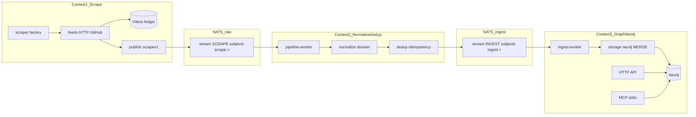
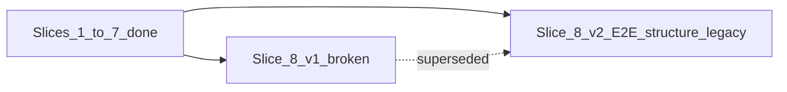

# Veil: три контекста + Vitess ledger + завершение refactor (без release)

## Прогресс factory / Veil (execution slices)

| Срез | План | Статус |
|------|------|--------|
| 1 | [scrape_factory_dry](scrape_factory_dry_5ee3f1f0.plan.md) | done — DS, factory, `scrape-worker` |
| 2 | [factory_slice_2](factory_slice_2_vuln_lola_8127b37e.plan.md) | done — vuln, lola |
| 3 | [factory_slice_3](factory_slice_3_ti_477684c7.plan.md) | done — TI, normalize в pipeline |
| 4 | [factory_slice_4](factory_slice_4_appsec_9a2c1f3e.plan.md) | done — sbom, coderules, nuclei в `scrape-worker` |
| 5 | [factory_slice_5](factory_slice_5_vitess_c26de8fc.plan.md) | done — `FetchIfDue` + `Unchanged`, pilot ledger |
| 6 | [factory_slice_6](factory_slice_6_vitess_5b_99ccc1ee.plan.md) | done — Vitess 5b (все HTTP feeds) |
| 7 | [factory_slice_7](factory_slice_7_graph_d.plan.md) | done — storage под `ingest/graph/`; worker → `ingest/graph` only; `legacy` facade для ti/vuln/lola/ds |
| 8 v1 | [factory_slice_8_e2e](factory_slice_8_e2e_d1352ee7.plan.md) | **бракован** — ошибочно смешан E2E с graph-pack release; не исполнять |
| **8 v2** | [factory_slice_8_v2](factory_slice_8_v2_e2e_refactor.plan.md) | **done** — структура/snake_case, graph без `legacy/` |
| **9** | [factory_slice_9](factory_slice_9_gate_tombstones.plan.md) | **done** — tombstones, docs paths |
| **10** | [factory_slice_10](factory_slice_10_scrape_dead_code.plan.md) | **done** — components, mongo yaml, cue_schemas |
| **11** | [factory_slice_11](factory_slice_11_scrapev1_only.plan.md) | **done** — scrapev1-only в scrapepub |
| **12** | [factory_slice_12](factory_slice_12_graph_promote.plan.md) | **done** — `ingest/graph/workeringest`, `scrapers/*/graph/ingest` |
| **13** | [factory_slice_13](factory_slice_13_pub_relocate.plan.md) | **done** — pub под `ingest/scrape`, `ingest/pipeline` |

**Текущий этап Veil:** cleanup **срезы 9–13 done**; опционально **формальный E2E** — `scripts/smoke_scrape_e2e.sh`. **Релиз graph-pack не делаем.**

Мастер cleanup: [repo_cleanup_slices](repo_cleanup_slices_8202be7e.plan.md).

| Фаза Veil | Статус |
|-----------|--------|
| A — NATS + skeleton | **done** |
| B — scrape factory (7 sources → `scrape_worker`) | **done** |
| C — Vitess crawl ledger | **done** (slices 5–6) |
| D — `ingest/graph` cleanup | **done** — AppSec в [`ingest/graph/storage/`](../ingest/graph/storage/); domain writers в `scrapers/*/graph/ingest` + [`ingest/graph/workeringest/`](../ingest/graph/workeringest/) |
| E — E2E + структура + legacy | **done** (срезы 8–9); cleanup 10–13 **done** |
| F — repo cleanup (9–13) | **done** — см. [repo_cleanup_slices](repo_cleanup_slices_8202be7e.plan.md) |

## Где остановились

| Этап | Статус |
|------|--------|
| Единый compose, NATS-only, без `direct` | **done** |
| Scrape profile: scrape + pipeline + ingest workers + `crawl-db` | **done** (7 sources в одном scrape worker) |
| Vitess ledger + `FetchIfDue` | **done** (slices 5–6) |
| Graph storage под `ingest/graph/` | **done** (slice 7–8 v2; без `legacy/`) |
| **Formal E2E smoke** (2× scrape, drain NATS, Cypher) | **pending** — [`scripts/smoke_scrape_e2e.sh`](../scripts/smoke_scrape_e2e.sh) |
| **Структура `ingest/` + snake_case** (`scrape_worker`, `pipeline_worker`, `ingest_worker`) | **done** (slice 8 v2) |
| **Удаление legacy** (forward, thin cmd, tombstones) | **done** (срезы 8–9) — нет `scrapers/*/cmd`, `scrapers/ingest-worker` |

**Не делаем в рамках Veil refactor:** `gh release`, graph-pack ZIP, обновление `DEFAULT_PACK_URL` под новую версию. *(Опционально позже, отдельное решение.)*

*(Исторический: [nats-only_+_graph_pack_0.3.1](nats-only_+_graph_pack_0.3.1_3b280ecb.plan.md) — release-план, не цель текущего этапа.)*

---

## Три контекста и два NATS-контура (ключевое уточнение)

**Целевой поток (как задумано):**

```text
scrape  →  NATS (raw)  →  normalize + dedup  →  NATS (ingestv1)  →  ingest-worker  →  Neo4j
                                                                              ↑
                                                                    API + MCP (read)
```



| Контекст | Бинарь / сервис | NATS | Ответственность | Не делает |
|----------|-----------------|------|-----------------|-----------|
| **1. Scrape** | **`scrape_worker`** (`SCRAPE_SOURCES`) | **Publish** `scrape.>` | Fetch → `scrapev1`, Vitess ledger (`FetchIfDue`), proxy | normalize, Cypher |
| **2. Normalize + dedup** | **`pipeline_worker`** | **Consume** `scrape.>` → **Publish** `ingest.>` | normalize ([pipeline/handle/ti.go](../ingest/pipeline-worker/internal/handle/ti.go)), `ingestv1` | HTTP fetch, Bolt |
| **3. Graph** | **`ingest_worker`**, `api`, `mcp` | **Consume** `ingest.>` | MERGE в Neo4j, read API/MCP | scrape feeds |

*Имена в коде/compose сейчас ещё `scrape-worker` / `pipeline-worker` / `ingest-worker` — переименование в snake_case — срез 8 v2.*

**Достигнуто (slices 1–6):** producers публикуют только `scrapev1`; TI normalize — в `pipeline-worker`; все 7 sources в одном `scrape-worker`; crawl ledger на основных HTTP feeds.

**Границы:**
- ctx1 → ctx2: `scrapev1.Envelope` (новый контракт, см. ниже)
- ctx2 → ctx3: существующий `ingestv1.Envelope` ([pkg/ingestv1](pkg/ingestv1/envelope.go)) — без изменения семантики MERGE в worker

---

## Целевая структура каталогов

Предлагаемый корень ingest (вместо разрозненных `scrapers/{ti,vuln,...}` как «мини-монорепы»):

```
pkg/
  scrapev1/              # raw envelope: source, kind, payload, scraped_at (без graph idempotency)
  ingestv1/              # как сейчас — только из pipeline-worker и для ingest-worker
ingest/
  scrape/
    scrape_worker/       # main binary (сейчас ingest/scrape/cmd — rename 8 v2)
    factory/
    feeds/
    ledger/
  pipeline/
    pipeline_worker/     # (сейчас ingest/pipeline-worker — rename 8 v2)
  graph/
    ingest_worker/       # (сейчас ingest/graph/worker — rename 8 v2)
    storage/             # sbom, coderules, nuclei — done
    workeringest/        # ti, vuln, lola, ds — цель 8 v2 (убрать legacy/)
scrapers/
  */scrapesource/        # только fetch + scrapev1; без workeringest после 8 v2
api/                     # ctx3 read Neo4j
mcp/                     # ctx3 read Neo4j
graph/                   # shared neo4j + query
```

**Compose (profile `scrape`):** **done** (имена hyphen — переименовать в 8 v2):

```text
nats → scrape_worker → pipeline_worker → ingest_worker → neo4j
```

**Стиль:** [docs/coding-style.md](docs/coding-style.md) — `cmd` → `usecase` → `repository` → `storage`; `storage/` вне `internal` для cross-module import worker’ом.

---

## Фабрика скрейперов

**Проблема сейчас:** дублирование в [scrapers/lola/internal/usecase/scrape.go](scrapers/lola/internal/usecase/scrape.go), [scrapers/vuln/internal/usecase/scrape.go](scrapers/vuln/internal/usecase/scrape.go), [scrapers/ds/internal/usecase/ingest.go](scrapers/ds/internal/usecase/ingest.go), [scrapers/ti/internal/feeds/runner.go](scrapers/ti/internal/feeds/runner.go) — `githubListDir`, `fetchBytes` + disk cache, proxy pool, backoff.

**Интерфейс (черновик):**

```go
type Source interface {
    Name() string
    Policy() FetchPolicy          // static | periodic | daily | ...
    Run(ctx context.Context, deps ScrapeDeps) error
}

type ScrapeDeps struct {
    Ledger    repository.CrawlLedger
    Publisher repository.RawPublisher   // только scrape.>
    HTTP      *feeds.Client
    Log       *slog.Logger
}
```

- **4× `natspub`** → **`scrapepub`**: публикуют `scrapev1` (сырой CVE blob, сырой IOC, YAML bytes, GH API path + body hash), **без** `normalize.CanonicalID` и **без** `ingestv1` в скрейпере.
- **AppSec** (`sbom`, `coderules`, `nuclei`): OSV JSON / GHSA path / template YAML → `scrapev1` kinds; normalize (CWE id, stable template id) — в `pipeline-worker`.

**Удалить мёртвый код:** [scrapers/vuln/internal/storage/mongo](scrapers/vuln/internal/storage/mongo) не используется в NATS-only path ([components/init.go](scrapers/vuln/internal/components/init.go) → только `natspub`).

---

## Vitess — crawl ledger (только метаданные)

**Выбор пользователя:** Vitess (MySQL-compatible, CNCF). **Не** хранить CVE/IOC/правила — только факт обращения.

**Схема (минимум):**

```sql
CREATE TABLE crawl_resource (
  resource_key   VARCHAR(512) PRIMARY KEY,  -- stable: feed:kev, gh:owner/repo/path, nvd:page:0:2000
  source         VARCHAR(64) NOT NULL,
  url            TEXT NOT NULL,
  etag           VARCHAR(255) NULL,
  content_sha256 CHAR(64) NULL,
  last_fetched_at TIMESTAMP NOT NULL,
  last_changed_at TIMESTAMP NULL,
  fetch_policy   ENUM('static','periodic','daily') NOT NULL
);
CREATE INDEX idx_crawl_last_fetched ON crawl_resource(last_fetched_at);
```

**Env (добавить в compose + [docs/threatintel-runtime.md](docs/threatintel-runtime.md)):**

| Variable | Default | Meaning |
|----------|---------|--------|
| `VITESS_DSN` | — | `user:pass@tcp(vitess:15306)/veil_ledger` |
| `SCRAPE_MIN_REFETCH_AFTER` | `24h` | Не качать URL снова, если `last_fetched_at` новее порога |
| `SCRAPE_FORCE_REFETCH` | `0` | `1` = игнорировать ledger (полный перескрейп) |

**Политики по категориям (классификация для плана):**

| Категория / feed | Policy | Поведение |
|------------------|--------|-----------|
| MITRE CWE zip, ATT&CK STIX, LOLBAS/GTFOBins tree | `static` | Один раз (или при смене etag/sha256) |
| NVD CVE page (по `startIndex`) | `periodic` | Refetch по `SCRAPE_MIN_REFETCH_AFTER`; отдельно CVE record immutable → skip re-parse если hash совпал |
| CISA KEV, URLhaus recent, ThreatFox, Feodo, OpenPhish | `daily` | Частый refetch |
| OSV per-CVE (`sbom`) | `periodic` | Ledger key `osv:CVE-…`; CVE без изменений в OSV — skip publish |
| GHSA JSON files | `periodic` | Ledger по path |
| Semgrep/CodeQL/Nuclei GitHub paths | `static`/`periodic` | Path-level ledger |
| Exploit-DB CSV, Metasploit listing | `periodic` | |
| TI JSONL file | bypass ledger | Локальный input |

**Интеграция в fetch:** обёртка `feeds.FetchIfDue(ctx, key, url, policy)` → Vitess `ShouldFetch` / `RecordFetch`; disk cache (`*_CACHE_DIR`) остаётся как L1, Vitess — L2 политики между запусками.

**Compose:** сервис `vitess` (или `mysql` + vtgate для dev) в profile `scrape`; volume для данных ledger.

---

## NATS: два stream / subject tree

| Stream | Subjects | Producers | Consumers |
|--------|----------|-----------|-----------|
| **`SCRAPE`** | `scrape.>` | все scrapers | **`pipeline-worker`** |
| **`INGEST`** | `ingest.>` | **`pipeline-worker`** | **`ingest-worker`** |

Env (добавить к [docs/ingest-contract.md](docs/ingest-contract.md)):

| Variable | Default | Meaning |
|----------|---------|--------|
| `NATS_SCRAPE_SUBJECT` | `scrape.>` | pipeline-worker pull filter (input) |
| `NATS_SCRAPE_DURABLE` | `pipeline-worker` | durable consumer SCRAPE |
| `NATS_INGEST_SUBJECT` | `ingest.>` | ingest-worker pull filter (unchanged) |
| `NATS_DURABLE` | `ingest-worker` | durable consumer INGEST |

Dedup на **втором** hop: `Nats-Msg-Id` = `ingestv1.idempotency_key` (как сейчас в [ingestpub](scrapers/ingestpub/publish.go)). На **первом** hop — опционально `scrapev1` content-hash как msg-id, чтобы pipeline не обрабатывал дубликаты сырья.

---

## Контекст 2: `pipeline-worker` (normalize + dedup)

**Сейчас (нужно убрать из scrapers):**
- TI normalize в [natspub](scrapers/ti/internal/natspub/publisher.go) до publish.
- `ingestv1` publish из всех producers → [ingest-worker](scrapers/ingest-worker/cmd/main.go).

**Цель:**
- Новый long-running binary `ingest/pipeline/cmd` (compose: **`pipeline-worker`**).
- Pull loop на `scrape.>` (аналог ingest-worker: errgroup, SIGTERM, batch fetch).
- Per `scrapev1.source` + `kind`: decode → **normalize** → build **`ingestv1.Envelope`** → publish `ingest.{domain}.*`.
- Перенести логику из `pkg/ingestv1` idempotency helpers + [ti/internal/normalize](scrapers/ti/internal/normalize) + ad-hoc vuln CVE normalize.

**`scrapev1` (черновик полей):**
- `schema_version`, `source`, `kind`, `payload` (JSON), `scraped_at`
- kinds зеркалят сырые артефакты: `scrape_nvd_page`, `scrape_ti_kev_row`, `scrape_lolbas_yaml`, `scrape_sbom_osv_json`, …

**TI JSONL:** scraper публикует `scrape_ti_jsonl_line` (raw line); pipeline → разбор JSONL → один или несколько `ingestv1` (как сейчас `KindTIJSONLRecord` в [ti/workeringest](scrapers/ti/workeringest/handler.go), но разбор переносится в pipeline).

**Vitess + dedup:** ledger остаётся в ctx1 (skip fetch). Dedup для графа — в ctx2 (не публиковать `ingestv1`, если payload hash не изменился — опционально второй уровень в Vitess или in-memory bloom; минимум — JetStream dedup на ingest hop).

---

## Контекст 3: Graph / Neo4j (без смешения со scrape)

**Оставить и сгруппировать:**
- [scrapers/ingest-worker](scrapers/ingest-worker) → `ingest/graph/worker`
- `*/storage/neo4j` + `*/workeringest` → `ingest/graph/storage/{sbom,ti,vuln,...}`
- [api/](api/), [mcp/](mcp/), [graph/query](graph/query) — **только чтение** Bolt; не импортируют scrape/feeds/Vitess.

**ingest-worker** — единственный writer **Neo4j**; читает **только** `ingest.>` (без изменения MERGE-семантики). [docs/ingest-contract.md](docs/ingest-contract.md): два контракта (`scrapev1` + `ingestv1`) и матрица kind→handler.

---

## Документация и брендинг Veil

- [README.md](README.md): заголовок **Veil (Vulnerability Exploitation Intelligence Layer)**; краткое описание; Mermaid с тремя слоями; сохранить MIT/license ссылки.
- [docs/coding-style.md](docs/coding-style.md): секция «три контекста» + Vitess env; пути `ingest/…`.
- [AGENTS.md](AGENTS.md), [scrapers/README.md](scrapers/README.md) → `ingest/README.md` или redirect.
- Имя репозитория/go module (`github.com/butbeautifulv/threat_intelligence`) — **не менять** в этом PR (breaking); опционально подзаголовок Veil в README.

---

## Фаза выполнения (порядок)

### A. Контракты NATS + skeleton — **done**
1. `pkg/scrapev1` + stream `SCRAPE`; `scrapepub` + pipeline publish.
2. `ingest/` skeleton (scrape / pipeline / graph).
3. `pipeline-worker` в compose.
4. Все scrapers на `scrapev1`.

### B. Scrape factory + все producers — **done** (slices 1–4)
5. Factory + `scrape-worker`; 7 sources.
6. TI normalize убран из scraper path.
7. Pipeline handlers для всех domains.

### C. Vitess ledger (ctx1) — **done** (slices 5–6)
8. `ingest/scrape/ledger` + `feeds.FetchIfDue` + `Unchanged`.
9. Compose `crawl-db` + `VITESS_DSN`.

### D. Graph ctx3 cleanup — **done** (срезы 7–8 v2)
10. **done:** `ingest_worker` → [`ingest/graph/ingest_worker`](../ingest/graph/ingest_worker/); AppSec → [`ingest/graph/storage/`](../ingest/graph/storage/); domain writers → `scrapers/*/graph/workeringest` (Go `internal` rule).
11. **done:** [`ingest/graph/README.md`](../ingest/graph/README.md), [`docs/ingest-contract.md`](../docs/ingest-contract.md).

### E. E2E + структура + legacy — **mostly done** ([factory_slice_8_v2](factory_slice_8_v2_e2e_refactor.plan.md))

1. **E2E (pending run):** [`scripts/smoke_scrape_e2e.sh`](../scripts/smoke_scrape_e2e.sh) — compose profile `scrape` ×2; lag SCRAPE/INGEST → 0; `crawl_resource`; Cypher counts; API `/health`.
2. **done — Структура:** `ingest/scrape/scrape_worker`, `ingest/pipeline/pipeline_worker`, `ingest/graph/ingest_worker`; Dockerfiles и compose в snake_case.
3. **done — Graph finish:** нет [`ingest/graph/legacy/`](../ingest/graph/legacy/); `workeringest` в `scrapers/*/graph/`.
4. **partial — Legacy:** deprecated `scrapers/*/cmd` stubs; TI dead HTTP helpers removed; `forward.go` AppSec удалён.

**Не входит в фазу E:** export graph-pack, `gh release`, `DEFAULT_PACK_URL`.

**«Сканирование и обогащение»** = полный **scrape profile**: все producers → **`pipeline-worker`** → **`ingest-worker`** → Neo4j; «обогащение» — рост связей в графе после полного прогона (см. [docs/ontology-appsec.md](docs/ontology-appsec.md)).

---

## Риски

- **Большой diff:** поэтапные PR/commits внутри ветки (A → B → C → D).
- **Vitess в dev:** тяжелее Mongo/Postgres; для локалки допустим `mysql:8` + один shard без полного Vitess cluster, с тем же DSN-контрактом.
- **Переименование путей:** все Dockerfile и CI должны обновиться синхронно.
- **Лимиты compose** (`NVD_MAX_PAGES=1` и т.д.) — для E2E smoke поднять env в «E2E profile» (docs), не для release.

---

## Критерии готовности Veil refactor (без release)

- [x] Два NATS-контура; normalize только в pipeline.
- [x] Vitess ledger (`FetchIfDue`).
- [x] AppSec graph storage в `ingest/graph/storage/` (срез 7).
- [ ] Formal E2E smoke зелёный — `scripts/smoke_scrape_e2e.sh --up` (опциональный gate).
- [x] Структура `ingest/` + бинарии `scrape_worker`, `pipeline_worker`, `ingest_worker`.
- [x] Нет `ingest/graph/legacy/`; нет per-scraper `cmd` / `ingest-worker` tombstone.
- [x] `ingest_worker` → `ingest/graph/workeringest/*`; pub в `ingest/scrape/pub`, `ingest/pipeline/pub`.
- [x] Scrape scrapepub без `pkg/ingestv1` (срез 11).
- [ ] Neo4j: данные всех 7 sources после полного scrape profile (E2E).

**Вне критериев:** graph-pack ZIP, GitHub release, sha256 gate.

## Дорожная карта срезов


