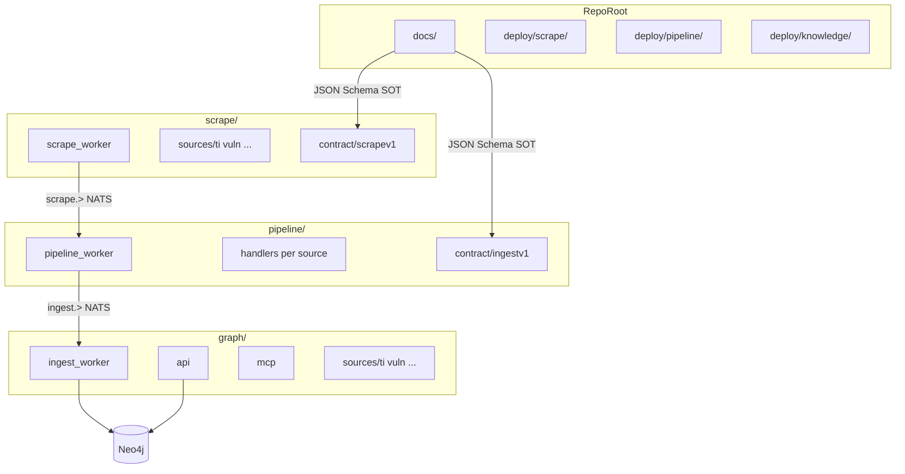
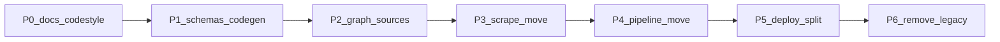

# План максимальной стандартизации Veil

Опирается на завершённый [veil_refactor.plan.md](.cursor/plans/veil_refactor.plan.md) (три контекста, два NATS-hop, factory, Vitess). Следующий шаг — **физическая и модульная изоляция**, а не новая функциональность.

## Целевое состояние



| Зона | Содержимое | Запрещено |
|------|------------|-----------|
| **Корень** | `README`, `LICENSE`, `AGENTS.md`, [`docs/`](docs/), [`deploy/`](deploy/) | `go.work`, прикладной Go-код, `pkg/`, `scrapers/`, `ingest/` |
| **`scrape/`** | worker, factory, feeds, ledger, pub, `sources/*` | `ingestv1`, Neo4j, импорт `pipeline/` или `knowledge/` |
| **`pipeline/`** | worker, normalize handlers, pub | HTTP fetch feeds, Bolt, импорт `scrape/sources/*` |
| **`knowledge/`** | ingest_worker, storage, api, mcp, query, domain writers | `scrapev1`, feeds, Vitess |

**Интеграция только через NATS** + документированные схемы ([`docs/ingest-contract.md`](docs/ingest-contract.md) расширить до machine-readable SOT).

---

## 1. Обновить кодстайл и AGENTS (первый PR, без переносов)

Файлы: [`docs/coding-style.md`](docs/coding-style.md), [`AGENTS.md`](AGENTS.md).

### Принципы (новая секция)

| Принцип | Правило в репо |
|---------|----------------|
| **CLEAN CODE** | Маленькие функции, говорящие имена, один уровень абстракции; `cmd` только wiring |
| **DRY** | Общий fetch/ledger — только в `scrape/`; normalize — только в `pipeline/`; MERGE — только в `knowledge/`; дублирование контрактов — только через schema/codegen |
| **KISS** | Один бинарь на слой в runtime; без лишних абстракций и «на всякий случай» интерфейсов |
| **DDD** | **`internal/domain/` обязателен** в каждом модуле-источнике и в каждом worker-модуле; доменные типы не тянут Neo4j/NATS/HTTP |

### Слойность (исправить текущую формулировку)

Заменить «`internal/domain/` *(optional)*» на обязательную схему:

```
cmd/           → wiring
internal/domain/   → entities, value objects, domain rules (no I/O)
internal/repository/ → ports (interfaces)
internal/usecase/  → orchestration
internal/feeds|connector/ → outbound I/O (только scrape)
storage/       → adapters (Neo4j — только graph; pub — в своём слое)
```

**Чеклист PR:** нет `pkg/ingestv1` в scrape; нет `pkg/scrapev1` в graph; нет импорта `scrapers/*` из `ingest/graph`.

### Именование

- Compose / сервисы / бинарии: **`snake_case`** (`scrape_worker`)
- NATS durable: **`snake_case`** (выровнять с compose; убрать `pipeline-worker` / `ingest-worker` в env defaults)
- Go module path: сохранить `github.com/butbeautifulv/threat_intelligence/...` (breaking rename module — вне scope)

---

## 2. Контракты: schema-first + codegen

**Источник истины:** `docs/schemas/` (новое)

| Файл | Владелец слоя | Потребители |
|------|---------------|-------------|
| `scrapev1-envelope.json` | scrape (publish) | pipeline (consume) |
| `ingestv1-envelope.json` | pipeline (publish) | graph (consume) |

- Обновить [`docs/ingest-contract.md`](docs/ingest-contract.md): ссылка на схемы, матрица `source`×`kind`, примеры payload.
- Генерация (минимальный v1): `scripts/gen-contracts.sh` → `scrape/contract/scrapev1`, `pipeline/contract/ingestv1`, `knowledge/contract/ingestv1` (graph — read-only копия или общий submodule `contract-ingestv1` **вне** runtime-слоёв, только как артефакт сборки).
- В CI/CONTRIBUTING: `make contracts` перед `go test` в слое, если схема изменилась.
- **Запрет:** ручное редактирование сгенерированных `*.gen.go` (или пометка `// Code generated`).

Перенос с [`pkg/scrapev1`](pkg/scrapev1) и [`pkg/ingestv1`](pkg/ingestv1): после codegen — удалить корневой `pkg/` (кроме того, что переедет в слой, см. ниже).

Доменные пакеты normalize (`pkg/tinormalize`, `pkg/vulndomain`, …) → **`pipeline/internal/normalize/{ti,vuln,...}`** (не общий `pkg/`).

---

## 3. Целевая структура каталогов

### `scrape/` (из `ingest/scrape/` + `scrapers/`)

```
scrape/
  scrape_worker/          # main (был ingest/scrape/scrape_worker)
  factory/ feeds/ ledger/ pub/
  contract/scrapev1/      # generated + thin validation helpers
  sources/
    ti/                   # бывший scrapers/ti — только fetch + scrapev1
    vuln/ lola/ ds/ sbom/ coderules/ nuclei/
  proxybroker/            # опционально, только scrape profile
```

Каждый `sources/<name>/`:

- `internal/domain/` — **обязательно**
- `scrapesource/` — регистрация в factory
- `internal/feeds/`, `internal/usecase/`, `internal/scrapepub/`
- **Удалить:** `knowledge/`, `knowledge/neo4j/`, зависимости на `pkg/ingestv1`, `ingest/graph`

### `pipeline/` (из `ingest/pipeline/`)

```
pipeline/
  pipeline_worker/
  pub/
  contract/ingestv1/      # generated (producer)
  internal/handle/        # ti, vuln, lola, ds, appsec...
  internal/normalize/     # бывший pkg/tinormalize, vulndomain, appsecparse
```

### `knowledge/` (из `ingest/graph/` + `api/` + `mcp/` + `knowledge/query`)

```
graph/
  ingest_worker/
  workeringest/           # тонкие адаптеры
  storage/                # sbom, coderules, nuclei + neo4j
  sources/                # бывший scrapers/*/knowledge/ingest
    ti/ vuln/ lola/ ds/
  contract/ingestv1/      # generated (consumer)
  query/                  # бывший knowledge/query
  api/ mcp/
```

[`knowledge/`](knowledge/) (neo4j driver) сливается в `knowledge/internal/neo4j` или `knowledge/pkg/neo4j` внутри слоя.

---

## 4. Послойный deploy (корень без runtime-compose)

Создать [`deploy/`](deploy/):

| Путь | Содержимое |
|------|------------|
| `deploy/scrape/compose.yml` | `crawl-db`, `nats`, `scrape_worker`, `proxybroker` |
| `deploy/pipeline/compose.yml` | `nats`, `pipeline_worker` |
| `deploy/knowledge/compose.yml` | `neo4j`, `graph-bootstrap`, `ingest_worker`, `api`; profiles `mcp`, `deploy` (nginx) |
| `deploy/knowledge/compose.full.yml` | optional overlay: все три слоя + shared `nats` network для local E2E |

Перенести Dockerfiles из [`docker/`](docker/) → `deploy/<layer>/docker/` (контекст сборки — **только каталог слоя**, не весь репо: `COPY . .` → `context: ../../scrape`).

Корневой [`docker-compose.yml`](docker-compose.yml) → thin redirect в `docs/` («для local: `docker compose -f deploy/knowledge/compose.yml ...`») или удалить после миграции docs.

Обновить [`docs/threatintel-runtime.md`](docs/threatintel-runtime.md), [`docs/deploy.md`](docs/deploy.md), [`README.md`](README.md).

---

## 5. Убрать root `go.work` и перекрёстные импорты

**Сейчас (проблемы):**

- [`go.work`](go.work) связывает 27 модулей
- [`ingest/graph/go.mod`](ingest/graph/go.mod) `replace` на `scrapers/{ti,vuln,lola,ds}`
- [`scrapers/ti/scrapesource`](scrapers/ti/scrapesource/source.go) импортирует `ingest/scrape/factory`
- AppSec graph уже в `ingest/graph/storage` — эталон для остальных доменов

**Цель:**

- Нет файла `go.work` в корне
- Каждый слой: **один корневой `go.mod`** на слой (multi-package внутри) *или* локальный `scrape/go.work` только для `scrape/sources/*` — допустимо, но не на весь репо
- Межслойные `replace ../../../scrapers` — **0**

**Порядок миграции импортов (критичный путь):**

1. Перенести `scrapers/*/knowledge/ingest` → `knowledge/sources/*`; обновить `workeringest` (сейчас в [`ingest/graph/workeringest/`](ingest/graph/workeringest/))
2. Удалить `knowledge/` и `ingestv1` из go.mod всех `scrapers/*`
3. Слить `scrapers/*` под `scrape/sources/*` с единым factory
4. Перенести normalize-пакеты в `pipeline/internal/normalize`
5. Удалить `go.work`; проверить `go build ./...` **внутри каждого слоя отдельно**

---

## 6. Фазы выполнения (инкрементальные PR)



| Фаза | Результат | Критерий готовности |
|------|-----------|---------------------|
| **P0** | coding-style + AGENTS + принципы | PR checklist в docs; domain mandatory |
| **P1** | `docs/schemas/`, `scripts/gen-contracts.sh`, contract modules | `go test` contract packages; ingest-contract ссылается на schema |
| **P2** | graph writers в `knowledge/sources/` | `ingest/graph` не `replace` scrapers; ti/vuln/lola/ds graph tests green |
| **P3** | `scrape/` tree, sources без graph | scrape build; no ingestv1 import |
| **P4** | `pipeline/` tree, normalize internal | pipeline build; handlers use generated ingestv1 |
| **P5** | `deploy/*`, Docker context per layer | `docker compose -f deploy/scrape/...` поднимает только scrape stack |
| **P6** | Удалить `go.work`, `ingest/`, `scrapers/`, `pkg/`, root `docker/` | grep по старым путям пуст; smoke [`scripts/smoke_scrape_e2e.sh`](scripts/smoke_scrape_e2e.sh) на overlay compose |

**Не в scope:** graph-pack release, смена go module path, Vitess cluster prod.

**Опционально после P6:** formal E2E из veil plan (`smoke_scrape_e2e.sh --up`).

---

## 7. Стандартный шаблон модуля-источника

Документировать в coding-style (и один эталон `scrape/sources/ti/`):

| Пакет | Ответственность |
|-------|-----------------|
| `internal/domain/` | TI IOC, Campaign, … |
| `internal/feeds/` | HTTP/GitHub fetch |
| `internal/usecase/` | orchestration |
| `internal/scrapepub/` | map domain → `scrapev1` kinds |
| `scrapesource/` | `factory.Register` |

Для graph-источника зеркально в `knowledge/sources/ti/`:

- `internal/domain/` (или reuse pipeline-normalized shapes as DTOs в contract only)
- `ingest/` — MERGE из `ingestv1` payload
- `storage/neo4j/` — Cypher implementations

---

## 8. Риски и смягчение

| Риск | Смягчение |
|------|-----------|
| Большой diff | Строго P0→P6; не смешать с feature work |
| Drift schema vs code | CI: `gen-contracts` + `git diff --exit-code` |
| Docker build break | Сначала dual-path Dockerfiles, потом удалить `docker/` |
| Короткие module names (`ti v0.0.0`) | При слиянии в слой — полные import paths `.../scrape/sources/ti` |

---

## Итоговый чеклист «стандартизирован»

- [ ] Корень: только docs + deploy + мета-файлы
- [ ] Нет `go.work` в корне
- [ ] Три каталога `scrape/`, `pipeline/`, `knowledge/` — независимая сборка
- [ ] Контракты: schema в docs → codegen; NATS — единственная связь
- [ ] `internal/domain/` в каждом модуле
- [ ] coding-style: CLEAN, DRY, KISS, DDD
- [ ] Deploy только в `deploy/{scrape,pipeline,graph}/`
