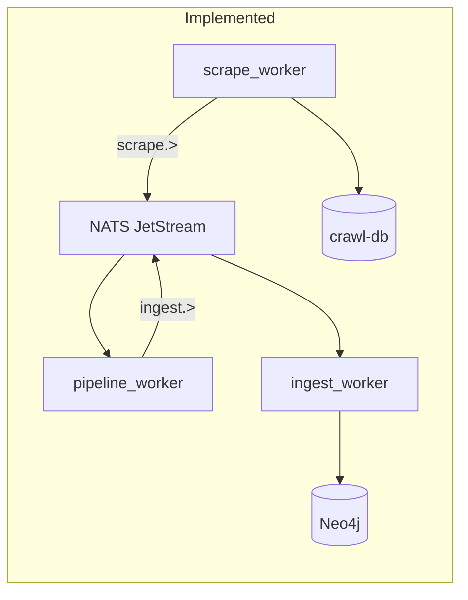
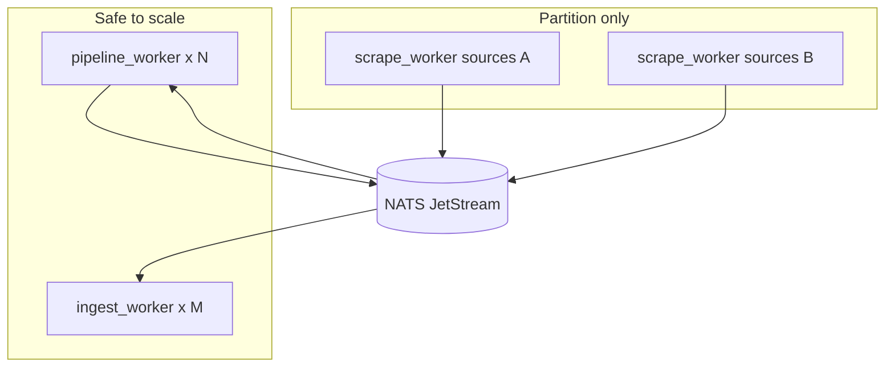

# Veil: статус планов, E2E, масштабирование воркеров

## Статус [veil_refactor.plan.md](.cursor/plans/veil_refactor.plan.md)

| Область | Статус | Доказательство |
|---------|--------|----------------|
| Три контекста (scrape → pipeline → graph) | **done** | [`discovery/`](discovery/), [`pipeline/`](pipeline/), [`graph/`](graph/) |
| Два NATS-hop (`scrape.>` → `ingest.>`) | **done** | `pipeline_worker` PullSubscribe SCRAPE; `ingest_worker` PullSubscribe INGEST |
| Factory + 7 sources в `scrape_worker` | **done** | [`deploy/discovery/compose.yml`](deploy/discovery/compose.yml) `SCRAPE_SOURCES=ds,vuln,lola,ti,sbom,coderules,nuclei` |
| Vitess/MySQL ledger | **done** | `crawl-db` + `VITESS_DSN` в scrape compose |
| Структура ingest → три слоя | **done** | `ingest/`, `scrapers/`, `pkg/` **удалены** |
| Graph без legacy | **done** | `graph/sources/*`, `graph/storage/*`, `graph/workeringest/*` |
| Срезы 8–13 (E2E structure, tombstones, scrapev1-only) | **done** | по таблице в плане |
| **Formal E2E smoke** | **pending** | [`scripts/smoke_scrape_e2e.sh`](scripts/smoke_scrape_e2e.sh) не прогонялся в этой сессии |
| **Neo4j: все 7 sources после полного scrape** | **pending** | критерий из плана; проверяется smoke + Cypher |



**Итог refactor:** функционально завершён; gate — зелёный `smoke_scrape_e2e.sh --up`.

---

## Статус [veil_standardization_1a21dc00.plan.md](.cursor/plans/veil_standardization_1a21dc00.plan.md)

Todos P0–P6 в YAML помечены `completed`. Фактическая проверка по чеклисту плана (стр. 292–298):

| Критерий | Факт | Вердикт |
|----------|------|---------|
| Нет root `go.work`, `pkg/`, `ingest/`, `scrapers/` | Отсутствуют | **pass** |
| Три слоя `discovery/`, `pipeline/`, `graph/` | Есть, сборка через layer `go.work` | **pass** (не single `go.mod`/layer — допустимо по плану) |
| `deploy/{scrape,pipeline,graph}/` | Есть compose + Dockerfiles | **pass** |
| Schema SOT + codegen | [`docs/schemas/`](docs/schemas/) есть | **partial** — [`scripts/gen-contracts.sh`](scripts/gen-contracts.sh) копирует из **удалённого** `pkg/scrapev1` / `pkg/ingestv1` (строки 33–49) → `make contracts` **сломается** |
| `internal/domain/` обязателен | Есть только в **ti, vuln, lola** (scrape + graph) | **partial** — нет в `ds`, `sbom`, `coderules`, `nuclei` (scrape) и `graph/sources/ds` |
| Документация без legacy-путей | [`docs/threatintel-runtime.md`](docs/threatintel-runtime.md), [`docs/ontology-appsec.md`](docs/ontology-appsec.md) ссылаются на `ingest/`, `scrapers/`, `pkg/` | **fail** |
| Масштабирование воркеров в deploy | Нет `replicas` / scale wrapper | **fail** (запрос пользователя) |

Прочие артефакты: [`graph/go.mod.ingest-graph.bak`](graph/go.mod.ingest-graph.bak), устаревшие комментарии `ingest/scrape/factory` в `scrapesource/source.go`, [`pipeline/pipeline_worker/README.md`](pipeline/pipeline_worker/README.md).

**Итог standardization:** структурная миграция **сделана**; «формально стандартизирован» — **нет** до фиксов выше + обновления docs.

---

## Масштабирование воркеров (текущее и целевое)

**Сейчас:** по одному контейнеру `pipeline_worker` и `ingest_worker`; JetStream pull с **общим durable** (`pipeline_worker`, `ingest_worker`) — несколько реплик с `--scale` уже конкурируют за сообщения (корректная модель).

**Ограничения:**
- `scrape_worker` — batch job (exit 0); **не** масштабировать копии с одним `SCRAPE_SOURCES` — дублирование crawl. Параллелизм scrape: **партиционирование** `SCRAPE_SOURCES` (2+ сервиса с разными списками) или последовательный `RunAll` внутри одного процесса.
- `deploy.replicas` в compose **игнорируется** без Docker Swarm; для обычного `docker compose` нужен `--scale` или overlay-скрипт.

**Целевое решение (после подтверждения плана):**

1. **Env-переменные** (документировать в [`deploy/README.md`](deploy/README.md)):
   - `PIPELINE_WORKER_SCALE` (default `1`)
   - `INGEST_WORKER_SCALE` (default `1`)
   - `SCRAPE_WORKER_PARTITION` (optional: `0` = один worker, `1` = два сервиса с разными `SCRAPE_SOURCES`)

2. **Скрипт** [`scripts/compose-up-full.sh`](scripts/compose-up-full.sh) (новый):
   ```bash
   docker compose -f deploy/discovery/compose.yml \
     -f deploy/pipeline/compose.yml \
     -f deploy/graph/compose.yml \
     up -d --build \
     --scale pipeline_worker=${PIPELINE_WORKER_SCALE:-1} \
     --scale ingest_worker=${INGEST_WORKER_SCALE:-1}
   ```

3. **Опциональный overlay** [`deploy/compose.scale.yml`](deploy/compose.scale.yml) — второй `scrape_worker` с профилем `scrape-partition`:
   - `scrape_worker_fast`: `SCRAPE_SOURCES=ti,sbom,coderules,nuclei`
   - `scrape_worker_slow`: `SCRAPE_SOURCES=ds,vuln,lola`
   - Включается `COMPOSE_PROFILES=scrape-partition`

4. **Compose hygiene** для long-running воркеров:
   - `restart: unless-stopped` на `pipeline_worker`, `ingest_worker`
   - `depends_on: nats` в [`deploy/pipeline/compose.yml`](deploy/pipeline/compose.yml) (сейчас только в `compose.full.yml`)
   - Явные `INGEST_BATCH` / `INGEST_MAX_WAIT` в graph compose (сейчас только defaults в коде)

5. **Обновить** [`scripts/smoke_scrape_e2e.sh`](scripts/smoke_scrape_e2e.sh): опционально `PIPELINE_WORKER_SCALE` / `INGEST_WORKER_SCALE` при `--up`; проверка, что lag SCRAPE/INGEST → 0 при N>1.



---

## Фаза выполнения (после подтверждения плана)

### 1. Прогон сервиса и сбор данных

```bash
cd /home/bbv/Desktop/threat_intelligence
./scripts/compose-up-full.sh   # или smoke --up
./scripts/smoke_scrape_e2e.sh --up
# при успехе pass 2:
./scripts/smoke_scrape_e2e.sh --restart-scrape
```

Проверки:
- `scrape_worker` → Exited (0)
- NATS `/healthz`, streams SCRAPE/INGEST drained
- MySQL `crawl_resource` rows > 0
- Neo4j label counts (smoke script)
- `curl http://127.0.0.1:8090/health`

При падении — логи `compose logs pipeline_worker ingest_worker scrape_worker`, фикс по месту (NATS URL, bootstrap, TI_JSONL mount).

### 2. Масштабирование в deploy

Файлы: [`deploy/pipeline/compose.yml`](deploy/pipeline/compose.yml), [`deploy/graph/compose.yml`](deploy/graph/compose.yml), [`deploy/graph/compose.full.yml`](deploy/graph/compose.full.yml), новый [`scripts/compose-up-full.sh`](scripts/compose-up-full.sh), [`deploy/README.md`](deploy/README.md).

### 3. Довести стандартизацию

| Задача | Файл |
|--------|------|
| Починить codegen: копировать из `scrape/contract/scrapev1` и `pipeline/contract/ingestv1` (или schema→go), убрать `pkg/` | [`scripts/gen-contracts.sh`](scripts/gen-contracts.sh) |
| Обновить runtime/deploy docs на новые пути | [`docs/threatintel-runtime.md`](docs/threatintel-runtime.md), [`docs/ontology-appsec.md`](docs/ontology-appsec.md), [`docs/deploy.md`](docs/deploy.md) |
| Минимальные `internal/domain/` для ds/sbom/coderules/nuclei (типы сущностей + пустые пакеты при необходимости) | `scrape/sources/*/internal/domain/`, `graph/sources/ds/internal/domain/` |
| Удалить `graph/go.mod.ingest-graph.bak`, поправить stale comments/README | misc |
| Синхронизировать чеклист в plan YAML | опционально |

### 4. Верификация

```bash
make contracts && make test-scrape test-pipeline test-graph
PIPELINE_WORKER_SCALE=2 INGEST_WORKER_SCALE=2 ./scripts/compose-up-full.sh
./scripts/smoke_scrape_e2e.sh
```

---

## Риски

| Риск | Смягчение |
|------|-----------|
| Долгий первый scrape (NVD, GitHub) | E2E env: `NVD_MAX_PAGES=1`, seed files уже в repo (`ti/example.jsonl`, `sbom/fixtures/`) |
| Neo4j lock при 2+ ingest_worker | MERGE идемпотентны; начать с scale=2, мониторить Bolt errors |
| `gen-contracts` ломает CI | исправить до merge |
| Доки вводят в заблуждение | обновить в том же PR, что scale |

---

## Критерии готовности (для этой задачи)

- [ ] `smoke_scrape_e2e.sh --up` зелёный
- [ ] Документированный scale pipeline/ingest через env + скрипт/overlay
- [ ] `make contracts` работает без `pkg/`
- [ ] Docs без ссылок на `ingest/`, `scrapers/`, `pkg/`
- [ ] `internal/domain/` во всех source-модулях или задокументированные исключения в coding-style
