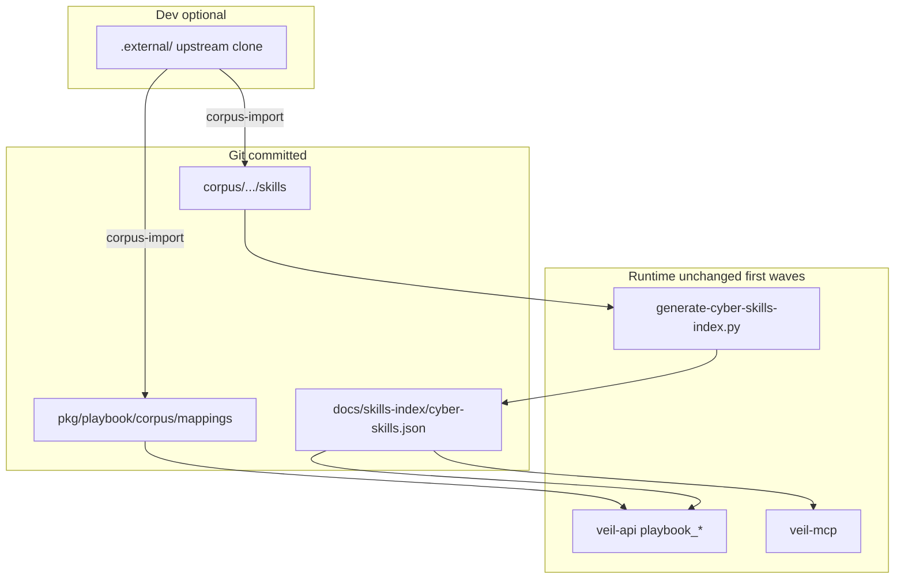

# Вендоринг Anthropic Cybersecurity Skills + домен mappings

## Контекст и цель

Сейчас operational read-path уже есть ([`pkg/playbook`](pkg/playbook), [`docs/skills-index/cyber-skills.json`](docs/skills-index/cyber-skills.json), veil-api `playbook_*`), но тела skills и **mappings** живут в [`.external/`](.external/) (**gitignored**). CI и прод без локального clone не видят SKILL.md; `VEIL_REPO_ROOT` — обходной костыль при запуске API из `knowledge/serve`.

Вы выбрали **split layout**:

| Зона | Путь | Роль |
|------|------|------|
| **Veil SOT — домен / frameworks** | [`pkg/playbook/corpus/mappings/`](pkg/playbook/corpus/mappings/) | MITRE Navigator layer, NIST CSF / OWASP MD, coverage — **железобетон**, эволюционирует в нашем домене |
| **Upstream mirror — процедуры** | [`corpus/anthropic-cybersecurity-skills/skills/`](corpus/anthropic-cybersecurity-skills/skills/) | 754× `SKILL.md` (+ `references/`, `LICENSE` per skill) — read-only до рефакторинга |
| **Индекс (как сейчас)** | [`docs/skills-index/cyber-skills.json`](docs/skills-index/cyber-skills.json) | Генерируется; поле пути → `corpus_path` (или alias `external_path` на переходе) |

`.external/Anthropic-Cybersecurity-Skills-main/` остаётся **dev-only** источником для `make corpus-import` (rsync), не operational truth.



**Лицензия:** Apache-2.0 / per-skill frontmatter — достаточно [`corpus/anthropic-cybersecurity-skills/NOTICE.md`](corpus/anthropic-cybersecurity-skills/NOTICE.md) + [`pkg/playbook/corpus/ATTRIBUTION.md`](pkg/playbook/corpus/ATTRIBUTION.md) (upstream URL, commit/tag, дата импорта). Не менять текст skills в волнах 0–2.

---

## Мастер-план и параллельные ветки

Новый файл: [`.cursor/plans/cyber_corpus_vendor_master.plan.md`](.cursor/plans/cyber_corpus_vendor_master.plan.md) (таблица фаз / branch / status / owner). Старый [anthropic_skills_knowledge plan](.cursor/plans/anthropic_skills_knowledge_c05c1c9c.plan.md) **не редактировать** — в мастере ссылка «MCP read done → corpus vendor».

Дисциплина: [.cursor/rules/veil-agent-parallel-branches.mdc](.cursor/rules/veil-agent-parallel-branches.mdc) — **одна фаза = одна ветка**, merge в `main` перед зависимой фазой.

| Фаза | Ветка | LOC / риск | Зависимости |
|------|--------|------------|-------------|
| **V0** mappings SOT | `feat/playbook-v0-mappings-sot` | ~200 KB, 7+ MD/JSON | — |
| **V1** skills mirror + import | `feat/playbook-v1-corpus-skills` | ~45 MB tree | V0 merge (paths only) |
| **V2** path switch (no domain rewrite) | `feat/playbook-v2-corpus-paths` | ~50 LOC Go/py | V1 merge |
| **V3** framework domain types | `feat/pkg-playbook-framework` | ~150–250 LOC Go | V0 merge |
| **V4** mappings API + MCP | `feat/knowledge-framework-read` | ~200 LOC | V2 + V3 merge |
| **V5** graph alignment (optional) | `feat/knowledge-framework-graph` | ingest/query | V4 + ATT&CK in Neo4j |
| **V6** engage hints by subdomain (optional) | `engage/phase-corpus-domain-hints` | малый diff | V4 |

**Параллельно после merge V0:** V1 и V3 можно вести в разных ветках (разные каталоги). **V2 строго после V1.**

Субагенты: `knowledge-implementer` (V0–V2, V4–V5), `cleanup-implementer` или `platform-implementer` (скрипты/Makefile), `docs-only` после каждого merge ([veil-agent-documentation.mdc](.cursor/rules/veil-agent-documentation.mdc)).

---

## V0 — Mappings «железобетон» (первый PR)

**Цель:** зафиксировать структуру домена безопасности из upstream `mappings/` в репо.

**Скопировать (без правок содержимого):**

Из [`.external/.../mappings/`](.external/Anthropic-Cybersecurity-Skills-main/mappings/) → [`pkg/playbook/corpus/mappings/`](pkg/playbook/corpus/mappings/):

- `README.md`, `attack-navigator-layer.json`
- `mitre-attack/README.md`, `mitre-attack/coverage-summary.md`
- `nist-csf/README.md`, `nist-csf/csf-alignment.md`
- `owasp/README.md`

**Добавить Veil-only:**

- `pkg/playbook/corpus/ATTRIBUTION.md` — upstream, license, импорт
- `pkg/playbook/corpus/VERSION` — upstream git SHA / release tag (ручной или из `corpus-import`)
- `pkg/playbook/corpus/README.md` — как читать mappings; связь с Veil categories (`playbook`, `mitre`, `detection`)
- `docs/cyber-domain-model.md` — **наш** обзор: subdomain ↔ CSF ↔ ATT&CK; ссылки только на committed paths (не `.external`)

**DoD:**

- `test -f pkg/playbook/corpus/mappings/attack-navigator-layer.json`
- `make check-corpus-mappings` (новый target: checksum или `jq` schema smoke)
- Critic: нет изменений в `engage/serve/catalog`, нет правок SKILL.md

---

## V1 — Skills mirror + import script

**Цель:** все `SKILL.md` в git; CI не зависит от `.external/`.

**Скопировать:**

- `.external/.../skills/**` → [`corpus/anthropic-cybersecurity-skills/skills/`](corpus/anthropic-cybersecurity-skills/skills/) (сохранить `references/`, per-skill `LICENSE`, `scripts/` как есть)
- [`corpus/anthropic-cybersecurity-skills/NOTICE.md`](corpus/anthropic-cybersecurity-skills/NOTICE.md) — краткая атрибуция + ссылка на `pkg/playbook/corpus/ATTRIBUTION.md`

**Скрипт (механика, без рефакторинга кода):**

[`scripts/knowledge/corpus-import.sh`](scripts/knowledge/corpus-import.sh):

```bash
# rsync from .external or CORPUS_SRC env
# --mappings → pkg/playbook/corpus/mappings/
# --skills   → corpus/anthropic-cybersecurity-skills/skills/
# writes pkg/playbook/corpus/VERSION
```

Makefile: `make corpus-import`, `make check-corpus-import` (опционально: сравнение file count 754).

**`.gitignore`:** не игнорировать `corpus/anthropic-cybersecurity-skills/` и `pkg/playbook/corpus/` (в отличие от `.external/`).

**DoD:** размер tree ~45 MB; `find corpus/.../skills -name SKILL.md | wc -l` ≈ 754; один commit «vendor skills mirror».

---

## V2 — Переключить пути (минимальный diff runtime)

**Без** переноса логики в новые пакеты — только defaults и docs.

| Файл | Изменение |
|------|-----------|
| [`scripts/knowledge/generate-cyber-skills-index.py`](scripts/knowledge/generate-cyber-skills-index.py) | `--corpus-skills` default `corpus/anthropic-cybersecurity-skills/skills`; `--mappings` default `pkg/playbook/corpus/mappings` (для будущего cross-check) |
| [`pkg/playbook/index/load.go`](pkg/playbook/index/load.go) | `DefaultSkillsRoot`, чтение body: `corpus/anthropic-cybersecurity-skills/skills/<id>/SKILL.md` |
| Index JSON | `corpus_path` + deprecated alias `external_path` на 1 релиз |
| [`docs/external-cybersecurity-skills.md`](docs/external-cybersecurity-skills.md) | operational paths; `.external` = dev import only |
| [`deploy/knowledge/compose.yml`](deploy/knowledge/compose.yml) | `VEIL_REPO_ROOT=/app` или mount `corpus/` + `pkg/playbook/corpus` в образ API |

`make skills-index && make check-skills-index` — green.

**DoD:** `curl localhost:8090/v1/playbooks/...` без `VEIL_REPO_ROOT` при cwd ≠ repo root (образ с WORKDIR=repo root).

---

## V3 — Домен Veil из mappings (pkg, без Neo4j)

Новый пакет рядом с [`pkg/playbook/domain`](pkg/playbook/domain):

[`pkg/playbook/framework/`](pkg/playbook/framework/) (имена уточнить в PR):

- `NavigatorLayer` — parse [`attack-navigator-layer.json`](pkg/playbook/corpus/mappings/attack-navigator-layer.json)
- `TechniqueCoverage` — technique id → score / skill count (из layer + coverage-summary)
- `SubdomainTaxonomy` — 26 subdomain из index + CSF tables из `nist-csf/*.md` (пока markdown → struct через лёгкий parser или hand-maintained JSON **generated** из MD в V3b)

Тесты: golden на 3–5 technique ids из layer; `go test ./pkg/playbook/...`.

**Принцип:** upstream MD остаётся source of truth для текста; Go types — для API/агентов.

---

## V4 — Read API для mappings (Knowledge)

Расширить veil-api / veil-mcp (малый diff):

| Endpoint / tool | Данные |
|-----------------|--------|
| `GET /v1/playbook/framework/mitre-layer` | raw или parsed Navigator layer |
| `GET /v1/playbook/framework/coverage` | coverage-summary stats |
| `playbook_subdomains` | список subdomain + counts из index |
| MCP `playbook_framework` | optional query `framework=mitre\|nist\|owasp` |

Не дублировать [`pkg/decision`](pkg/decision/) — framework = **онтология**, decision = **catalog tool**.

Docs: [`docs/mcp-agents.md`](docs/mcp-agents.md), [`docs/cyber-domain-model.md`](docs/cyber-domain-model.md).

---

## V5 — Граф (опционально, после V4)

- Seed из Navigator layer: усилить [`playbook_seed`](knowledge/ingest/cmd/playbook_seed) или отдельный `framework_seed` — рёбра `HAS_PLAYBOOK` + опционально `ALIGNS_TO_CSF`
- Сверка technique id с `AttackTechnique.id` (string external_id, как в текущем плане)
- `bump-graph-version.sh patch` при новых ingest paths ([AGENTS.md](AGENTS.md))

---

## V6+ — Постепенный рефакторинг в «наш домен» (долгий хвост)

Не одним PR:

1. **Документ** [`docs/cyber-domain-model.md`](docs/cyber-domain-model.md) — Veil naming для subdomain / tactic / engage category (таблица из плана anthropic § «Сопоставление»).
2. **Тонкие Veil SKILL.md** в [`.cursor/skills/cyber-playbooks/`](.cursor/skills/cyber-playbooks/) — ссылка на MCP `playbook_get`, не копия 754 файлов.
3. **Выборочный fork** hot skills (DFIR, IR) → `pkg/playbook/skills/<id>/SKILL.md` с пометкой `veil_derived: true` в frontmatter.
4. **Ingest NATS** — только если появится live upstream; иначе оставить batch import.

---

## Риски

| Риск | Митигация |
|------|-----------|
| +45 MB в git | Один раз V1; при необходимости Git LFS только для `corpus/.../skills` |
| Дрейф upstream | `VERSION` + `make corpus-import` + diff stat в CI |
| ATT&CK v14 (layer) vs v18 (STIX ingest) | Match по string `Txxxx`; документировать в `cyber-domain-model.md` |
| Дубль mappings/skills | Split layout: mappings только в `pkg/playbook/corpus/mappings/` |

---

## Definition of done (программа)

- [ ] `pkg/playbook/corpus/mappings/` в git с Navigator + NIST + OWASP MD
- [ ] `corpus/anthropic-cybersecurity-skills/skills/` в git (~754 SKILL.md)
- [ ] `make corpus-import` + attribution files
- [ ] Runtime читает из committed paths; CI `check-skills-index` без `.external`
- [ ] `pkg/playbook/framework` + read API (V3–V4)
- [ ] Мастер-план с ветками и merge discipline
- [ ] Engage catalog и hexstrike `.external` **без изменений**

---

## Рекомендуемый старт

1. Merge **V0** (mappings) — сразу «железобетон» для домена.
2. Параллельно после V0: **V1** (skills) + **V3** (Go types) в отдельных ветках.
3. **V2** после V1 — переключить API/index paths.
4. **V4** — agents получают framework + playbooks из одного контракта.

Оценка: **5–6 PR**, первые два — преимущественно copy + docs (<100 LOC Go).
