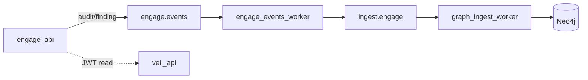

# Документация, agent-workflow и commit/push Phase 13

## Текущее состояние

- **Код Phase 12–13 уже в рабочем дереве**, но **не закоммичен** (последний коммит: `08834bb feat(engage): fourth layer...`).
- Документация частично обновлена в прошлой сессии ([docs/engage-runtime.md](docs/engage-runtime.md), [pipeline/README.md](pipeline/README.md), greenfield plan), но **корневой [README.md](README.md)**, **[engage/README.md](engage/README.md)**, **[AGENTS.md](AGENTS.md)**, **[docs/coding-style.md](docs/coding-style.md)**, **[docs/ingest-contract.md](docs/ingest-contract.md)** и **[.cursor/rules/veil-agent-workflow.mdc](.cursor/rules/veil-agent-workflow.mdc)** не отражают полный bus и чеклисты агента.
- **[versions.env](versions.env)**: `APP_VERSION=0.4.3`, `GRAPH_PACK_VERSION=v0.4.3` — согласовано с engage graph ingest.



## 1. Обновить корневой README

Файл: [README.md](README.md)

| Секция | Изменение |
|--------|-----------|
| Architecture mermaid | Добавить опциональную ветку: `engage-api` → `engage.events.*` → `engage-events-worker` → `ingest.engage.*` → `ingest_worker` (пунктир, «when NATS enabled») |
| Pipeline row | Упомянуть `pipeline/engage-events` bridge |
| Graph pack | Указать текущий pack **v0.4.3** (из `versions.env`) |
| Engage quick start | Пример overlay: `compose.events.yml`, `make test-engage-events-pipeline` |
| Tests | Добавить `make test-engage-events-pipeline`, `make test-engage-compose` в блок тестов |

## 2. Обновить engage README

Файл: [engage/README.md](engage/README.md)

- Исправить «Five default enabled tools» → **11 tools** в [tools.live.yaml](engage/serve/catalog/tools.live.yaml).
- Новая секция **Events bus (Phase 13)**: `ENGAGE_EVENTS_NATS_ENABLED`, subjects `engage.events.audit` / `engage.events.finding`, [deploy/engage/compose.events.yml](deploy/engage/compose.events.yml), [pipeline/engage-events/](pipeline/engage-events/), `make test-engage-events-pipeline`, profile `graph-ingest`.
- Ссылка на [docs/engage-runtime.md](docs/engage-runtime.md#events-bus-e2e-nats--ingest).

## 3. Обновить ingest-contract и schemas

Файлы: [docs/ingest-contract.md](docs/ingest-contract.md), [docs/schemas/commit-envelope.json](docs/schemas/commit-envelope.json) (если есть enum `kind` / `source`)

Добавить секцию **engage (cross-layer, optional)**:

- Stream `ENGAGE_EVENTS` / subjects `engage.events.>`
- Bridge: [pipeline/connector/nats/engage_consumer.go](pipeline/connector/nats/engage_consumer.go) → `ingest.engage.tool_run`, `ingest.engage.finding`
- Kinds: `engage_tool_run`, `engage_finding`; source `engage`; payloads в [pkg/commit/envelope.go](pkg/commit/envelope.go)
- Graph: [graph/ingest/internal/sources/engage/](graph/ingest/internal/sources/engage/) → labels `EngageToolRun`, `EngageFinding`, `EngageTarget`

Соответствует правилу AGENTS: при изменении `pkg/commit` — обновить schemas в том же PR.

## 4. Исправить coding-style (engage + NATS)

Файл: [docs/coding-style.md](docs/coding-style.md)

Строка 45 сейчас неверна: `Engage | — (HTTP to veil-api only)`.

Заменить на:

- **NATS (optional):** publish `engage.events.>` when `ENGAGE_EVENTS_NATS_ENABLED=1`; **no** direct `ingest.>` publish from engage — только через [pipeline/engage-events](pipeline/engage-events/).
- **Must not:** Bolt, `scrape.>`, cross-layer Go imports (без изменений).

## 5. Обновить AGENTS.md и veil-agent-workflow

**[AGENTS.md](AGENTS.md)** — в End-of-task checklist:

- При правках `engage/.../events`, `pipeline/engage-events`, `graph/ingest/.../engage`: `make test-engage` + `make test-pipeline` + `make test-graph`; опционально `make test-engage-events-pipeline` (docker).
- Явно: engage ingest kinds → `bump-graph-version` + `make check-graph-version` (уже есть для ingest paths).

**[.cursor/rules/veil-agent-workflow.mdc](.cursor/rules/veil-agent-workflow.mdc)** — синхронно с AGENTS:

- Добавить `make test-engage` в список layer tests.
- Уточнить: cross-layer **integration** только NATS + HTTP; engage **не** импортирует pipeline/graph.
- Сохранить: **не коммитить** `.cursor/plans/`, `data/`, secrets.

## 6. Мелкие doc touch-ups (по необходимости)

- [graph/README.md](graph/README.md) — одна строка про `SourceEngage` ingest module.
- [deploy/README.md](deploy/README.md) — `compose.events.yml` + profile `graph-ingest` (если ещё нет в таблице engage overlays).

**Не редактировать:** [.cursor/plans/engage_phase_13_3c4af607.plan.md](.cursor/plans/engage_phase_13_3c4af607.plan.md) (по вашему требованию).

## 7. Pre-commit verification

```bash
make test-engage
make test-pipeline
make test-graph
make check-graph-version
```

## 8. Git: stage all → commit → push

Исключения (по [veil-agent-workflow.mdc](.cursor/rules/veil-agent-workflow.mdc)):

- `.cursor/plans/` — **не в коммит**
- `data/` — **не в коммит** (permission issues)
- `scripts/engage/__pycache__/` — **не в коммит**

Команды:

```bash
git add -A -- . ':!.cursor/plans' ':!data' ':!scripts/engage/__pycache__'
git status   # sanity check
git commit -m "$(cat <<'EOF'
feat(engage): Phase 12–13 bus, graph ingest, and CI smokes

Close engage→pipeline→graph loop: engage.events bridge, EngageToolRun/
EngageFinding Neo4j ingest, findings from smart-scan, expanded live
catalog and events e2e smoke. Bump graph pack to v0.4.3.

EOF
)"
git push -u origin HEAD
```

Если `check-graph-version` или pre-commit hook упадёт — исправить и **новый** коммит (не amend), если hook не менял файлы после успешного commit.

## Итог для пользователя

После approve: один атомарный push с кодом Phase 12–13 + обновлённой документацией; README и agent-workflow описывают полный Veil loop и правила коммита для будущих агентов.
