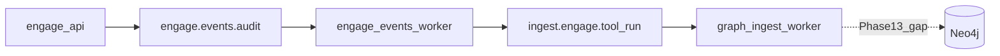

# Engage Phase 13 — Graph ingest, bus e2e, execution scale

## Контекст

[Phase 12](.cursor/plans/engage_phase_12.plan.md) (R57–R62) закрыла playbooks run, MCP/graph intelligence, `ExecuteAttackChain`, Postgres audit read, `ENGAGE_PDF_ENGINE`, pipeline [`engage-events-worker`](pipeline/engage-events/cmd/worker).

**Критический разрыв в стеке:** [`engage_consumer.go`](pipeline/connector/nats/engage_consumer.go) публикует `commit.Envelope` с `SourceEngage` / `KindEngageToolRun` на `ingest.engage.tool_run`, но [`graph/ingest/internal/ingest/consumer.go`](graph/ingest/internal/ingest/consumer.go) не имеет ветки для `SourceEngage` — сообщения попадают в `default: unknown kind` и **молча ack без записи в Neo4j**.

**Не редактировать:** [engage_phase_10.plan.md](.cursor/plans/engage_phase_10.plan.md), [engage_phase_11_audit_06020c9c.plan.md](.cursor/plans/engage_phase_11_audit_06020c9c.plan.md), [engage_phase_12_c80ea11e.plan.md](.cursor/plans/engage_phase_12_c80ea11e.plan.md).

---

## Releases (R63–R69)

### R63 — Graph ingest для engage tool runs (приоритет #1)

**Цель:** `KindEngageToolRun` персистится в Neo4j; engage-сканы видны в графе рядом с TI/vuln.

| Deliverable | Детали |
|-------------|--------|
| Ingest module | `graph/ingest/internal/sources/engage/` — `envelope/setup.go`, `apply.go`, `storage/neo4j.go` |
| Schema | MERGE `(:EngageToolRun {id})` + optional `(:Host\|Target {name})-[:ENGAGE_RAN]->(:EngageToolRun)`; поля: tool, target, subject, success, at |
| Router | В [`consumer.go`](graph/ingest/internal/ingest/consumer.go): `case commit.SourceEngage:` → `rt.Apply.Engage`; в `validateEnvelopeSource` — case для `KindEngageToolRun` |
| Components | `DomainAppliers.Engage` в [`components.go`](graph/ingest/internal/components/components.go) |
| Wire | Использовать существующий [`EngageToolRunPayload`](pkg/commit/envelope.go) |
| Version | `./scripts/release/bump-graph-version.sh patch` + cypher в graph pack при новых labels |
| Tests | Unit test apply + опционально ingest consumer test с mock Neo4j |

**Out of scope Phase 13:** veil-api read API для engage nodes (Phase 14).

---

### R64 — Events bus e2e (закрытие R58 по качеству)

**Цель:** Smoke доказывает end-to-end, а не только «compose healthy».

| Deliverable | Детали |
|-------------|--------|
| [`smoke-engage-events-pipeline.sh`](scripts/test/smoke-engage-events-pipeline.sh) | После tool run: `nats stream view` / JetStream API — ≥1 msg на `ingest.engage.tool_run`; опционально с `graph-ingest` в compose и проверка Neo4j node count |
| Compose | [`compose.events.yml`](deploy/engage/compose.events.yml) — optional profile `graph-ingest` + shared Neo4j |
| CI | Job `engage-events-e2e` в [`.github/workflows/engage.yml`](.github/workflows/engage.yml) (continue-on-error только если docker недоступен) |
| Makefile | `make test-engage-events-pipeline` уже есть — задокументировать в [engage-runtime.md](docs/engage-runtime.md) |

---

### R65 — Catalog execution breadth (завершение R62)

**Цель:** API-audit и agent tools реально исполняются в CI, не только по PATH в lab.

| Deliverable | Детали |
|-------------|--------|
| [`tools.live.yaml`](engage/serve/catalog/tools.live.yaml) | +5–8 enabled: `api_fuzzer`, `api_schema_analyzer`, `jwt_analyzer`, `graphql_scanner`, `ffuf`, `arjun` (minimal args) |
| CI | Расширить [`smoke-engage-tool-matrix.sh`](scripts/test/smoke-engage-tool-matrix.sh) или matrix в engage.yml |
| Parity | В [`check-catalog-parity.sh`](scripts/engage/check-catalog-parity.sh) — optional assert: intelligence bridge tool names ⊆ catalog |

---

### R66 — Audit webhook CI

**Цель:** Закрыть пункт Phase 10/11 «webhook smoke в CI».

| Deliverable | Детали |
|-------------|--------|
| Test | `httptest` mock server в engage unit/integration test: `POST /api/audit/export-webhook` → 200, HMAC header при secret |
| CI | Step в engage.yml (быстрый, без docker) |

---

### R67 — Findings → ingest bus (optional, high value)

**Цель:** Smart-scan / assessment findings попадают в граф, не только audit metadata.

| Deliverable | Детали |
|-------------|--------|
| Wire | `KindEngageFinding` + `EngageFindingPayload` в [`pkg/commit`](pkg/commit/) |
| Engage | После `SmartScan` / `AssessmentReport` — publish на `engage.events.finding` (или тот же stream, другой subject) |
| Pipeline | Расширить consumer или второй handler → `ingest.engage.finding` |
| Graph | MERGE `(:EngageFinding)` linked to Host; severity, title, tool |

**Минимальный слайс:** publish + ingest apply без сложной корреляции с CVE nodes.

---

### R68 — Agent UX polish

| Item | Детали |
|------|--------|
| `ai_generate_payload` / `ai_generate_attack_suite` | MCP bridge → [`payloads`](engage/serve/internal/usecase/payloads/) generate API (deterministic, document «not LLM») |
| `format_tool_output_visual` | Structured JSON summary (findings count, severity breakdown) вместо HexStrike ANSI |
| Pattern params | Довести 15 legacy keys в [`patterns.go`](engage/serve/internal/usecase/intelligence/patterns.go) до HexStrike-level `Params` (частично сделано в R60; сверка с `.external`) |

---

## Порядок PR

1. **R63** — graph ingest (разблокирует ценность всего bus)
2. **R64** — events e2e smoke + CI
3. **R65** — catalog/CI matrix
4. **R66** — webhook CI
5. **R67** — findings ingest (если scope позволяет)
6. **R68** — agent polish

## Критерии готовности Phase 13

- Tool run с `ENGAGE_EVENTS_NATS_ENABLED=1` → node `EngageToolRun` в Neo4j (smoke или unit)
- `make test-engage` и `make test-graph` green; graph version bumped
- `smoke-engage-events-pipeline.sh` проверяет сообщение на ingest subject
- ≥10 tools в live/matrix smoke; webhook test в CI
- Создать [engage_phase_13.plan.md](.cursor/plans/engage_phase_13.plan.md); секция Phase 13 в [greenfield](.cursor/plans/engage_layer_greenfield_9d048eec.plan.md)

## Минимальный слайс

**R63 + R64 + R66** — полный bus + ops; R65/R67/R68 — Phase 13b или Phase 14.

## Осознанно out of scope

- LLM / HexStrike `IntelligentDecisionEngine` port
- 150 отдельных Go adapters
- veil-api `GET /v1/engage/*` read (Phase 14)
- Line-by-line Python parity
