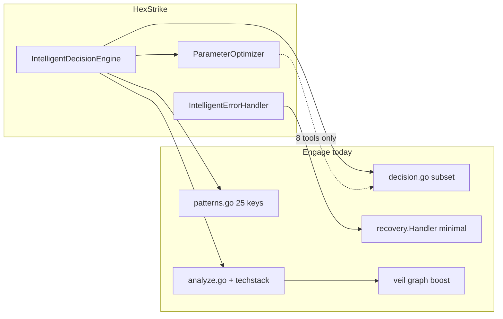
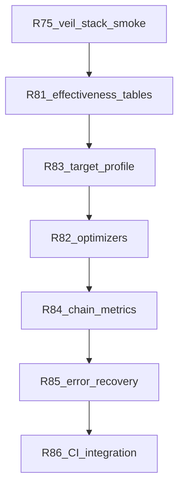

# Engage Phase 15 v2 — HexStrike engine port + Veil integration

## Почему кажется, что DecisionEngine «не портировали»

**Частично портировали**, но в планах и greenfield это называлось двусмысленно:

| Формулировка в планах | Что на самом деле |
|----------------------|-------------------|
| «R12 IntelligentDecisionEngine — не сделан» | В [greenfield](.cursor/plans/engage_layer_greenfield_9d048eec.plan.md) R12 остался **open**, хотя R19–R22 уже дали **subset** |
| «Out of scope: LLM / IntelligentDecisionEngine» | Имелось в виду **не** переносить весь монолит `hexstrike_server.py` (~17k LOC) и **не** добавлять LLM |
| «AI-powered» в README HexStrike | **Маркетинг**: в [`.external/hexstrike-ai-master/hexstrike_server.py`](.external/hexstrike-ai-master/hexstrike_server.py) L572–1545 **нет вызовов LLM** — только эвристики, таблицы, patterns |

Текущий Go-код **явно заявляет порт таблиц**:

```3:4:engage/serve/internal/usecase/intelligence/decision.go
// DecisionEngine scores tools per target type (port of HexStrike IntelligentDecisionEngine tables).
type DecisionEngine struct {
```

**Декомпозиция** `IntelligentDecisionEngine` (Python ~970 LOC класса + `ParameterOptimizer` + `IntelligentErrorHandler`):



**Стратегическое решение Phase 5–14:** «behavioral parity», не line-by-line — поэтому закрыли маршруты, patterns, MCP bridge, events bus, а **глубину engine** оставили в backlog (см. [engage_phase_5](.cursor/plans/engage_phase_5_a7b78921.plan.md) R22: «без full engine port»).

---

## Реальные пробелы vs HexStrike (после Phase 14)

| Компонент | HexStrike | Engage сейчас | Gap |
|-----------|-----------|---------------|-----|
| Effectiveness tables | 5 `TargetType` + **binary** (~20–30 tools/type) | 5 типов (`web/api/ip/cloud/unknown`), **~8–12 scores/type**, **нет `binary`** | Средний |
| `select_optimal_tools` | quick / comprehensive / stealth + **tech-specific** (wpscan, nikto) | `SelectTools` + stealth/comprehensive filters | Средний |
| `optimize_parameters` | 15+ `_optimize_*` + `optimize_parameters_advanced` (tech + profile) | 8 tools в [`decision.go`](engage/serve/internal/usecase/intelligence/decision.go) | **Высокий** |
| `analyze_target` | DNS, attack_surface_score, confidence formula | HTTP/DNS heuristics + veil; **нет attack_surface** | Средний |
| `create_attack_chain` | pattern + optimized params + **success_prob × confidence** + **time estimates** | patterns + `effectiveness_score`; params из pattern **без** `OptimizeParameters` на каждом шаге | Средний |
| `IntelligentErrorHandler` | 10+ error types, recovery strategies, backoff, history | [`recovery`](engage/serve/internal/usecase/recovery/handler.go) — 5 types, 6 alt tools | **Высокий** |
| Attack patterns | 15 named keys | **25** keys (≥ HexStrike) | OK |
| HTTP/MCP routes | 156 Flask routes | [engage-legacy-parity.md](docs/engage-legacy-parity.md) — в основном OK | Низкий |
| Infra | standalone :8888 | events → Neo4j; **нет единого lab smoke** veil+engage | **Интеграция** |

**Не редактировать:** [engage_phase_15_1fbc74b3.plan.md](.cursor/plans/engage_phase_15_1fbc74b3.plan.md) (оригинал с R76 publish).

**Вне scope v2 (по вашему выбору):** graph pack publish (R76), LLM-слой, line-by-line port 17k LOC Python.

---

## Цель Phase 15 v2

1. **Детерминированный полный паритет** `IntelligentDecisionEngine` + упрощённый, но поведенчески эквивалентный `ParameterOptimizer` + расширенный `IntelligentErrorHandler`.
2. **Интеграция с Veil:** один compose entrypoint, shared NATS, engage events → graph ingest, smoke/e2e на реальном стеке.
3. **Не публиковать** graph pack на GitHub.

---

## Releases (R75 + R81–R86)

### R75 — Veil + Engage lab stack (доделать, уже начато)

**Есть:** [`deploy/engage/compose.veil-stack.yml`](deploy/engage/compose.veil-stack.yml), [`scripts/ops/compose-up-veil-engage.sh`](scripts/ops/compose-up-veil-engage.sh).

**Доделать:**

| Deliverable | Детали |
|-------------|--------|
| Smoke | [`scripts/test/smoke-veil-engage-stack.sh`](scripts/test/smoke-veil-engage-stack.sh): `POST /api/tools/nmap` (или httpx) → events pipeline → `GET /v1/categories/engage/search?q=<host>` count ≥ 1 |
| Docs | [deploy/README.md](deploy/README.md), [docs/engage-runtime.md](docs/engage-runtime.md): **либо** `compose.events.yml` (standalone NATS), **либо** `compose.veil-stack.yml` — не оба одновременно |
| `make` target | `test-engage-veil-stack` → smoke script |

---

### R81 — Effectiveness tables + SelectTools parity

**Источник истины:** `_initialize_tool_effectiveness` (L581–667) в [hexstrike_server.py](.external/hexstrike-ai-master/hexstrike_server.py).

| Задача | Файлы |
|--------|-------|
| Извлечь таблицы в Go | Новый `engage/serve/internal/usecase/intelligence/effectiveness_gen.go` или JSON + `go:generate` скрипт [`scripts/engage/extract-decision-tables.py`](scripts/engage/extract-decision-tables.py) — **сверка с Python**, не ручной copy-paste |
| Target types | Маппинг: `NETWORK_HOST` → `ip`, `WEB_APPLICATION` → `web`, добавить **`binary`** (сейчас `detect.go` ставит `binary`, но [`decision.go`](engage/serve/internal/usecase/intelligence/decision.go) таблицы нет → fallback 0.5) |
| Tech-specific tools | Порт `select_optimal_tools` L994–1000: WordPress → wpscan, PHP → nikto — в [`analyze.go`](engage/serve/internal/usecase/intelligence/analyze.go) `SelectToolsForTarget` |
| Objectives | quick (top 3), comprehensive (>0.7), stealth — уже частично; **table-driven tests** против фикстур из Python |

**Критерий:** для каждого `targetType` из HexStrike ≥90% tool scores совпадают с legacy (допуск ±0.01).

---

### R82 — Parameter optimization (legacy + simplified advanced)

**Источник:** `_optimize_*_params` (L1070–1460) + subset `ParameterOptimizer.optimize_parameters_advanced` (L4702+) — **без** `performance_monitor` / resource tuning (не критично для паритета агентов).

| Задача | Детали |
|--------|--------|
| Per-tool optimizers | +12 tools: hydra, nmap-advanced, enum4linux-ng, autorecon, ghidra, pwntools, ropper, angr, prowler, scout-suite, kube-hunter, trivy, checkov — методы на `DecisionEngine` или `parameter.go` |
| Profile-aware | `OptimizeParameters(targetType, tool, params, profile TargetProfile)` — CMS/technologies влияют на nuclei templates, gobuster extensions |
| Wire в chain | [`CreateAttackChain`](engage/serve/internal/usecase/intelligence/analyze.go) / [`ExecuteAttackChain`](engage/serve/internal/usecase/intelligence/execute_chain.go): merge pattern params → `OptimizeParameters` перед run |
| MCP/API | `POST /api/intelligence/optimize-parameters` уже есть — расширить contract tests |

---

### R83 — TargetProfile + analyze_target parity

**Источник:** `analyze_target`, `_calculate_attack_surface`, `_calculate_confidence` (L811–969).

| Поле | Действие |
|------|----------|
| `attack_surface_score` | Формула из HexStrike (type base + tech + ports + cms) |
| `confidence_score` | Формула L955–968; veil graph hit → +boost (уже частично) |
| DNS resolve | `probeTarget` / resolver для web/api (как `_resolve_domain`) |
| Response | Расширить `AnalyzeTargetResponse` metadata **без breaking** HTTP (новые keys в `metadata`) |

**Интеграция Veil:** [`graphBoost`](engage/serve/internal/usecase/intelligence/analyze.go) — расширить boost map по категориям `vuln`/`ti`/`engage` (не только nuclei/trivy +0.1).

---

### R84 — Attack chain metrics

**Источник:** `create_attack_chain` L1506–1540.

| Поле step | Формула |
|-----------|---------|
| `success_probability` | `effectiveness[tool] * profile.confidence_score` |
| `execution_time_estimate` | Таблица `time_estimates` из L1516–1525 |
| Chain aggregate | `calculate_success_probability` — среднее по steps (как сейчас `successProb`, но с confidence) |
| `expected_outcome` | Строка `"Discover vulnerabilities using {tool}"` |

Тесты: golden JSON для `web` + `comprehensive` vs зафиксированный snapshot из Python (один раз extract script).

---

### R85 — IntelligentErrorHandler depth

**Источник:** L1606+ (~400 LOC core logic).

Расширить [`recovery/handler.go`](engage/serve/internal/usecase/recovery/handler.go):

| Capability | Минимум для parity |
|------------|-------------------|
| Error types | +network_unreachable, invalid_parameters, resource_exhausted, target_unreachable, parsing_error |
| Recovery | retry_with_backoff (cap 3), retry_with_reduced_scope (threads/timeout flags в params) |
| Alternatives | Расширить `tool_alternatives` из HexStrike `_initialize_tool_alternatives` |
| Wire | [`tools/run.go`](engage/serve/internal/usecase/tools/run.go) — уже вызывает recovery; добавить backoff retry loop (bounded) |

**Не в scope:** error history 1000 entries, human escalation webhook.

---

### R86 — Integration hardening (без pack publish)

| Задача | Детали |
|--------|--------|
| CI | [`.github/workflows/engage.yml`](.github/workflows/engage.yml): paths `graph/connector/**`, `graph/ingest/**`, `pipeline/**`; `engage-events-e2e` **required** (убрать `continue-on-error` где возможно) |
| Parity gate | [`scripts/engage/check-catalog-parity.sh`](scripts/engage/check-catalog-parity.sh) + новый `check-decision-parity.sh` (сравнение effectiveness JSON) |
| Runner | Документировать 15 live tools; matrix smoke для tools, участвующих в top effectiveness |
| Deferred из Phase 15 v1 | R77 target-timeline, R78 graph name lookup, R80 MAY_RELATE_TO traverse → **Phase 16** (read UX, не блокирует engine port) |

---

## Порядок работ (рекомендуемый)



**Параллельно после R81:** R75 smoke можно финализировать независимо.

---

## Definition of Done

- `make test-engage` green; новые table-driven tests для decision/chain/recovery.
- `make test-engage-veil-stack` (или documented manual): tool run → Neo4j engage category.
- Агент через MCP `analyze_target_intelligence` / `create_attack_chain_ai` получает **те же поля**, что HTTP API (intel bridge уже есть).
- [docs/engage-legacy-parity.md](docs/engage-legacy-parity.md): секция «DecisionEngine» — **full deterministic parity** (не «stub»).
- **Нет** release `veil-graph-v0.4.4` на GitHub.

---

## Риски

| Риск | Митигация |
|------|-----------|
| Drift таблиц Python ↔ Go | generate-from-source script + CI check |
| Enabled tools << catalog scores | `SelectTools` уже фильтрует `enabled`; документировать `tools.live.yaml` для lab |
| ParameterOptimizer «advanced» слишком тяжёлый | Порт только tech/CMS веток, без resource monitor |
| R75 WIP конфликт | Проверить `git status` перед стартом; не смешивать с pack publish |
