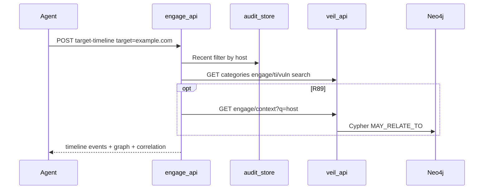
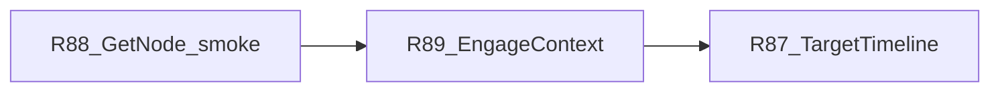

# Engage Phase 16 — Graph read UX (target timeline)

## Связь с мастер-планом

Срез из [engage_hexstrike_master](.cursor/plans/engage_hexstrike_master_7666e9b4.plan.md) (Phase 16). Переносит **R77–R80** из [engage_phase_15](.cursor/plans/engage/engage_phase_15_1fbc74b3.plan.md); **не** дублирует R76 (pack publish) и **не** трогает Phase 15 v2 (DecisionEngine — уже done).

**Предпосылки (уже в main):**
- Write path: `engage.events.*` → ingest → `EngageToolRun` / `EngageFinding` / `EngageTarget` ([ingest-contract.md](docs/ingest-contract.md))
- Read path: veil-api category `engage` ([categories.go](graph/connector/query/categories.go))
- Ingest CVE link: `(EngageFinding)-[:MAY_RELATE_TO]->(Vulnerability)` ([neo4j.go](graph/ingest/internal/sources/engage/storage/neo4j.go) L80–84)
- Veil stack smoke: [smoke-veil-engage-stack.sh](scripts/test/smoke-veil-engage-stack.sh) (Phase 15 v2 R75)
- `correlate_threat_intelligence` в [graph_intel.go](engage/serve/internal/usecase/intelligence/graph_intel.go)



---

## Проблема

Агент после скана должен спросить «что по `example.com`?» **без** `elementId` и без трёх отдельных вызовов (`/api/audit/recent`, `correlate-threat`, `GET /v1/categories/engage/search`).

| Gap | Сейчас |
|-----|--------|
| Единый timeline API | Нет |
| `GetNode("example.com")` | [service.go](graph/connector/query/service.go) L171 — только `elementId`, `id`, `cve`, `uri`, `link`; **нет `EngageTarget.name`** |
| CVE на read | Ingest пишет `MAY_RELATE_TO`; read search **не** отдаёт связанные `Vulnerability` |
| MCP | Нет `target_timeline` в [intel_bridge.go](engage/serve/internal/transport/mcpserver/intel_bridge.go) |

---

## Releases R87–R89

### R87 — Target timeline API (engage)

**Цель:** один HTTP/MCP ответ = audit + graph + correlation.

| Deliverable | Детали |
|-------------|--------|
| Usecase | Новый [`engage/serve/internal/usecase/intelligence/target_timeline.go`](engage/serve/internal/usecase/intelligence/target_timeline.go): `TargetTimeline(ctx, TargetTimelineRequest)` |
| Inject audit | Расширить [`intelligence.Service`](engage/serve/internal/usecase/intelligence/analyze.go): поле `Audit audit.Reader`; wire в [`components/api.go`](engage/serve/internal/components/api.go) из `AuditReader` |
| Секции ответа | `target`, `host` (normalized), `analysis` (light `AnalyzeTarget`), `audit_events[]` (filter `Event.Target` / host), `graph` (`ti`/`vuln`/`engage` search), `correlation` (reuse `CorrelateThreatIntelligence` summary), `timeline[]` (merged events: `at`, `source`, `kind`, `summary`) |
| HTTP | `POST /api/intelligence/target-timeline` body `{ "target", "limit?", "include_graph?" }`; опционально `GET ?target=&limit=` |
| Router | [`router.go`](engage/serve/internal/transport/httpserver/router.go) рядом с `correlate-threat` |
| MCP | [`intel_bridge.go`](engage/serve/internal/transport/mcpserver/intel_bridge.go): case `target_timeline_intelligence` (и/или catalog alias); [`check-catalog-parity.sh`](scripts/engage/check-catalog-parity.sh) bridge set |
| Contract | Опционально тип в [`pkg/engage/contract`](pkg/engage/contract/) для стабильного JSON |
| Tests | `target_timeline_test.go`: mock `Veil` + in-memory audit; router test 200 |

**Поведение timeline merge:**
1. Audit events с matching host (substring / normalized host из `graphSearchQuery`)
2. Graph hits: парсить `engage` search items если структура позволяет; иначе raw blocks в `graph.engage`
3. R89: append `cve_links[]` на finding events

**Не в scope R87:** отдельный microservice `engage-read`; изменение ingest schema.

---

### R88 — EngageTarget lookup + graph smoke

**Цель:** `GET /v1/nodes/{id}` и neighbors работают с hostname.

| Deliverable | Детали |
|-------------|--------|
| Cypher | В [`GetNode`](graph/connector/query/service.go) и [`Neighbors`](graph/connector/query/service.go) seed clause добавить: `OR (n:EngageTarget AND n.name = $id)` |
| Tests | `graph/connector/query/service_test.go` или `graph/serve` integration: node by name после ingest fixture |
| Smoke | Новый [`scripts/test/smoke-graph-engage-category.sh`](scripts/test/smoke-graph-engage-category.sh): categories list contains `engage`; search `q=example.com` 200; optional GetNode by hostname |
| Makefile | `test-graph-engage-category` → smoke script |
| Docs | [docs/mcp-agents.md](docs/mcp-agents.md): пример `ti_search_in_category` + `GET /v1/nodes/example.com` для EngageTarget; [engage-legacy-parity.md](docs/engage-legacy-parity.md) строка target-timeline |

**veilgraph client (минимум для R89):** [`client.go`](engage/serve/internal/client/veilgraph/client.go) — `GetNode(ctx, id)`, `Neighbors(ctx, id, depth)` → `/v1/nodes/{id}`, `/v1/nodes/{id}/neighbors`.

---

### R89 — MAY_RELATE_TO read enrichment

**Цель:** timeline/correlate показывают связанные CVE nodes, не только текст в finding title.

**Подход (KISS, graph owns Cypher):**

| Layer | Deliverable |
|-------|-------------|
| Connector | [`graph/connector/query/engage_context.go`](graph/connector/query/engage_context.go): `EngageTargetContext(ctx, host)` — один read Cypher |

```cypher
MATCH (t:EngageTarget {name: $host})
OPTIONAL MATCH (t)-[:ENGAGE_RAN]->(r:EngageToolRun)
OPTIONAL MATCH (t)-[:ENGAGE_FOUND]->(f:EngageFinding)
OPTIONAL MATCH (f)-[:MAY_RELATE_TO]->(v:Vulnerability)
RETURN t, collect(DISTINCT r), collect(DISTINCT f), collect(DISTINCT v)
```

| veil-api | `GET /v1/categories/engage/context?q={host}` в [graph/serve router](graph/serve/internal/transport/httpserver/router.go) |
| veilgraph | `EngageContext(ctx, host)` |
| engage | `TargetTimeline` включает `engage_context` / `related_vulnerabilities[]` из ответа |
| correlate | Опционально: `CorrelateThreatIntelligence` добавляет `related_cves` из `EngageContext` когда `ENGAGE_VEIL_API_URL` set |

| Tests | Connector unit test с mock driver или testcontainers; engage test с mock JSON fixture |
| Ingest | **Без** изменения Cypher ingest; [cve_test.go](graph/ingest/internal/sources/engage/storage/cve_test.go) — только doc comment что read идёт через R89 |
| Graph pack | **Не bump** версии pack (read-only feature) |

**Fallback:** если `EngageContext` 404/empty — timeline всё равно отдаёт search + audit (degrade gracefully).

---

## Порядок PR



1. **R88** — разблокирует hostname lookup и veilgraph node API  
2. **R89** — structured CVE links  
3. **R87** — агрегирующий endpoint + MCP  

---

## Hardening и codestyle

| Rule | Применение |
|------|------------|
| [coding-style.md](docs/coding-style.md) | engage: usecase в `intelligence/`; graph: Cypher только в `graph/connector/query` |
| No Neo4j in engage | Только `veilgraph.Client` HTTP |
| Auth | Timeline routes под тем же JWT/RBAC что `correlate-threat` |
| Limits | `limit` default 50, cap 200; veil search limit согласовать с connector |

---

## Definition of Done

- `POST /api/intelligence/target-timeline` с `target=example.com` возвращает `audit_events`, `graph`, `correlation`, `timeline` (non-empty после smoke tool run + ingest)
- MCP `tools/call` `target_timeline_intelligence` → тот же payload
- `GET /v1/nodes/example.com` резолвит `EngageTarget` (после ingest)
- `GET /v1/categories/engage/context?q=example.com` возвращает findings + optional `Vulnerability` nodes
- `make test-engage`, `make test-graph-serve` green; `make test-graph-engage-category` (new) green
- `make test-engage-veil-stack` документирован в [engage-runtime.md](docs/engage-runtime.md) как e2e для Phase 16
- [engage-legacy-parity.md](docs/engage-legacy-parity.md) + [mcp-agents.md](docs/mcp-agents.md) обновлены

---

## Out of scope (Phase 16)

- Graph pack publish (R76)
- CTF / Bug Bounty phased workflows (Phase 17–18)
- Batch enrichment engine / FP metrics (Phase 22)
- Отдельный namespace `/v1/engage/*` вне categories (осознанно остаёмся на `categories/engage`)
- LLM summarization of timeline

---

## После Phase 16

Мастер-план: **Phase 17 (CTF)** — крупнейший функциональный пробел; Phase 16 разблокирует agent workflow «scan → read timeline» для всех последующих фаз.
