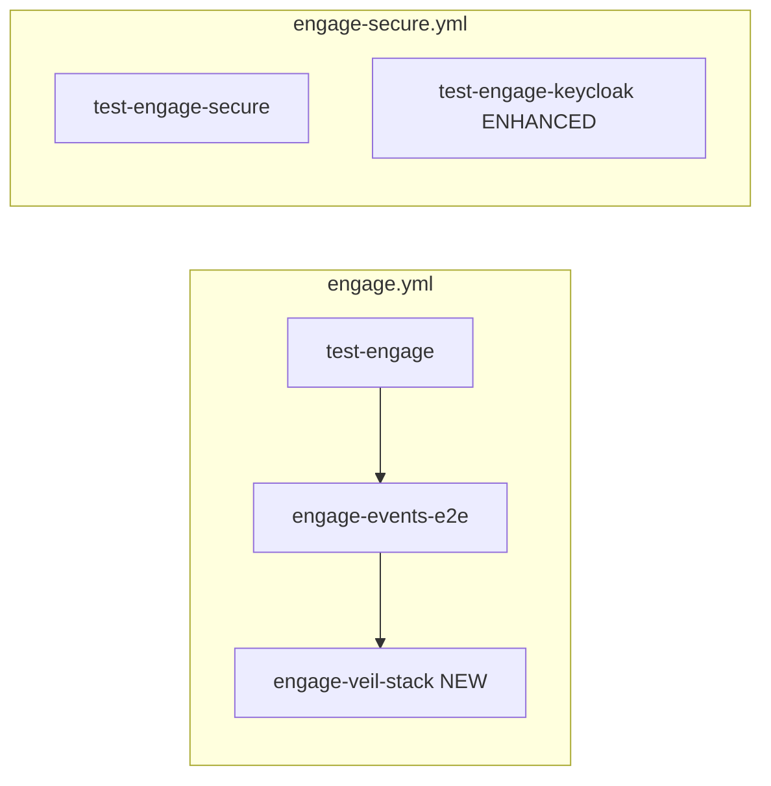

# Engage Phase 23 — Production hardening & full-stack CI

## Контекст (из [мастер-плана](.cursor/plans/engage_hexstrike_master_7666e9b4.plan.md))

| ID | Deliverable | Статус сейчас |
|----|-------------|---------------|
| **R117** | `make test-engage-veil-stack` в CI (Docker, profile veil-stack) | Target есть ([`Makefile`](Makefile) L112–114), smoke [`smoke-veil-engage-stack.sh`](scripts/test/smoke-veil-engage-stack.sh) — **SKIP без поднятого стека**; в [`.github/workflows/engage.yml`](.github/workflows/engage.yml) **нет** job |
| **R118** | Keycloak required path; deny `ENGAGE_ALLOW_RAW_COMMAND` в secure | [`smoke-engage-keycloak.sh`](scripts/test/smoke-engage-keycloak.sh) — только health; [`command/runner.go`](engage/serve/internal/usecase/command/runner.go) читает env напрямую; [`secure-engage.env`](deploy/profiles/secure-engage.env) без явного запрета raw |
| **R119** | Graph pack bump только при ingest schema change | [`check-graph-version-bump.sh`](scripts/release/check-graph-version-bump.sh) + [`make check-graph-version`](Makefile) — **не в CI** |
| **R120** | Greenfield appendix Phase 16–23; закрыть R2–R6 | [`engage_layer_greenfield_9d048eec.plan.md`](.cursor/plans/engage_layer_greenfield_9d048eec.plan.md) останавливается на Phase 14; R2–R6 помечены «частично» |

**Прецедент:** Phase 22 (pool, parsers, benchmark) — done; Phase 9 R44 — nightly [`engage-secure.yml`](.github/workflows/engage-secure.yml).



---

## Scope (R117–R120)

| ID | Ключевые файлы |
|----|----------------|
| **R117** | [`scripts/test/smoke-veil-engage-stack-ci.sh`](scripts/test/smoke-veil-engage-stack-ci.sh) (new), [`.github/workflows/engage.yml`](.github/workflows/engage.yml), [`deploy/engage/compose.veil-stack.yml`](deploy/engage/compose.veil-stack.yml) |
| **R118** | [`config/security.go`](engage/serve/internal/config/security.go), [`command/runner.go`](engage/serve/internal/usecase/command/runner.go), [`components/api.go`](engage/serve/internal/components/api.go), [`deploy/profiles/secure-engage.env`](deploy/profiles/secure-engage.env), smoke scripts |
| **R119** | [`.github/workflows/engage.yml`](.github/workflows/engage.yml) или graph workflow, [`docs/engage-runtime.md`](docs/engage-runtime.md), [`.cursor/rules/veil-ingest-graph-version.mdc`](.cursor/rules/veil-ingest-graph-version.mdc) |
| **R120** | [`.cursor/plans/engage_layer_greenfield_9d048eec.plan.md`](.cursor/plans/engage_layer_greenfield_9d048eec.plan.md), [`docs/engage-legacy-parity.md`](docs/engage-legacy-parity.md) |

**Не в scope:** публикация graph pack на GitHub; правки `.external/`; обязательный benchmark в PR CI (остаётся `make test-engage-benchmark` локально/nightly).

---

## R117 — veil-stack CI

### Проблема

[`smoke-veil-engage-stack.sh`](scripts/test/smoke-veil-engage-stack.sh) предполагает ручной [`compose-up-veil-engage.sh`](scripts/ops/compose-up-veil-engage.sh) (полный Veil stack) — в CI стек не поднимается → всегда SKIP.

### Решение

1. **Новый self-contained smoke** `scripts/test/smoke-veil-engage-stack-ci.sh`:
   - `COMPOSE_FILES` = scrape + pipeline + graph + `deploy/engage/compose.yml` + `compose.veil-stack.yml` (как в ops script)
   - Env: `GRAPH_PACK_SKIP=1`, `SMOKE_VEIL_ENGAGE_WAIT_SEC=180` (быстрее bootstrap)
   - `compose up -d` минимум: `nats`, `neo4j`, `ingest_worker`, `api`, `engage-api`, `engage-events-worker` (без scrape workers)
   - Повторить логику smoke: tool run → poll `GET /v1/categories/engage/search?q=...` на veil-api
   - `trap` cleanup `compose down -v`
   - SKIP только если нет docker (как другие smokes)

2. **Makefile** — опционально переключить `test-engage-veil-stack` на CI-скрипт или добавить `test-engage-veil-stack-ci` и вызывать его из CI.

3. **`.github/workflows/engage.yml`** — job `engage-veil-stack`:
   - `needs: engage-events-e2e` (ingest path уже green)
   - `timeout-minutes: 45`
   - `run: make test-engage-veil-stack-ci` (или env `ENGAGE_CI_VEIL_STACK=1` в существующем скрипте)
   - Path filters уже включают `smoke-veil-engage-stack.sh` — добавить новый скрипт

**Не комбинировать** `compose.events.yml` (standalone NATS) с `compose.veil-stack.yml` — см. [engage-runtime.md](docs/engage-runtime.md).

---

## R118 — Secure defaults & Keycloak path

### Deny raw command in secure/prod

1. Расширить [`SecurityConfig`](engage/serve/internal/config/security.go):

```go
AllowRawCommand bool // false when ENGAGE_ENV=prod or ENGAGE_DENY_RAW_COMMAND=1
```

   - `LoadSecurityForEnv`: `AllowRawCommand = envBool("ENGAGE_ALLOW_RAW_COMMAND", false) && !prod && !envBool("ENGAGE_DENY_RAW_COMMAND", false)`
   - [`deploy/profiles/secure-engage.env`](deploy/profiles/secure-engage.env): явно `ENGAGE_DENY_RAW_COMMAND=1` (или не задавать `ENGAGE_ALLOW_RAW_COMMAND`)

2. [`command.New`](engage/serve/internal/usecase/command/runner.go): принимать `allowRaw bool` из config, не читать `os.Getenv` напрямую.

3. [`components/api.go`](engage/serve/internal/components/api.go): `cmduc.New(exec, reg, cfg.Security.AllowRawCommand)`.

4. Unit test: `parseCommand` rejects non-catalog binary when `AllowRaw=false` даже если `ENGAGE_ALLOW_RAW_COMMAND=1` в env процесса (config wins).

### Keycloak required-path smoke

Усилить [`smoke-engage-keycloak.sh`](scripts/test/smoke-engage-keycloak.sh):

1. Дождаться Keycloak healthy + engage-api.
2. **Без токена:** `POST /api/jobs` или `GET /api/tools` → expect **401** (при `AUTH_ENABLED=1`).
3. **С токеном:** получить JWT (Keycloak master realm: password grant или documented lab client из [`docs/auth-keycloak.md`](docs/auth-keycloak.md)) → `GET /health` или `POST /api/jobs` → **200**.
4. Fail (не SKIP) если auth включён, но 401 не приходит без токена.

Опционально: вынести в `make test-engage-keycloak` и добавить в **weekly** workflow (рядом с `engage-secure.yml`) — не блокировать каждый PR из-за Keycloak startup time (~4 min).

### Secure overlay smoke extension

В [`smoke-engage-secure.sh`](scripts/test/smoke-engage-secure.sh) после TLS health:

- `POST /api/command` с `{"command":"id"}` (или другой non-catalog binary) → expect `success: false` и сообщение allowlist (при `ENGAGE_ENV=prod` из secure profile).

Документировать в [`docs/engage-runtime.md`](docs/engage-runtime.md) таблицу env:

| Variable | Lab | Secure (`compose.secure.yml`) |
|----------|-----|-------------------------------|
| `ENGAGE_ALLOW_RAW_COMMAND` | optional `1` | **ignored / denied** |
| `VEIL_REQUIRE_AUTH` | optional | `1` via profile |

---

## R119 — Graph pack version gate in CI

1. В [`.github/workflows/engage.yml`](.github/workflows/engage.yml) добавить step **после checkout** (или отдельный job):

```yaml
- name: Graph pack version bump check
  run: make check-graph-version
```

   - Скрипт уже сравнивает `graph/ingest`, `pkg/harvest`, `pkg/commit`, `docs/schemas` vs `versions.env`.
   - На PR base = `main`; fork PRs — document fallback `HEAD~1` (уже в скрипте).

2. Обновить [`docs/engage-runtime.md`](docs/engage-runtime.md) / [`CONTRIBUTING.md`](CONTRIBUTING.md): engage PRs, затрагивающие ingest, требуют `make bump-graph-patch` + `check-graph-version`.

3. **Не bump** `versions.env` в Phase 23, если ingest schema не менялась (R119 — процесс, не релиз pack).

---

## R120 — Greenfield appendix & R2–R6 closure

### Appendix в greenfield plan

Добавить секцию **«Phase 16–23 (HexStrike master parity)»** в [engage_layer_greenfield_9d048eec.plan.md](.cursor/plans/engage_layer_greenfield_9d048eec.plan.md):

| Phase | IDs | Status |
|-------|-----|--------|
| 16 Graph read UX | R87–R89 | done |
| 17 CTF | R90–R94 | done |
| 18 Bug Bounty | R95–R98 | done |
| 19 Tools breadth | R99–R104 | done (R104 optional shims) |
| 20 CVE | R105–R108 | done |
| 21 Browser/visual | R109–R112 | done |
| 22 Scale/benchmarks | R113–R116 | done |
| 23 Prod CI/hardening | R117–R120 | **this phase** |

Ссылка на детальные планы: `engage_phase_16` … `engage_phase_22`, новый `engage_phase_23`.

### Закрытие R2–R6 (category adapters)

Обновить блок «R2–R6 (исходная таблица)»:

| Original | Resolution |
|----------|------------|
| **R2–R5** Per-category Go packages (`internal/tools/{network,web,...}`) | **N/A** — заменено generic catalog runner + ARGS templates (Phase 4–19) |
| **R6** Full intelligence port in category packages | **Done** via `intelligence/` + MCP bridge (Phase 11–16) |
| **R104** Thin adapters | **Optional done** — stubs in [`engage/serve/internal/tools/{web,network,cloud}/`](engage/serve/internal/tools/) только где matrix требует; не 150 пакетов |

Обновить [`engage-pr6-category-go`](.cursor/plans/engage_layer_greenfield_9d048eec.plan.md) строку: `doc-only → closed as N/A (superseded by generic runner)`.

### Parity doc

[`docs/engage-legacy-parity.md`](docs/engage-legacy-parity.md): строка CI — `engage-veil-stack` job; secure raw command; ссылка на master DoD checklist.

---

## Tests (DoD)

| Test | Where |
|------|-------|
| `command` deny raw when prod | `command/runner_test.go` |
| Keycloak 401 without token | `smoke-engage-keycloak.sh` |
| Secure command rejected | `smoke-engage-secure.sh` |
| veil-stack e2e | `smoke-veil-engage-stack-ci.sh` + CI job |
| Graph version gate | `make check-graph-version` in CI |
| Regression | `make test-engage` green |

---

## PR order

1. **R118** — security config + command runner + secure env + smoke extensions
2. **R117** — veil-stack CI script + engage.yml job
3. **R119** — CI `check-graph-version` step + docs
4. **R120** — greenfield appendix + parity doc (docs-only PR acceptable last)

---

## Definition of Done

- CI job `engage-veil-stack` поднимает overlay и проходит search assert (не SKIP)
- `ENGAGE_ALLOW_RAW_COMMAND=1` **не** обходит allowlist при `ENGAGE_ENV=prod` / secure profile
- Keycloak smoke проверяет 401 без JWT и успех с JWT
- PR с изменениями ingest без bump `versions.env` падает на `check-graph-version`
- Greenfield plan содержит таблицу Phase 16–23; R2–R6 закрыты как N/A / R104 optional
- `make test-engage` green

---

## Зависимости

- **После:** Phase 22 (benchmark, parsers, `ENGAGE_MAX_PARALLEL`)
- **Закрывает:** мастер-план Phase 16–23 roadmap; Definition of Done veil-stack + secure deploy
