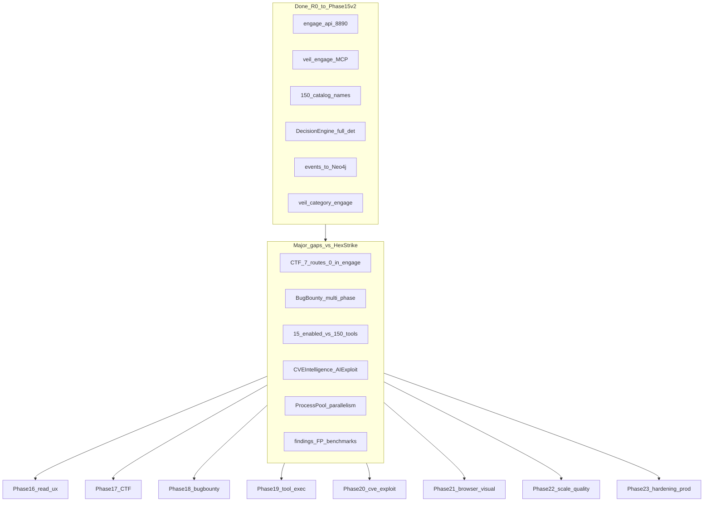
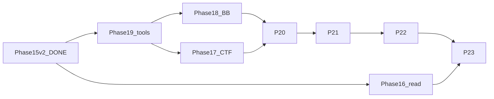

# Engage — мастер-план полного порта HexStrike на Go

## Контекст и цель

**Источник истины:** [`.external/hexstrike-ai-master/`](.external/hexstrike-ai-master/) (~17k LOC `hexstrike_server.py`, 151 MCP tools, 156 HTTP routes). **Целевая реализация:** [engage/](engage/) как четвёртый слой Veil ([greenfield](.cursor/plans/engage_layer_greenfield_9d048eec.plan.md)).

**Конечная цель:** повторить **уровень возможностей** HexStrike v6 (автоматизация, intelligence engine, workflows, отчёты, MCP/HTTP parity), а не line-by-line Python. Маркетинговые метрики README («98.7% detection», «24x faster») — **целевые KPI для бенчмарков**, не заявления «уже достигнуто»; в плане — отдельный трек измерений.

**Ограничения (сохраняем):**
- Не править `.external/`
- Нет cross-import между `scrape` / `pipeline` / `graph` / `engage`
- Graph только через `veil-api`; write path через NATS `engage.events.*` → `ingest.engage.*` ([docs/ingest-contract.md](docs/ingest-contract.md))
- Стиль: [docs/coding-style.md](docs/coding-style.md) (четвёртый runtime context), [docs/engage-runtime.md](docs/engage-runtime.md), [AGENTS.md](AGENTS.md)

---

## Что уже сделано (не терять в планировании)

### Greenfield R0–R74 (закрыто)

Сводка в [engage_layer_greenfield_9d048eec.plan.md](.cursor/plans/engage_layer_greenfield_9d048eec.plan.md): scaffold, `pkg/auth`, catalog 150 имён, generic runner + docker sandbox, jobs (memory/file/redis/nats), process API, intelligence HTTP routes, 25 attack patterns, MCP intel bridge, playbooks YAML, events bus + graph ingest + category `engage`, CI engage.yml.

### Phase 15 v2 (закрыто) — [engage_phase_15_v2](.cursor/plans/engage/engage_phase_15_v2_1a8c83ca.plan.md)

| Release | Результат |
|---------|-----------|
| R75 | [`compose.veil-stack.yml`](deploy/engage/compose.veil-stack.yml), [`smoke-veil-engage-stack.sh`](scripts/test/smoke-veil-engage-stack.sh), `make test-engage-veil-stack` |
| R81–R84 | Полные effectiveness tables + `binary`, [`parameter.go`](engage/serve/internal/usecase/intelligence/parameter.go), [`profile.go`](engage/serve/internal/usecase/intelligence/profile.go), chain metrics |
| R85 | Расширенный [`recovery`](engage/serve/internal/usecase/recovery/handler.go) + backoff в [`tools/run.go`](engage/serve/internal/usecase/tools/run.go) |
| R86 | `make test-engage-decision-parity`, required `engage-events-e2e`, CI paths graph/pipeline |

Документация: секция Decision engine в [docs/engage-legacy-parity.md](docs/engage-legacy-parity.md).

### Архитектурный выигрыш vs legacy

| HexStrike | Engage (Veil) |
|-----------|---------------|
| Python MCP + Flask :8888, no auth | Go `engage-api` :8890 + Keycloak RBAC |
| Монолит | Catalog + subprocess; events → Neo4j |
| Нет TI graph | `ENGAGE_VEIL_API_URL`, correlate, engage search |

---

## Матрица пробелов vs HexStrike (приоритет)

Легенда: **OK** ≈ behavioral parity; **Partial** — маршрут/имя есть, логика упрощена; **Missing** — нет в engage.

| Подсистема HexStrike | Engage сейчас | Gap | Фаза |
|----------------------|---------------|-----|------|
| **151 MCP tool names** | 158 catalog (151 legacy + 8 bridge); parity CI | **OK** | — |
| **Tool execution** | **80** `enabled` в [`tools.live.yaml`](engage/serve/catalog/tools.live.yaml); tier-1 runner image | **Partial** — не все 150 subprocess; strict matrix in runner CI | P19+audit |
| **IntelligentDecisionEngine** | R81–R84 done | **OK** (детерминированный) | — |
| **ParameterOptimizer advanced** | tech/CMS в `parameter.go` | **Partial** — no `performance_monitor` HTTP | Low |
| **IntelligentErrorHandler** | recovery + backoff + `/api/error-handling/*` diagnostics | **Partial** — no persistent history | Low |
| **BugBountyWorkflowManager** | 6× `/api/bugbounty/*` phased (`bugbounty/manager.go`) | **OK** (structural) | P18 done |
| **CTFWorkflowManager** | 7× `/api/ctf/*` + MCP `ctf_*` bridge | **OK** (structural) | P17 done |
| **CVEIntelligenceManager** | `/api/vuln-intel/*` + NVD + graph correlate | **OK** (no LLM) | P20 done |
| **AIExploitGenerator** | deterministic exploit templates only | **N/A** (no neural) | P20 |
| **AIPayloadGenerator** | `POST /api/payloads/generate` | **Partial** | P20 |
| **BrowserAgent** | sidecar + `browser_agent_inspect` | **Partial** vs full Python agent | P21 |
| **ProcessPool** | jobs + `GET /api/processes/dashboard`; legacy pool N/A | **Partial** | P22 |
| **Visual / dashboard** | JSON/PDF + scan-progress; no ANSI live UI | **Partial** (N/A ANSI) | P21 |
| **RateLimitDetector** | `ratelimit.go` + recovery classify | **Partial** | P22 |
| **TechnologyDetector** | `detect.go` + `techstack.go` + HTTP route | **Partial** | P19 |
| **Graph read UX** | target-timeline GET/POST + MCP bridge | **OK** | P16 done |
| **Hardening** | secure compose, `ENGAGE_DENY_RAW_COMMAND`, veil-stack CI | **OK** lab/CI | P23 done |

---

## Фазы 16–23 (рекомендуемый roadmap)

### Phase 16 — Graph read UX (отложено из Phase 15 v1)

**Цель:** agent-centric read без `elementId`.

| ID | Deliverable |
|----|-------------|
| R87 | `POST /api/intelligence/target-timeline` + MCP bridge |
| R88 | `EngageTarget` name lookup в graph connector |
| R89 | `MAY_RELATE_TO` traversal в correlate/timeline |

**DoD:** smoke на veil-stack; [docs/mcp-agents.md](docs/mcp-agents.md) workflow engage→read.

---

### Phase 17 — CTF subsystem (крупнейший функциональный пробел)

**Источник:** `CTFWorkflowManager`, `CTFToolManager`, `CTFChallengeAutomator`, `CTFTeamCoordinator` ([hexstrike_server.py](.external/hexstrike-ai-master/hexstrike_server.py) L2795+, routes L16116+).

| ID | Deliverable |
|----|-------------|
| R90 | `internal/usecase/ctf/` — category tools map (web/crypto/pwn/forensics/rev/misc/osint) из HexStrike |
| R91 | HTTP: `POST /api/ctf/create-challenge-workflow`, `auto-solve-challenge`, `suggest-tools`, `team-strategy` |
| R92 | `cryptography-solver`, `forensics-analyzer`, `binary-analyzer` — orchestration (catalog tools + heuristics, не magic AI) |
| R93 | MCP intel bridge + catalog category `ctf`; playbooks `playbooks/ctf.yaml` |
| R94 | Тесты: table-driven workflows; smoke 1 CTF web + 1 pwn path |

**DoD:** все 7 legacy CTF routes в [engage-legacy-parity.md](docs/engage-legacy-parity.md); agent может пройти «CTF web challenge» end-to-end.

---

### Phase 18 — Bug Bounty depth

**Проблема сейчас:** [`router.go`](engage/serve/internal/transport/httpserver/router.go) вызывает `RunWorkflow(name)` → для не-`comprehensive` это **generic** `SelectTools` + sequential run ([`workflow.go`](engage/serve/internal/usecase/intelligence/workflow.go)), а не phased workflow из `BugBountyWorkflowManager` (L2473+).

| ID | Deliverable |
|----|-------------|
| R95 | `internal/usecase/bugbounty/manager.go` — phased workflows: recon, vuln-hunt, osint, business-logic, file-upload, comprehensive |
| R96 | `high_impact_vulns` map → objectives + tool/payload hints (порт L2451–2460) |
| R97 | `RunWorkflow` / playbooks делегируют в manager; ответ с `phases[]`, `estimated_time`, `tools_count` как в HexStrike |
| R98 | Playbook run async + findings bus per phase |

**DoD:** `POST /api/bugbounty/reconnaissance-workflow` возвращает ≥4 phases с named tools; parity snapshot test vs Python structure.

---

### Phase 19 — Tool execution breadth (основа «24x faster»)

Без этого маркетинговая таблица README недостижима: автоматизация есть, но **инструменты не запускаются**.

| ID | Deliverable |
|----|-------------|
| R99 | Runner image: tier-1 tools (top effectiveness per type) — расширить [`engage-runner`](deploy/engage/) Dockerfile; документировать matrix в [docs/engage-tools.md](docs/engage-tools.md) |
| R100 | `tools.live.yaml` → 50+ enabled в lab; `enable-tools-on-path.sh` по категориям |
| R101 | ARGS_TEMPLATES: 150/150 non-generic или documented infer; `make catalog-engage` gate в CI |
| R102 | Per-tool smoke matrix: все tools с score ≥0.85 в effectiveness (best-effort skip) |
| R103 | Technology detection: HTTP body sample + header signatures (subset HexStrike `_initialize_technology_signatures`) |
| R104 | Optional: thin `internal/tools/{web,network,cloud,binary}/` adapters только где generic runner недостаточен (KISS — не 150 пакетов) |

**DoD:** CI matrix ≥30 green tools; subdomain enum path (amass+subfinder+httpx) <15 min в lab smoke.

---

### Phase 20 — CVE & exploit intelligence

| ID | Deliverable |
|----|-------------|
| R105 | `internal/usecase/cve/` — port subset `CVEIntelligenceManager` (lookup, exploit suggestions, tie to veil `vuln` category) |
| R106 | `AIExploitGenerator` → deterministic exploit **templates** + payload hints (без внешнего LLM) |
| R107 | Расширить `correlate_threat_intelligence` / `discover_attack_chains` CVE traversal |
| R108 | MCP: `cve_intelligence_*` tools → HTTP bridge |

---

### Phase 21 — Browser & visual engine

| ID | Deliverable |
|----|-------------|
| R109 | BrowserAgent parity: form extraction, screenshot, tech detect via Playwright ([`browser-agent`](engage/serve/cmd/browser-agent)) |
| R110 | `GET /api/processes/dashboard` enrich (live stats) |
| R111 | Visual: progress JSON for smart-scan/chain; optional SSE or poll endpoint |
| R112 | Report pipeline: executive summary section matching HexStrike assessment shape |

---

### Phase 22 — Scale, quality & benchmarks (Success Metrics)

**Цель:** измеримые KPI, не копирование README.

| KPI (из HexStrike README) | Как измерять в Veil |
|---------------------------|---------------------|
| Subdomain enum 5–10 min | scripted benchmark: `bugbounty-recon` on fixed lab target |
| Vuln scan 15–30 min | `smart-scan` comprehensive + timing in audit |
| Report 2–5 min | `assessment-report` latency |
| FP rate | findings dedup + manual labeled set (future) |

| ID | Deliverable |
|----|-------------|
| R113 | `ProcessPool` pattern: bounded worker pool for smart-scan/chain (NATS or in-process, cap `ENGAGE_MAX_PARALLEL`) |
| R114 | Findings parsers: nuclei/json, ffuf, sqlmap — structured `EngageFinding` severity |
| R115 | `scripts/benchmark/engage-hexstrike-parity.sh` — timing table output |
| R116 | Rate limit detection helper (optional pre-flight httpx) |

---

### Phase 23 — Production hardening & full-stack CI

| ID | Deliverable |
|----|-------------|
| R117 | `make test-engage-veil-stack` в CI (Docker job, profile veil-stack) |
| R118 | Keycloak required path smoke; deny `ENGAGE_ALLOW_RAW_COMMAND` in secure profile |
| R119 | Graph pack version bump only when ingest schema changes ([veil-ingest-graph-version.mdc](.cursor/rules/veil-ingest-graph-version.mdc)) |
| R120 | Greenfield plan appendix: Phase 16–23 table + close R2–R6 original «category adapters» as N/A or P19 R104 |

---

## Порядок выполнения

**Параллельно:** P16 (read) и P19 (tools) после P15v2; P17 и P18 после P19.

---

## Definition of Done (мастер-план)

Аудит 2026-05-16: [docs/engage-audit-report.md](docs/engage-audit-report.md).

- [x] [docs/engage-legacy-parity.md](docs/engage-legacy-parity.md): 156 HTTP routes — implemented / N/A (`make test-engage-route-parity`, [engage-route-parity.csv](docs/engage-route-parity.csv))
- [x] 151 MCP names + 8 bridge tools in catalog; parity CI green
- [x] CTF + Bug Bounty: структурный parity (phased workflows, HTTP + MCP bridge)
- [x] `make test-engage` + parity + decision-parity + catalog-args + route-parity green
- [x] events-e2e + veil-stack smoke — CI jobs `engage-events-e2e`, `engage-veil-stack` (Phase 24)
- [x] Benchmark script (`make test-engage-benchmark`) — regression when API up
- [x] Secure deploy documented; no secrets in catalog

## Вне scope (явно)

- Line-by-line port 17k LOC Python
- Обязательный LLM (опциональный трек Phase 24+ если понадобится)
- Публикация graph pack на GitHub без отдельного запроса
- Правки `.external/`

## Связанные документы

| Doc | Роль |
|-----|------|
| [docs/external-hexstrike.md](docs/external-hexstrike.md) | Reference-only architecture |
| [docs/engage-legacy-parity.md](docs/engage-legacy-parity.md) | Living checklist — обновлять каждую фазу |
| [docs/engage-tools.md](docs/engage-tools.md) | Catalog / ARGS / CI matrix |
| [docs/engage-reports.md](docs/engage-reports.md) | Reports |
| [docs/mcp-agents.md](docs/mcp-agents.md) | Dual MCP + cross-layer |
| [docs/coding-style.md](docs/coding-style.md) | Layering + engage constraints |
