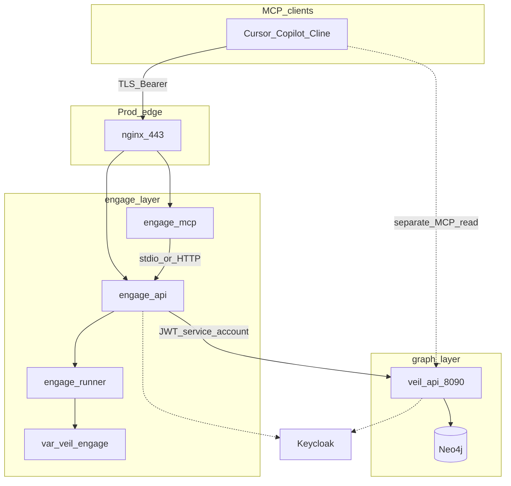

# Engage layer: greenfield Go + deploy (HexStrike parity)

## Архитектурное решение

Ваше ощущение верное: **pentest / discovery / отчёты / запуск tools** — это не `graph/serve` (read-only intel), а **отдельный runtime-контекст**, как scrape vs pipeline vs graph.

| Слой | Ответственность | MCP / API |
|------|----------------|-----------|-----------|
| scrape | Сбор сырья | — |
| pipeline | Нормализация | — |
| graph | Neo4j + read API/MCP | `veil-graph` (read) |
| **engage** (новый) | Исполнение tools, workflows, отчёты | `veil-engage` (exec) |



**Связь с графом (выбор):** engage **внутри** вызывает [veil-api](graph/serve/cmd/api) через [`engage/serve/internal/client/veilgraph`](engage/serve/internal/client/veilgraph) (client credentials / service account JWT, роль `veil-reader`). Агенты могут дополнительно держать dual MCP (`veil-graph` + `veil-engage`), но workflows не зависят от IDE-конфига.

**Стратегия «без diff, но всё переделано»:**

- Не трогать [`.external/hexstrike-ai-master/`](.external/hexstrike-ai-master/) — только спецификация.
- Новое дерево **`engage/`** + **`deploy/engage/`** + **`pkg/engage/`** — только additive commits.
- Не portить 22k строк Python построчно: **каталог возможностей** (YAML) + тонкие Go-адаптеры на категорию.
- Паритет 150+ tools — **под-релизы R0–R6** (вы выбрали parity).

---

## Repo layout (coding-style)

Следуем [docs/coding-style.md](docs/coding-style.md): `cmd/` = wiring, `internal/usecase`, `domain` без I/O, адаптеры снаружи.

```
engage/
  go.work
  README.md
  serve/                          # один Go module (как graph/serve)
    cmd/
      api/                        # REST + workflows + reports
      mcp/                        # veil-engage MCP (stdio + optional HTTP)
      worker/                     # long-running scan jobs (phase R3+)
    internal/
      components/                 # DI: auth, runner, veil client, registry
      config/
      domain/
        target/                   # TargetProfile, scope, rules of engagement
        job/                      # Job, Run, status
        report/                   # Finding, Report, severity
        tool/                     # ToolSpec, Result (no os/exec here)
      usecase/
        intelligence/             # analyze-target, select-tools, attack-chain
        workflow/                 # bugbounty/*, smart-scan
        report/                   # summary-report, vulnerability-card
        tools/                    # RunTool, ListTools
      transport/
        httpserver/               # /api/tools/*, /api/intelligence/*, /health
        mcpserver/                # reuse patterns from graph/serve
        securityhttp/
      runner/
        executor.go               # subprocess, timeout, cwd, env allowlist
        sandbox.go                # optional: firejail/docker exec hook
      tools/                      # по категориям HexStrike README
        registry.go               # RegisterAll, Lookup, ListByCategory
        network/                  # nmap, rustscan, masscan, …
        web/                      # nuclei, ffuf, httpx, …
        cloud/                    # prowler, trivy, scout-suite, …
        binary/                   # ghidra headless hooks, gdb, …
        auth/                     # hydra, hashcat, …
        osint/
        ctf/
        common/                   # shared arg builders, output parsers
      client/
        veilgraph/                # GET /v1/... with service JWT
      auth/                       # thin: roles engage-runner, engage-admin
    catalog/                      # generated tool manifests (YAML), not hand-edited per tool in Go
      tools.yaml                  # name, category, binary, arg template, timeout
pkg/
  engage/
    toolid/                       # stable tool IDs, categories enum
    contract/                     # JSON shapes for API/MCP (OpenAPI source)
  auth/                           # NEW: вынести Keycloak JWT+RBAC из graph/serve (DRY)
    keycloak/
    rbac/
deploy/
  engage/
    compose.yml
    compose.secure.yml
    docker/
      api.Dockerfile              # distroless
      mcp.Dockerfile
      runner.Dockerfile           # bookworm + security tools (heavy)
    profiles/
      secure-engage.env
docs/
  engage-runtime.md
  engage-tools.md                 # category matrix, parity checklist
  engage-hexstrike-parity.md      # mapping hexstrike route → engage route
```

**Правила слоя engage (добавить в coding-style / AGENTS):**

- Engage **не импортирует** `scrape/`, `pipeline/`, `graph/ingest`.
- Может импортировать `pkg/*`, `pkg/auth`, `pkg/engage/*`.
- Вызов Neo4j только через **HTTP veil-api**, не Bolt напрямую (граница ответственности).
- Каждый tool — один файл или пара `register.go` + `run_*.go` в категории; общий runner — DRY.

---

## Auth и RBAC (Keycloak)

Переиспользовать паттерн [graph/serve/internal/auth](graph/serve/internal/auth), вынести в [**`pkg/auth`**](pkg/auth) (рефактор graph/serve в том же PR или сразу после R0):

| Realm role | Permission |
|------------|------------|
| `veil-engage-runner` | `engage:tool:run`, `engage:job:create`, `engage:report:read` |
| `veil-engage-admin` | + cancel any job, cache clear, admin telemetry |
| `veil-reader` (existing) | только для service account к veil-api |

Env (аналог graph): `AUTH_ENABLED`, `VEIL_REQUIRE_AUTH`, `KEYCLOAK_*`, `ENGAGE_ENV=prod`.

MCP:

- `tools/call` → RBAC + audit log (subject, tool, target, job_id).
- Отдельный server name **`veil-engage`** (не смешивать с `veil-mcp`).
- `MCP_HTTP_AUTH_STRICT=1` в secure profile.

Service account для veil-api:

- `ENGAGE_VEIL_API_URL`, `ENGAGE_VEIL_CLIENT_ID`, `ENGAGE_VEIL_CLIENT_SECRET` (client credentials).
- Internal client с кэшем token + retry.

---

## Hardening (как graph secure)

| Мера | Где |
|------|-----|
| distroless api/mcp | [deploy/engage/docker/api.Dockerfile](deploy/engage/docker/api.Dockerfile) |
| nginx TLS, rate limit | [deploy/engage/compose.secure.yml](deploy/engage/compose.secure.yml) |
| `read_only` + `tmpfs` | api/mcp containers |
| Runner isolation | отдельный **runner** image с cap_drop, no host network по умолчанию |
| Body limits, timeouts | `securityhttp` + `http.Server` |
| Audit | structured log + optional `engage_audit` table / file under `var/veil/engage/audit/` |
| No publish runner port | только engage-api/mcp через nginx |

Runner-контейнер **намеренно не distroless** (нужны `nmap`, `nuclei`, … на PATH) — как сейчас у HexStrike, но сетево изолирован от graph Neo4j.

---

## API surface (паритет с HexStrike)

Группы маршрутов (сохранить совместимость путей где разумно, префикс `/api/`):

1. **Tools** — `POST /api/tools/{name}` → registry + runner.
2. **Intelligence** — `analyze-target`, `select-tools`, `optimize-parameters`, `create-attack-chain`, `smart-scan`, `technology-detection`.
3. **Workflows** — `bugbounty/*`, `comprehensive-assessment`.
4. **Process** — `processes/list|status|terminate|…`, `command`.
5. **Visual / reports** — `visual/summary-report`, `vulnerability-card`, `tool-output`.
6. **Files / cache / telemetry** — с RBAC admin-only на destructive ops.

MCP: 1:1 mapping tool names → HTTP handlers (как HexStrike MCP → server), но через **единый usecase** (не дублировать логику).

---

## Под-релизы (parity 150+ tools)

| Release | Deliverable | Tools (ориентир) |
|---------|-------------|------------------|
| **R0 Foundation** | `engage/go.work`, cmd/api+mcp skeleton, auth, securityhttp, deploy compose, catalog schema, veilgraph client mock | 0 live tools, health only |
| **R1 Core** | runner executor, registry, audit, 5 e2e tools (nmap, nuclei, httpx, subfinder, trivy) | ~5 |
| **R2 Network** | `internal/tools/network/*` + catalog slice | +25 |
| **R3 Web** | web + browser-agent optional sidecar | +40 |
| **R4 Cloud + Auth** | cloud/, auth/ | +32 |
| **R5 Binary + OSINT + CTF** | binary/, osint/, ctf/ | +55 |
| **R6 Intelligence + workflows + reports** | decision engine port (simplified), all workflow endpoints, report PDF/JSON | parity MCP ~151 tools |
| **R7 Hardening prod** | secure compose, nginx, penetration test checklist | — |

**Генерация каталога (один раз на релиз):**

- Скрипт `scripts/engage/extract-hexstrike-catalog.py` читает `.external` (routes + `@mcp.tool` names) → `engage/serve/catalog/tools.yaml`.
- Go `go generate` или `internal/tools/registry.go` загружает YAML at startup.
- Покрытие: `make test-engage` + parity checklist в CI (`tools.yaml` count vs hexstrike list).

---

## Deploy

[`deploy/engage/compose.yml`](deploy/engage/compose.yml):

| Service | Port (dev) | Image |
|---------|------------|--------|
| engage-api | 8890 | distroless |
| engage-mcp | 8892 (HTTP optional) | distroless |
| engage-runner | internal only | toolbox |
| (optional) engage-worker | — | для async jobs R3+ |

Env file [`deploy/profiles/secure-engage.env`](deploy/profiles/secure-engage.env): `VEIL_REQUIRE_AUTH=1`, `ENGAGE_VEIL_API_URL=http://api:8090`, Keycloak secrets via secret manager.

**Не включать** в default `compose-up-full.sh` — только opt-in profile `engage` (offensive tooling).

Makefile targets:

- `test-engage` — unit + registry tests
- `test-engage-smoke` — api health + one tool against runner
- `catalog-engage` — regenerate tools.yaml from `.external`

---

## Документация

- [docs/engage-runtime.md](docs/engage-runtime.md) — ports, env, threat model (exec vs read).
- [docs/engage-hexstrike-parity.md](docs/engage-hexstrike-parity.md) — route/tool matrix, MIT attribution.
- Обновить [docs/external-hexstrike.md](docs/external-hexstrike.md) → «superseded by engage layer».
- [docs/coding-style.md](docs/coding-style.md) — четвёртый контекст + границы импорта.
- [deploy/README.md](deploy/README.md) — engage table, prod vs dev ports.

Примеры MCP: `examples/mcp/engage.*.example` (отдельно от `veil-graph`).

---

## Риски и ограничения

- **Лицензия MIT** HexStrike: сохранить NOTICE/attribution в `engage/NOTICE.hexstrike`.
- **Legal/safety**: tools runner только в lab/VPN; документировать authorized use.
- **Размер runner image**: гигабайты; CI собирает slim profile (`ENGAGE_TOOLS_MINIMAL=1`) для smoke.
- **Паритет 150+ tools** — много subprocess-обёрток; качество через общий `runner` + шаблоны, не 150 копий логики.

---

## Порядок работ (первый PR — R0)

1. Создать `engage/go.work`, module `engage/serve`, пустые `cmd/api`, `cmd/mcp`.
2. Вынести `pkg/auth` из graph/serve (минимальный refactor + тесты).
3. `internal/config`, `securityhttp`, `httpserver` `/health`, `mcpserver` initialize.
4. `client/veilgraph` + integration test с mock HTTP.
5. `deploy/engage/compose.yml` + Dockerfiles (api/mcp distroless, runner stub).
6. `catalog/tools.yaml` schema + extract script (output from hexstrike, no runtime dep on Python).
7. Docs R0 + Makefile `test-engage`.

Последующие PR — по таблице R1–R7, каждый с зелёным `test-engage` и обновлением parity checklist.

---

## Статус foundation + Phase 2+ (2026-05)

- **R0, R1, R7:** выполнены (scaffold, 5 live tools, secure deploy, docs).
- **Phase 2+ (engage-pr1…pr6):** выполнены — нейминг каталога, veil-engage MCP stdio/HTTP, mcp deploy, runner image, worker skeleton, category doc packages.
- **R2–R6 (исходная таблица):** **частично** — 150 имён в catalog + generic runner; нет category Go adapters и нет порта DecisionEngine.

### Phase 2+ — итог

| PR | id | Статус |
|----|-----|--------|
| 1 | engage-pr1-catalog | done |
| 2 | engage-pr2-mcp-stdio | done |
| 3 | engage-pr3-mcp-deploy | done |
| 4 | engage-pr4-runner-tools | done |
| 5 | engage-pr5-worker | skeleton (не в HTTP) |
| 6 | engage-pr6-category-go | doc-only |

---

## Phase 3 — полная Go-перепись (приоритет: exec depth)

| Release | Содержание |
|---------|------------|
| **R8** | catalog `parameters`, BuildArgs, per-tool MCP inputSchema, workflow→catalog names |
| **R9** | `runner/sandbox.go`, docker exec в engage-runner |
| **R10** | `tools.enabled.yaml`, parity CI |
| **R11** | process manager, `POST/GET /api/jobs`, engage-worker в compose |
| **R12** | IntelligentDecisionEngine на Go |
| **R13** | structured reports + visual JSON |

Границы: не правим `.external/`; единый `POST /api/tools/{name}`; поведенческий паритет, не line-by-line port 17k LOC Python.
