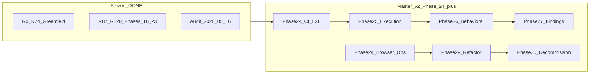

# Engage HexStrike — мастер-план v2 (post-audit)

## Наследие и статус baseline

Три предшествующих плана остаются **историческими артефактами**, не переписываются:

| План | Роль |
|------|------|
| [engage_layer_greenfield_9d048eec.plan.md](.cursor/plans/engage_layer_greenfield_9d048eec.plan.md) | R0–R74: scaffold, catalog, runner, intelligence, events, veil read |
| [engage_hexstrike_master_7666e9b4.plan.md](.cursor/plans/engage_hexstrike_master_7666e9b4.plan.md) | Phase 16–23 (R87–R120): CTF, BB, tools, CVE, browser, scale, hardening — **completed** |
| [hexstrike_migration_audit_12c9842f.plan.md](.cursor/plans/hexstrike_migration_audit_12c9842f.plan.md) | Формальный аудит — **completed** |

**Источник истины по факту:** [docs/engage-audit-report.md](docs/engage-audit-report.md), [docs/engage-route-parity.csv](docs/engage-route-parity.csv), [docs/engage-mcp-runner-triangle.csv](docs/engage-mcp-runner-triangle.csv).



## Два уровня «полного переезда»

| Уровень | Статус (аудит) | Цель v2 |
|---------|----------------|---------|
| **Architecture / capabilities** | **Достигнут** | Поддерживать gates; не регрессировать |
| **Execution parity** | **Partial** (80/158 live, 151 MCP имён) | Tier-1: **100+** runnable в runner; остальное — **формальная N/A-матрица** |
| **Behavioral parity** | **Partial** (CTF/BB структура OK, golden нет) | Fixture-тесты vs `.external/` snapshots |
| **Operational parity** | **Partial** (events/veil-stack CI flaky) | Обязательный green в CI |
| **Refactoring** | Не было отдельной фазой | Упростить engage под long-term ownership |

**Не в scope v2:** line-by-line `hexstrike_server.py`, правки `.external/`, обязательный LLM, README KPI 24×/98.7% как CI gate.

---

## Agent coordination (parallel streams)

Правила: [AGENTS.md](../../AGENTS.md), [veil-karpathy-guidelines.mdc](../../.cursor/rules/veil-karpathy-guidelines.mdc), [veil-agent-kaizen-metacognition.mdc](../../.cursor/rules/veil-agent-kaizen-metacognition.mdc), [veil-agent-parallel-branches.mdc](../../.cursor/rules/veil-agent-parallel-branches.mdc), [veil-agent-critic.mdc](../../.cursor/rules/veil-agent-critic.mdc).

| Phase | Branch | Status | Owner / stream | Critic | Merge SHA |
|-------|--------|--------|----------------|--------|-----------|
| 24 | `engage/phase-24-ci-e2e` | in_progress | implementer | orchestrator chat | — |
| 25 | — | pending | — | — | — |
| 26 | — | pending | — | — | — |
| 27 | — | pending | — | — | — |
| 28 | — | pending | — | — | — |
| 29 | — | pending | — | — | — |
| 30 | — | pending | — | — | — |

- **Implementer** (Task / отдельный чат): одна ветка = одна фаза, PR в `main`, без merge самостоятельно.
- **Critic & compliance** (оркестратор / этот чат): ревью PR, вердикт APPROVE / REQUEST_CHANGES, обновление таблицы после merge.
- Независимые фазы (разные файлы, нет общего `versions.env`) — можно параллельно на разных ветках; зависимые — только после merge зависимости + `git rebase origin/main`.

---

## Phase 24 — CI / E2E closure (критично для DoD)

**Проблема (аудит):** `make test-engage-events-pipeline` (Neo4j `EngageToolRun` = 0), `make test-engage-veil-stack-ci` (timeout engage-api ~240s).

| ID | Deliverable | Файлы |
|----|-------------|-------|
| R121 | Стабилизировать events smoke: health wait, ingest assert, cypher count (уже частично в [smoke-engage-events-pipeline.sh](scripts/test/smoke-engage-events-pipeline.sh)) | smoke script, [compose.events.yml](deploy/engage/compose.events.yml) |
| R122 | veil-stack-ci: увеличить/параметризовать wait (`SMOKE_VEIL_ENGAGE_WAIT_SEC`), логи при fail, optional `depends_on` health | [smoke-veil-engage-stack-ci.sh](scripts/test/smoke-veil-engage-stack-ci.sh), compose overlay |
| R123 | Master DoD: events + veil-stack **required green** в [.github/workflows/engage.yml](.github/workflows/engage.yml) | CI only |
| R124 | Обновить [engage-audit-report.md](docs/engage-audit-report.md) — повторный gate run | docs |

**DoD Phase 24:** `make test-engage-events-pipeline` и `make test-engage-veil-stack-ci` green на чистом Docker host; master DoD checklist — оба пункта `[x]`.

---

## Phase 25 — Execution breadth II (P0 post-audit)

**Сейчас:** 80 enabled в [tools.live.yaml](engage/serve/catalog/tools.live.yaml) (30 catalog + 50 synthetic); strict matrix в [Makefile](Makefile) `test-engage-tool-matrix-strict`.

| ID | Deliverable | Файлы |
|----|-------------|-------|
| R125 | **N/A execution matrix:** для каждого из 158 catalog tools — `live` \| `runner_N/A` \| `bridge_api` с причиной | новый `docs/engage-tools-na-matrix.md` + генератор из catalog |
| R126 | Расширить runner: wpscan, enum4linux-ng, jaeles, x8, … (только если образ < разумного лимита) | [runner.Dockerfile](deploy/engage/docker/runner.Dockerfile), [generate-tools-live.py](scripts/engage/generate-tools-live.py) |
| R127 | Цель **100+** enabled (реальные binary, не только synthetic clones) | `tools.live.yaml` |
| R128 | CI: `ENGAGE_TOOL_MATRIX_STRICT=1`, min **30** passed в compose job (уже в [smoke-engage-compose.sh](scripts/test/smoke-engage-compose.sh)) — довести до стабильного pass | CI + matrix script |
| R129 | Triangle CSV в CI artifact: `audit-mcp-runner-triangle.py` | [scripts/engage/audit-mcp-runner-triangle.py](scripts/engage/audit-mcp-runner-triangle.py) |
| R130 | Документировать тяжёлые tools (ghidra, burp GUI, metasploit GUI, angr) как permanent N/A | [engage-tools.md](docs/engage-tools.md) |

**DoD Phase 25:** ≥100 `enabled: true`; strict matrix ≥30 green в `engage-compose` CI; N/A doc покрывает 100% catalog имён.

---

## Phase 26 — Behavioral golden parity (P1)

| ID | Deliverable | Файлы |
|----|-------------|-------|
| R131 | Golden fixtures: CTF (`create-challenge`, `auto-solve`, `crypto`, `forensics`) — JSON snapshots из legacy или hand-crafted | `engage/serve/internal/usecase/ctf/testdata/golden/` |
| R132 | Golden fixtures: Bug Bounty 6 workflows — `phases[]`, `estimated_time`, `tools_count` | `engage/serve/internal/usecase/bugbounty/testdata/golden/` |
| R133 | `make test-engage-ctf` / `make test-engage-bugbounty` — compare normalized JSON (stable fields only) | test packages |
| R134 | Обновить [engage-legacy-parity.md](docs/engage-legacy-parity.md) — behavioral row | docs |

**DoD Phase 26:** golden tests green; расхождения >5% полей — documented waiver в parity doc.

---

## Phase 27 — Findings quality (P1 / future)

| ID | Deliverable | Файлы |
|----|-------------|-------|
| R135 | Dedup findings по (target, tool, signature) в ingest path | [findings/parse.go](engage/serve/internal/usecase/findings/parse.go), events payload |
| R136 | Расширить parsers: wpscan, masscan grepable (по приоритету matrix) | `findings/` |
| R137 | Labeled dataset stub + FP rate metric (offline, не CI gate) | `engage/serve/internal/usecase/findings/testdata/` |
| R138 | Smart-scan / assessment-report: deduped findings в ответе | intelligence + report usecase |

**DoD Phase 27:** unit tests на dedup; nuclei+ffuf+sqlmap без дублей в smoke fixture.

---

## Phase 28 — Browser & observability (optional depth)

| ID | Deliverable | Файлы |
|----|-------------|-------|
| R139 | Browser sidecar: forms + security_analysis parity с legacy subset | [browser/](engage/serve/internal/usecase/browser/), sidecar |
| R140 | Optional `GET /api/process/resource-usage` (telemetry extension) | [router.go](engage/serve/internal/transport/httpserver/router.go) |
| R141 | Benchmark regression table artifact в CI (не 24× gate) | [engage-hexstrike-parity.sh](scripts/benchmark/engage-hexstrike-parity.sh) |
| R142 | `make test-engage-benchmark` в compose smoke (SKIP if no API — OK) | smoke |

**DoD Phase 28:** browser smoke green; benchmark publishes JSON artifact when API up.

---

## Phase 29 — Engage refactor (целевой рефакторинг)

Цель: снизить сложность после быстрого greenfield, не меняя внешние контракты.

| ID | Deliverable | Файлы |
|----|-------------|-------|
| R143 | Split [router.go](engage/serve/internal/transport/httpserver/router.go) — intel / ctf / vuln / admin уже частично; завершить вынос `register*` в отдельные файлы | `httpserver/*.go` |
| R144 | Единый catalog pipeline: `make catalog-engage` = extract + live + validate args + parity | scripts/Makefile |
| R145 | `components.APIComponents` — явные интерфейсы для test doubles (Intel, CVE, CTF) | [components/api.go](engage/serve/internal/components/api.go) |
| R146 | MCP bridge: таблица `name → handler` вместо большого switch (опционально codegen) | [intel_bridge.go](engage/serve/internal/transport/mcpserver/intel_bridge.go) |
| R147 | Удалить мёртвый код / дубли после refactor; `make test-engage` green | engage/ |

**DoD Phase 29:** нет файлов >800 LOC в httpserver; cyclomatic switch в bridge сокращён; zero regression в route-parity + parity CI.

---

## Phase 30 — Decommission HexStrike reference (ops)

| ID | Deliverable | Файлы |
|----|-------------|-------|
| R148 | Runbook: dual-MCP → veil-engage only ([mcp-agents.md](docs/mcp-agents.md)) | docs |
| R149 | Deprecation checklist: когда `.external/` можно не монтировать в dev | [external-hexstrike.md](docs/external-hexstrike.md) |
| R150 | Final migration sign-off: повторный audit gate + обновление v2 plan frontmatter | audit report |

**DoD Phase 30:** команда может работать без Flask :8888; задокументирован migration path для агентов.

---

## Gates (регрессия на каждую фазу)

```bash
make test-engage
make test-engage-parity
make test-engage-catalog-args
make test-engage-decision-parity
make test-engage-route-parity
make test-engage-tool-matrix          # best-effort
make test-engage-tool-matrix-strict   # Phase 25+
make test-engage-events-pipeline      # Phase 24 required
make test-engage-veil-stack-ci        # Phase 24 required
make test-engage-ctf / test-engage-bugbounty  # Phase 26+
```

---

## Definition of Done — мастер-план v2 (полный переезд)

- [ ] Phase 24: events + veil-stack CI green
- [ ] Phase 25: ≥100 live tools + N/A matrix 100% catalog
- [ ] Phase 26: CTF/BB golden tests green
- [ ] Phase 27: findings dedup в production path
- [ ] Phase 28–29: по приоритету команды (browser/obs + refactor)
- [ ] Phase 30: decommission runbook + sign-off audit
- [x] Architecture parity (аудит 2026-05-16) — **не регрессировать**
- [x] HTTP route parity 156/156 accounted
- [x] 158 catalog names + MCP bridge

---

## Приоритет и оценка

| Phase | Приоритет | Оценка | Зависимости |
|-------|-----------|--------|-------------|
| 24 CI/E2E | **P0** | 3–5 d | Docker |
| 25 Execution | **P0** | 5–8 d | 24 желательно |
| 26 Behavioral | **P1** | 3–5 d | — |
| 27 Findings | **P1** | 5–7 d | 25 частично |
| 28 Browser/Obs | **P2** | 3–4 d | — |
| 29 Refactor | **P1** | 4–6 d | после 24–26 |
| 30 Decommission | **P2** | 1–2 d | 24–26 |

**Рекомендуемый порядок:** 24 → 25 → 26 → 29 (параллельно с 27) → 28 → 30.

---

## Артефакт плана

Создать файл: `.cursor/plans/engage_hexstrike_master_v2_post_audit.plan.md` (этот документ после approve) — **не** редактировать [hexstrike_migration_audit_12c9842f.plan.md](.cursor/plans/hexstrike_migration_audit_12c9842f.plan.md) и старый master, только ссылки.

Обновлять living docs: [engage-legacy-parity.md](docs/engage-legacy-parity.md), [engage-tools.md](docs/engage-tools.md), [engage-audit-report.md](docs/engage-audit-report.md) по завершении каждой фазы.
