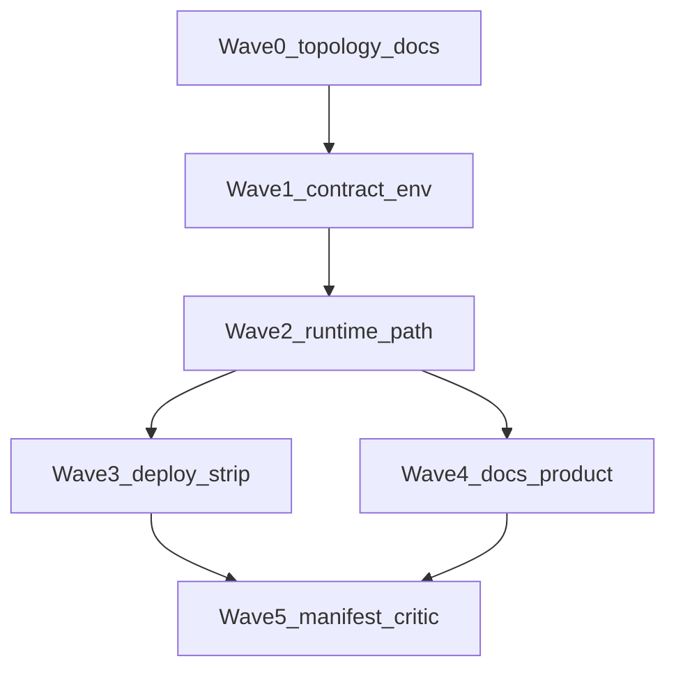

# Engage v3 — client-native execution (hexstrike model, no Docker runner)

## Ответ на вопрос «сервер + бинарники у клиента»

**Стандартный MCP (Cursor / Claude Desktop / stdio):** процесс `veil-engage` (или `engage-api` при HTTP MCP) — это **тот же хост**, на котором выполняется `exec.Command` / `subprocess`. Протокол MCP **не переносит** вызов `nmap` на диск клиента, если сервер крутится на удалённой ВМ: на ВМ должны быть свои бинарники (или там stub/ошибка).

| Сценарий | Где должны лежать инструменты | Кто запускает engage |
|----------|------------------------------|----------------------|
| **Рекомендуемый pentest** | На машине аналитика (PATH как у hexstrike) | Локально: `go run` / бинарь + MCP stdio в Cursor |
| **«Сервер в интернете» + Cursor дома** | На **сервере** (если MCP указывает на удалённый HTTP MCP) | Тогда engage **на сервере**, и **на сервере** же apt/pip для tools — не «на клиенте» |
| **Гибрид (редко)** | Отдельный агент на клиенте с RPC | Вне scope этого плана — не MCP из коробки |

**Вывод для плана:** фраза «требования к клиенту» означает **к машине, где запущен MCP-сервер Veil Engage** (в типичном Cursor — это ваш laptop/workstation). Это совпадает с [hexstrike README](.external/hexstrike-ai-master/README.md): clone → venv → `pip install` → **Install Security Tools** на той же системе → `python3 hexstrike_server.py`.

## Цель продукта (не LAB)

- Engage = **слой управления**: каталог инструментов, RBAC/аудит (где включено), параметры, отчёты, вызов allowlisted subprocess.
- **Не** позиционировать как «обязательный docker toolbox»; **не** использовать `docker exec` / `engage-runner` в поддерживаемом пути.
- **Контракт пользователя:** секции **Core Tools**, **Cloud Security Tools**, **Browser Agent Requirements** из hexstrike README — как **чеклист зависимостей** (документ + optional preflight script), без автоматической установки в CI.

## Инварианты (архитектура)

1. Единственный режим исполнения каталога: **`ENGAGE_RUNNER_MODE=local`** (переименование — отдельный микро-PR, если нужно для ясности).
2. **`ENGAGE_EXECUTION_PROFILE=client-native`** (имя фиксируется в P3): при старте API/MCP — **fail-fast**, если `ENGAGE_RUNNER_MODE=docker` или задан `ENGAGE_RUNNER_CONTAINER` / попытка использовать [`pkg/exec/sandbox.go`](pkg/exec/sandbox.go). **Поддерживаемого пути с `docker exec` не остаётся** — только поэтапное удаление/мёртвый код в поздних фазах (малый diff за раз).
3. Subprocess: существующий путь [`pkg/exec/executor.go`](pkg/exec/executor.go) `runLocal` — источник истины; [`pkg/exec/sandbox.go`](pkg/exec/sandbox.go) остаётся **deprecated** и не используется в дефолтном профиле (удаление/изоляция — поздняя фаза, маленький diff).
4. Каталог: `enable-catalog-by-category.sh` / `tools.enabled.yaml` — **на машине MCP-сервера** перед сессией пентеста.

## Связь с агентами и правилами

| Ресурс | Как использовать |
|--------|-------------------|
| [`.cursor/agents/manifest.yaml`](.cursor/agents/manifest.yaml) | Спавнить **engage-implementer** с `plan_path` = slice из таблицы фаз ниже; после Wave 5 добавить записи в `phases:` для P3, P7, P12… |
| [`.cursor/rules/veil-agent-parallel-branches.mdc`](.cursor/rules/veil-agent-parallel-branches.mdc) | Одна фаза = одна ветка `engage/client-native-pNN-<slug>`; мердж на `main` после critic **APPROVE** |
| [`.cursor/rules/veil-agent-critic.mdc`](.cursor/rules/veil-agent-critic.mdc) | Оркестратор: scope, hardening не ослаблять без явного запроса, тесты из фазы |
| [`.cursor/skills/veil-karpathy-guidelines/SKILL.md`](.cursor/skills/veil-karpathy-guidelines/SKILL.md) | Минимальный diff; DoD = команды `make` из фазы |
| [AGENTS.md](AGENTS.md) | После Wave 4: ссылка на этот мастер-план как **активный** engage-трек v3 |

## Порядок мерджей (чтобы субагентам было проще)

**Правило:** сначала всё, что **не трогает** `go test` engage и не ломает CI; затем контракт env + security; затем runtime; затем deploy/CI; затем большие доки.



**Параллельно после W2:** W3 и W4 можно вести **разными** субагентами на **разных** ветках, если не трогают одни файлы; при конфликте — сначала W3 (compose/helm), потом rebase W4.

---

## Фазы (много, малый diff)

Каждая фаза: **один PR**, предпочтительно &lt; ~150 строк diff (исключение — сгенерированные CSV/матрицы отдельным коммитом в той же фазе).

### Wave 0 — Топология и контракт (docs-first)

| ID | Slug ветки | Файлы (ориентир) | DoD |
|----|------------|------------------|-----|
| P0 | `engage/client-native-p00-mcp-topology` | Новый `docs/engage-mcp-topology.md` | Диаграмма: Cursor → stdio MCP → engage → `exec` на **том же** хосте; явный anti-pattern «remote engage + local nmap без RPC» |
| P1 | `engage/client-native-p01-hexstrike-contract` | `docs/engage-client-dependencies.md` | Таблица: группа инструментов ↔ команда проверки ↔ ссылка на блок README hexstrike (Core / Cloud / Browser) |
| P2 | `engage/client-native-p02-readme-engage-one-liner` | [`engage/README.md`](engage/README.md) | Первый экран: «execution = host PATH; install tools like hexstrike»; убрать акцент на runner profile как default |

### Wave 1 — Контракт исполнения (код, узкий)

| ID | Slug | Файлы | DoD |
|----|------|-------|-----|
| P3 | `engage/client-native-p03-execution-profile-env` | `engage/serve/internal/config` или security init, `docs/engage-runtime.md` | `ENGAGE_EXECUTION_PROFILE=client-native` — единственный поддерживаемый профиль для MCP/пентест; краткая заметка о миграции со старых compose (runner удаляется в P12–P14) |
| P4 | `engage/client-native-p04-hardening-forbid-docker` | [`engage/serve/internal/security/hardening.go`](engage/serve/internal/security/hardening.go) | `ENGAGE_RUNNER_MODE=docker` или непустой `ENGAGE_RUNNER_CONTAINER` → startup **error**; тесты |
| P5 | `engage/client-native-p05-api-default-profile` | `engage/serve/cmd/api`, compose defaults | Default: `client-native` + `ENGAGE_RUNNER_MODE=local` |
| P6 | `engage/client-native-p06-mcp-default-profile` | `engage/serve/cmd/mcp` | Аналогично P5 |

### Wave 2 — Runtime только local + UX

| ID | Slug | Файлы | DoD |
|----|------|-------|-----|
| P7 | `engage/client-native-p07-executor-skip-sandbox` | [`pkg/exec/executor.go`](pkg/exec/executor.go) | При `client-native`: never call `Sandbox.Exec` (явная ветка или Sandbox=nil из factory) |
| P8 | `engage/client-native-p08-path-extra` | `pkg/exec/executor.go` / filterEnv | `ENGAGE_PATH_EXTRA` документирован |
| P9 | `engage/client-native-p09-preflight-script` | `scripts/engage/preflight-client-tools.sh` | Exit codes; проверка subset из hexstrike Core list |
| P10 | `engage/client-native-p10-run-api-local` | `scripts/engage/run-client-native-api.sh` | Экспорт profile + `go run ./cmd/api` |
| P11 | `engage/client-native-p11-run-mcp-local` | [`scripts/mcp/run-veil-engage.sh`](scripts/mcp/run-veil-engage.sh) | Source profile + `client-native`; не ломать существующий smoke |

### Wave 3 — Deploy: убрать Docker runner из «happy path»

| ID | Slug | Файлы | DoD |
|----|------|-------|-----|
| P12 | `engage/client-native-p12-compose-no-runner-service` | [`deploy/engage/compose.yml`](deploy/engage/compose.yml), [`deploy/engage/README.md`](deploy/engage/README.md) | Сервис `engage-runner` не поднимается в базовом compose; только api/mcp/worker + host PATH |
| P13 | `engage/client-native-p13-delete-or-archive-compose-runner` | [`deploy/engage/compose.runner.yml`](deploy/engage/compose.runner.yml) | Либо удалить overlay, либо переместить в `docs/archive/` + ссылка — один маленький PR |
| P14 | `engage/client-native-p14-stacks-no-runner-refs` | [`deploy/stacks/*.yml`](deploy/stacks/) | Пресеты не ссылаются на `compose.runner.yml` / profile runner |
| P15 | `engage/client-native-p15-helm-engage-off-stage` | [`deploy/helm/veil/values-stage.yaml`](deploy/helm/veil/values-stage.yaml) | `engage.*.enabled: false` если ещё не сделано в v2 плане |
| P16 | `engage/client-native-p16-ci-compose-optional` | [`.github/workflows/engage.yml`](.github/workflows/engage.yml) | `engage-compose` за `vars.ENGAGE_DOCKER_E2E==1` |

### Wave 4 — Продуктовые доки (не LAB)

| ID | Slug | Файлы | DoD |
|----|------|-------|-----|
| P17 | `engage/client-native-p17-mcp-agents` | [`docs/mcp-agents.md`](docs/mcp-agents.md) | Сценарий: Cursor + stdio + инструменты на хосте |
| P18 | `engage/client-native-p18-runtime-rewrite` | [`docs/engage-runtime.md`](docs/engage-runtime.md) | Удалить/сжать «runner profile» как основной путь |
| P19 | `engage/client-native-p19-agents-md` | [`AGENTS.md`](AGENTS.md) | Активный трек v3 + ссылка на этот план |
| P20 | `engage/client-native-p20-root-readme` | [`README.md`](README.md) | Одна строка про engage client-native |

### Wave 5 — Манифест, аудит, финальный gate

| ID | Slug | Файлы | DoD |
|----|------|-------|-----|
| P21 | `engage/client-native-p21-manifest-phases` | [`.cursor/agents/manifest.yaml`](.cursor/agents/manifest.yaml) | 3–5 записей `phases:` (кластеры P3, P7, P12) для рендера `render-task-prompt.sh` |
| P22 | `engage/client-native-p22-audit-signoff` | [`docs/engage-audit-report.md`](docs/engage-audit-report.md) | Поддерживаемое исполнение: **только** client-native / host PATH; docker-runner снят с поддержки |

**Финальный gate (ручной + CI):**

```bash
make test-engage
./scripts/engage/preflight-client-tools.sh || true   # не валит CI если нет nmap
export ENGAGE_EXECUTION_PROFILE=client-native
./scripts/mcp/run-veil-engage.sh   # smoke по фазе P11
```

## Out of scope (явно)

- Перенос выполнения на «другой» хост без агента на той машине.
- Удаление кода `Sandbox` в P7 — только **отключение в профиле**; полное удаление — отдельный мини-трек после P22.
- Авто-установка apt в Veil repo.
- Правки внутри [`.external/hexstrike-ai-master/`](.external/hexstrike-ai-master/) — только цитирование в доках.

## Статус (оркестратор заполняет)

| Phase | Branch | Status | Notes |
|-------|--------|--------|-------|
| P0 | `engage/client-native-p00-mcp-topology` | **merged main** | `docs/engage-mcp-topology.md` |
| P1 | `engage/client-native-p01-hexstrike-contract` | **merged main** | `docs/engage-client-dependencies.md` |
| P2 | `engage/client-native-p02-readme-engage-one-liner` | **merged main** | `engage/README.md` |
| P3–P6 | `engage/client-native-wave1-p03-p06` | **merged main** | `391758f` — `ENGAGE_EXECUTION_PROFILE`, `ValidateExecutionProfile`, compose; merge commit `e14fc4d` |
| P7–P11 | `engage/client-native-wave2-p07-p11` | **merged main** | `1dabb9d` — sandbox skip + `ENGAGE_PATH_EXTRA` + scripts; merge `3da75af` |
| P12–P16 | `main` | **merged main** | compose no longer defines runner services by default; `compose.runner.yml` owns runner services; stage helm engage disabled; `engage-compose` job gated by `ENGAGE_DOCKER_E2E` |
| P17–P20 | `main` | **merged main** | Product docs updated for client-native default: `docs/mcp-agents.md`, `docs/engage-runtime.md`, `AGENTS.md`, `README.md` |
| P21+ | — | pending | Wave 5 |

После каждого merge: обновить таблицу + SHA; субагентам: `git pull origin main` перед следующей фазой.
