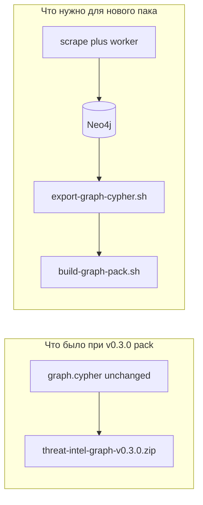

# Почему граф-паки «одинакового веса» и как собрать новый граф

## Факт по репозиторию

Скрипт [scripts/build-graph-pack.sh](scripts/build-graph-pack.sh) **не тянет данные из Neo4j сам** — он только упаковывает уже существующий файл **`data/neo4j_user_export/graph.cypher`**. Версия в имени ZIP (`threat-intel-graph-v0.3.0.zip`) задаётся параметром/`GRAPH_PACK_VERSION`, но **байты дампа** берутся из того же пути, что и для v0.2.

В ваших манифестах уже зафиксировано:

- [data/neo4j_user_export/releases/manifest.v0.2.0.json](data/neo4j_user_export/releases/manifest.v0.2.0.json) — `sha256`: `b4fd360a2d…`
- [data/neo4j_user_export/releases/manifest.v0.3.0.json](data/neo4j_user_export/releases/manifest.v0.3.0.json) — **тот же** `sha256`

Значит **`graph.cypher` при сборке v0.3.0 не перегенерировали** (не запускали [scripts/export-graph-cypher.sh](scripts/export-graph-cypher.sh) после нового наполнения БД). ZIP почти того же размера — ожидаемо: тот же Cypher + чуть другой `manifest.json`.

## Что сделать, чтобы «максимально собрать граф» и проверить цепочку

### 1. Чистый или осознанный Neo4j

- Для **полного** перескрейпа с нуля: `docker compose down -v` (сотрёт volume Neo4j) или отдельный инстанс/профиль — иначе старые узлы смешаются с новыми, а export будет «толще», но не обязательно «чище».
- Если нужно **донакачать** поверх существующего — volume не трогать, но тогда export отражает **текущее** состояние БД.

### 2. Поднять стек со scrape + NATS + worker

- Команда из [docs/threatintel-runtime.md](docs/threatintel-runtime.md) / [docs/deploy.md](docs/deploy.md):  
  `INGEST_MODE=nats docker compose -f docker-compose.yml -f docker-compose.scrape-nats.yml --profile scrape up --build -d`  
  (или базовый compose с `INGEST_MODE=nats` в env, если не нужен override без `NEO4J_*` на продьюсерах).
- Убедиться, что **`ingest-worker`** и **`nats`** healthy, скрейперы не падают в restart loop (логи `docker compose logs`).

### 3. Дождаться/ограничить объём скрейпа

- Лимиты фидов задаются env (`*_MAX_*`, `NVD_MAX_PAGES`, и т.д. в [docker-compose.yml](docker-compose.yml) и [scrapers/README.md](scrapers/README.md)). Для «максимума» — поднять лимиты **осознанно** (время, диск, rate limits внешних API, GitHub token для приватных фидов).

### 4. Экспорт и новый граф-пак

- С Neo4j в рабочем состоянии:  
  `./scripts/export-graph-cypher.sh`  
  затем  
  `GRAPH_PACK_VERSION=v0.3.1 ./scripts/build-graph-pack.sh`  
  (или bump до **новой** версии, чтобы не путать с уже опубликованным идентичным v0.3.0 ZIP).
- Опционально одной командой: `EXPORT_FIRST=1 GRAPH_PACK_VERSION=v0.3.1 ./scripts/build-graph-pack.sh` (скрипт сам вызовет export, см. [build-graph-pack.sh](scripts/build-graph-pack.sh) строки 20–22).

### 5. Проверки «всё работает»

| Проверка | Действие |
|----------|----------|
| Данные парсятся | Логи сервисов `vuln`, `ti`, `sbom`, … без фатальных ошибок; при `nats` — рост pending в JetStream не бесконечен (worker снимает). |
| Worker собирает | Логи `ingest-worker`: нет бесконечных NAK; при желании smoke Cypher (счётки labels) из README / [docs/threatintel-runtime.md](docs/threatintel-runtime.md). |
| БД поднята | `cypher-shell` / Neo4j Browser; health Neo4j в compose. |
| API | `curl http://localhost:${API_PORT:-8090}/health` и несколько `/v1/...` (как в runtime-doc). |
| С nginx (если используете deploy) | `curl http://localhost:${LB_HTTP_PORT:-8888}/health`. |
| MCP | `docker compose --profile mcp run --rm -i mcp` после успешного bootstrap (как в [docs/threatintel-runtime.md](docs/threatintel-runtime.md#mcp-stdio)). |

### 6. Релиз на GitHub (если меняется дамп)

- После **нового** `sha256` в `manifest.json`: обновить при необходимости [docker/graph-bootstrap.sh](docker/graph-bootstrap.sh) `DEFAULT_PACK_URL` / имя файла, [docker-compose.testpack.yml](docker-compose.testpack.yml), и выложить новый **`gh release`** с ZIP (как в [docs/deploy.md](docs/deploy.md)).

## Краткий ответ на «уверен ли ты, что что-то собираем»

**Пак v0.3.0 в текущем виде — это переупаковка того же `graph.cypher`, что и v0.2.0** (одинаковый sha256). Новый контент появится только после **реального наполнения Neo4j** (скрейп + worker при `nats`) и **повторного `export-graph-cypher.sh`** перед `build-graph-pack.sh`.
