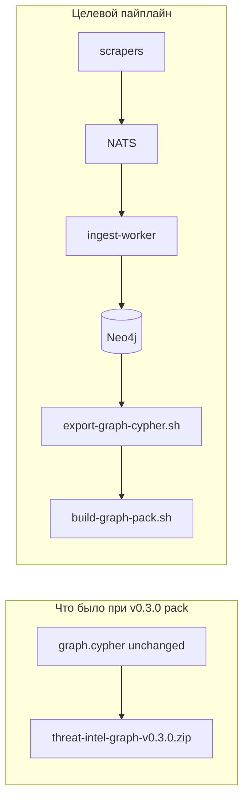

# NATS-only compose + свежий граф-пак 0.3.1 (слияние двух планов)

## Общий контекст (оба плана)

**Почему ZIP v0.2 и v0.3 «одинакового веса»:** [scripts/build-graph-pack.sh](scripts/build-graph-pack.sh) не читает Neo4j — он упаковывает уже существующий [data/neo4j_user_export/graph.cypher](data/neo4j_user_export/graph.cypher). В [manifest.v0.2.0.json](data/neo4j_user_export/releases/manifest.v0.2.0.json) и [manifest.v0.3.0.json](data/neo4j_user_export/releases/manifest.v0.3.0.json) **один и тот же `sha256`** для дампа (`b4fd360a2d…`) — v0.3.0 был переупаковкой без повторного [scripts/export-graph-cypher.sh](scripts/export-graph-cypher.sh) после нового наполнения БД.

Итог: **новый контент в ZIP появится только после реального наполнения Neo4j** (скрейп + worker) и **export перед build**.

---

## Фаза 1 — NATS-only и один compose (из [nats-only плана](.cursor/plans/nats-only_compose_refactor_0.3.1_34823a5b.plan.md))

### Цели

- Единственный write-path: **NATS → ingest-worker → Neo4j**. Убрать **`direct`**, **`INGEST_MODE=direct`**, legacy-формулировки в коде и доках.
- **Один основной** [docker-compose.yml](docker-compose.yml): перенести/слить содержимое [docker-compose.deploy.yml](docker-compose.deploy.yml), [docker-compose.scrape-nats.yml](docker-compose.scrape-nats.yml), [docker-compose.neo4j.yml](docker-compose.neo4j.yml); лишние файлы удалить; профили **`deploy`**, **`scrape`**, **`mcp`** (+ решение по **`testpack`** — см. таблицу ниже).

### Compose (файл за файлом)

| Файл | Действие |
|------|----------|
| [docker-compose.scrape-nats.yml](docker-compose.scrape-nats.yml) | Удалить; в `docker-compose.yml` для **`vuln`/`ti`/`lola`/`ds`/`sbom`/`coderules`/`nuclei`**: убрать **`NEO4J_*`**, NATS-only; **`depends_on`**: **`nats` healthy** (не ждать Neo4j на продьюсере). **`ingest-worker`**: **`neo4j` + `nats`**. |
| [docker-compose.deploy.yml](docker-compose.deploy.yml) | Удалить; **`nginx-lb`** (профиль **`deploy`**) в основной compose. |
| [docker-compose.neo4j.yml](docker-compose.neo4j.yml) | Удалить (дубликат Neo4j без bootstrap/API). |
| [docker-compose.testpack.yml](docker-compose.testpack.yml) | Либо фрагмент override в [docs/threatintel-runtime.md](docs/threatintel-runtime.md) + удалить файл; либо оставить один минимальный файл — по удобству CI (ссылки сейчас в основном в доках). |

Обновить **все** команды в [README.md](README.md), [docs/threatintel-runtime.md](docs/threatintel-runtime.md), [docs/deploy.md](docs/deploy.md), [scrapers/README.md](scrapers/README.md) — без `-f docker-compose.scrape-nats.yml` / `-f docker-compose.deploy.yml`.

### Код: убрать `direct`

- [scrapers/sbom](scrapers/sbom): [cmd/main.go](scrapers/sbom/cmd/main.go), [internal/config](scrapers/sbom/internal/config/config.go), [internal/usecase/scrape.go](scrapers/sbom/internal/usecase/scrape.go) — убрать `IngestModeDirect`, Neo4j store в скрейпе; CVE только **file/URL** ([cvesource](scrapers/sbom/internal/cvesource)).
- Аналогично: [scrapers/ti](scrapers/ti/cmd/main.go), [scrapers/vuln/internal/components/init.go](scrapers/vuln/internal/components/init.go), [scrapers/lola](scrapers/lola/internal/components/init.go), [scrapers/ds](scrapers/ds/cmd/main.go), [scrapers/coderules](scrapers/coderules/cmd/main.go), [scrapers/nuclei](scrapers/nuclei/cmd/main.go) + config/usecase — единственный режим NATS; убрать инициализацию Neo4j writer в скрейпере.
- [pkg/ingestv1](pkg/ingestv1), [docs/ingest-contract.md](docs/ingest-contract.md), [docs/coding-style.md](docs/coding-style.md), [scrapers/ingest-worker/README.md](scrapers/ingest-worker/README.md) — без «direct fallback» / «как direct».
- [scrapers/ingest-worker/cmd/main.go](scrapers/ingest-worker/cmd/main.go): семантика MERGE без изменений (по желанию только комментарии).

**Важно (путаница в логах):** строки «running **direct**» в [scrapers/ti/internal/feeds/runner.go](scrapers/ti/internal/feeds/runner.go) и [scrapers/ds](scrapers/ds/internal/usecase/ingest.go) относятся к **HTTP proxy**, не к ingest — переименовать в духе «without proxy», чтобы не путать с удалённым legacy ingest.

### Документация и диаграммы

- [README.md](README.md) Mermaid: только **NATS → worker → Neo4j**; убрать стрелки `direct: MERGE`.
- [docs/threatintel-runtime.md](docs/threatintel-runtime.md): таблица **`INGEST_MODE`** удалить или заменить одной строкой «режим фиксирован NATS»; убрать секцию про optional scrape-nats override.
- [CONTRIBUTING.md](CONTRIBUTING.md), [AGENTS.md](AGENTS.md): не описывать `direct`.
- **Дополнительно из граф-плана:** 1 абзац в [docs/deploy.md](docs/deploy.md) или runtime-doc: *одинаковый размер ZIP = тот же sha256 `graph.cypher`; при новом export обязательно bump версии пака*, чтобы не путать артефакты.

### Риски (сохранить из NATS-плана)

- Удаление **`direct`** убирает «быстрый» локальный запуск без NATS — **намеренно**.
- Скрейперы без **`depends_on: neo4j`** могут стартовать раньше БД; JetStream переживёт, worker — после Neo4j.

---

## Фаза 2 — наполнение, E2E, новый пак и релиз (из [fresh graph плана](.cursor/plans/fresh_graph_pack_and_e2e_verify_b562af79.plan.md), команды после фазы 1)

После слияния compose **не** использовать старую связку `-f docker-compose.yml -f docker-compose.scrape-nats.yml` — ориентир: **`docker compose --profile scrape`** (как в NATS-плане).

### 1. Neo4j: чистый или донакачка

- **Полный перескрейп с нуля:** `docker compose down -v` (сотрёт volume Neo4j) или отдельный инстанс — иначе старые узлы смешаются с новыми.
- **Донакачка:** volume не трогать; export отражает **текущее** состояние БД.

### 2. Поднять стек

- `docker compose --profile scrape up --build -d` (и при необходимости другие профили из актуальных доков).
- Убедиться: **`ingest-worker`**, **`nats`** healthy; скрейперы не в restart loop (`docker compose logs`).

### 3. Объём скрейпа

- Лимиты: `*_MAX_*`, `NVD_MAX_PAGES` и т.д. в [docker-compose.yml](docker-compose.yml) и [scrapers/README.md](scrapers/README.md); для «максимума» — осознанно (время, диск, rate limits, GitHub token).

### 4. Export и сборка пака

- `./scripts/export-graph-cypher.sh` затем `GRAPH_PACK_VERSION=v0.3.1 ./scripts/build-graph-pack.sh` (**новая** версия, чтобы не путать с уже опубликованным идентичным v0.3.0 ZIP).
- Или одной командой: `EXPORT_FIRST=1 GRAPH_PACK_VERSION=v0.3.1 ./scripts/build-graph-pack.sh` (см. начало [build-graph-pack.sh](scripts/build-graph-pack.sh), ~строки 20–22).
- Сверить: **sha256 в новом manifest ≠** старый `b4fd360a…`.

### 5. Проверки «всё работает» (полная таблица из граф-плана)

| Проверка | Действие |
|----------|----------|
| Данные парсятся | Логи `vuln`, `ti`, `sbom`, … без фаталей; при NATS — рост pending в JetStream не бесконечен. |
| Worker | Логи `ingest-worker`: нет бесконечных NAK; опционально smoke Cypher (счётки labels) из runtime-doc. |
| БД | `cypher-shell` / Neo4j Browser; health Neo4j в compose. |
| API | `curl http://localhost:${API_PORT:-8090}/health` и несколько `/v1/...`. |
| nginx (deploy) | `curl http://localhost:${LB_HTTP_PORT:-8888}/health`. |
| MCP | `docker compose --profile mcp run --rm -i mcp` после успешного bootstrap (секция MCP в runtime-doc). |

### 6. Релиз GitHub

- После **нового** sha256: **`gh release create v0.3.1-graph-pack`** (или согласованное имя тега) с новым ZIP.
- Обновить [docker/graph-bootstrap.sh](docker/graph-bootstrap.sh) (`DEFAULT_PACK_URL` / имя файла), фрагмент testpack / [docker-compose.testpack.yml](docker-compose.testpack.yml) если остаётся, и ссылки в доках с v0.3.0 на v0.3.1 где это дефолт bootstrap.

---

## Порядок выполнения (кратко)

1. Compose + удаление лишних файлов + правки доков команд.  
2. Код NATS-only + правки ingest-contract / coding-style / ingest-worker README + proxy-логи.  
3. README/CONTRIBUTING/AGENTS/runtime + абзац про ZIP/sha256.  
4. `docker compose --profile scrape build` → `up -d` → логи producer/worker.  
5. export → build v0.3.1 → проверка sha256.  
6. curl API, MCP, при deploy — LB.  
7. gh release + graph-bootstrap + testpack/доки.

Ни один пункт из исходных двух планов выше не опущен: объединены цели NATS-only, таблица compose, список скрейперов и пакетов, proxy-логи, риски, объяснение дубликата ZIP, варианты Neo4j volume, лимиты, `EXPORT_FIRST`, полная таблица проверок и шаги релиза.
