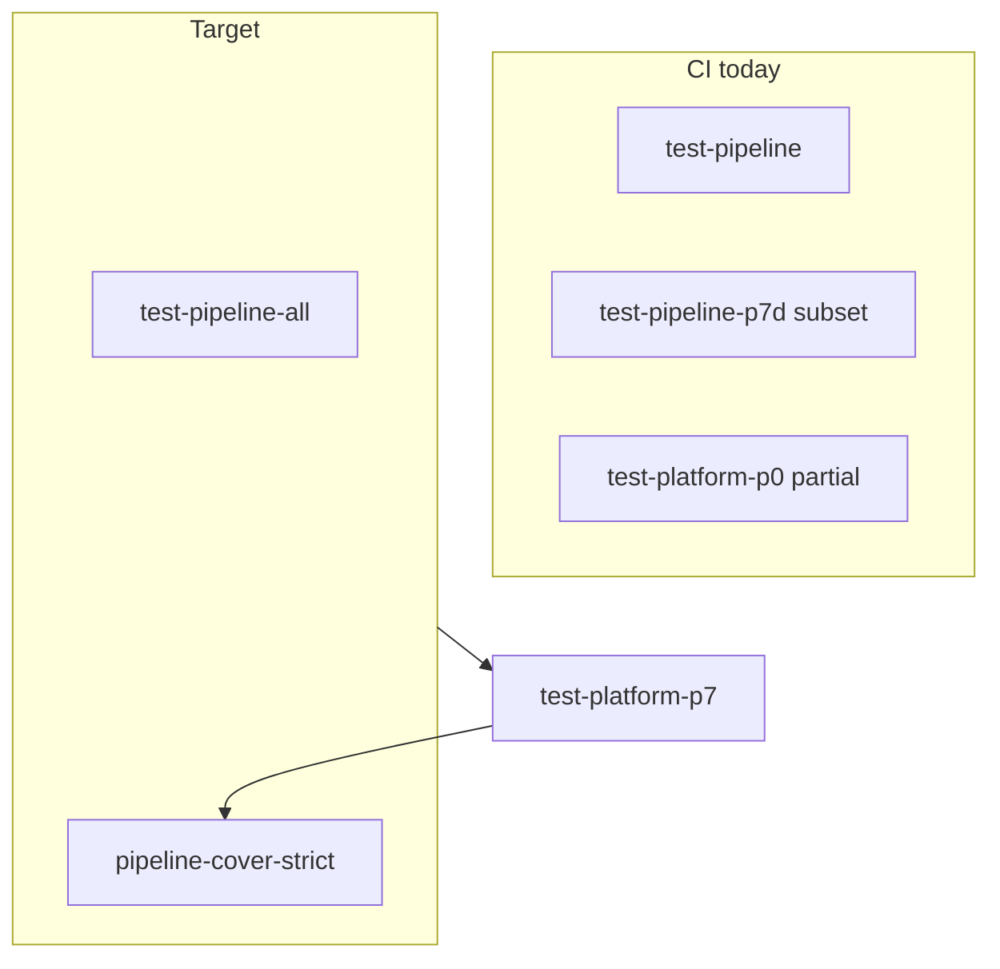

# Полное unit-покрытие `pipeline/` (T3)

## Baseline (сейчас)

| Область | Статус |
|---------|--------|
| [`pipeline/pkg/nvd`](pipeline/pkg/nvd) | parse/map + fixture; happy path only |
| [`pipeline/ned/internal/sources`](pipeline/ned/internal/sources) | ds/lola/appsec table tests; **ti/vuln** частично |
| [`pipeline/ned/internal/dedup`](pipeline/ned/internal/dedup), [`consumer`](pipeline/ned/internal/consumer) | TI IOC happy path; не `PublishIngest` errors |
| [`pipeline/connector/nats`](pipeline/connector/nats) | stream ensure integration; engage tests **не вызывают** handlers |
| [`pipeline/ned/internal/transform`](pipeline/ned/internal/transform) | **нет** `router_test.go` |
| [`pipeline/ned/internal/config`](pipeline/ned/internal/config) | **нет** тестов |
| [`pipeline/ned/internal/components`](pipeline/ned/internal/components) | runtime wiring — 0% |
| CI | [`make test-pipeline`](Makefile), [`test-pipeline-p7d`](Makefile) (subset), [`test-platform-p0`](Makefile) (consumer+dedup+connector) — **нет** `pipeline-cover` gate |

Образец процесса: [pkg unit tests plan](.cursor/plans/pkg_unit_tests_full_165670eb.plan.md), [pkg-test-coverage.md](docs/development/pkg-test-coverage.md), [`scripts/test/pkg-cover-strict.sh`](scripts/test/pkg-cover-strict.sh).



## Definition of Done (T3)

| Tier | Scope | Критерий |
|------|-------|----------|
| **T0** | каждый import path в `pipeline/go.work` с `.go` (кроме `cmd/*/main`) | `*_test.go` или явный build-only в матрице |
| **T1** | exported pure helpers (`ScrapeToIngest`, transforms, parse, `config.Load`, handlers) | table / round-trip / golden envelope |
| **T3** | логика (не thin `main`) | **100%** statements; gate: `make test-pipeline-cover-strict` |

**Вне scope:** Docker ([`test-engage-events-pipeline`](Makefile)), live NATS cluster, Neo4j, рефакторинг wire-схем.

**Build-only (T0 exception):** [`pipeline/ned/cmd/pipeline_worker`](pipeline/ned/cmd/pipeline_worker), [`pipeline/engage-events/cmd/worker`](pipeline/engage-events/cmd/worker) — покрытие через [`make test-pipeline`](Makefile) build step + handler tests в connector.

## Оркестрация (минимальный diff, один push)

Отличие от pkg-волн: **одна ветка**, субагенты **без** commit/push; финал — оркестратор.

| Шаг | Действие |
|-----|----------|
| 1 | `git fetch && git checkout main && git pull` → `git checkout -b platform/pipeline-tests-full` |
| 2 | Параллельно 4–5 Task с `scrape-pipeline-implementer` + `render-task-prompt.sh --phase pipeline-tests-wN` (см. волны) |
| 3 | Разрешить конфликты только в Makefile/docs/manifest (один владелец — W0 или W8) |
| 4 | `make test-pipeline-cover-strict && make test-platform-p0` |
| 5 | `git add -A -- . ':!data'` → **один** commit → `git push -u origin HEAD` → PR → critic → merge |

Правила: [veil-agent-subagents.mdc](.cursor/rules/veil-agent-subagents.mdc), [veil-agent-parallel-branches.mdc](.cursor/rules/veil-agent-parallel-branches.mdc) (override: push только оркестратор).

**Critic checklist:** diff только `pipeline/` + harness (`Makefile`, `scripts/test/`, `docs/development/`, `.cursor/agents/manifest.yaml`, master plan); нет импортов knowledge/engage в pipeline; `make test-pipeline-cover-strict` green.

---

## W0 — Harness (serial, первый субагент)

**phase_id:** `pipeline-tests-w0` · **~80 LOC**

| Артефакт | Содержание |
|----------|------------|
| [`Makefile`](Makefile) | `test-pipeline-all`: `cd pipeline && go test ./...` (+ `pipeline/pkg`); `test-pipeline-cover` / `test-pipeline-cover-strict` |
| [`scripts/test/pipeline-cover.sh`](scripts/test/pipeline-cover.sh) | T0 NOTEST + floor 70% |
| [`scripts/test/pipeline-cover-strict.sh`](scripts/test/pipeline-cover-strict.sh) | T3: 100% (mirror pkg) |
| [`docs/development/pipeline-test-coverage.md`](docs/development/pipeline-test-coverage.md) | матрица пакет → tier → owner wave |
| [`.cursor/plans/pipeline_unit_tests_master.plan.md`](.cursor/plans/pipeline_unit_tests_master.plan.md) | master + статус волн |
| [`.cursor/agents/manifest.yaml`](.cursor/agents/manifest.yaml) | phases `pipeline-tests-w0`…`w8` |

**DoD W0:** `test-pipeline-all` green на текущих тестах (strict может FAIL — baseline зафиксирован в doc).

---

## Параллельные срезы (W1–W5) — независимые пути

Каждый субагент: **только свои `*_test.go` + testdata**; паттерны из существующих тестов (`recordPublisher`, `t.Parallel()`, [`nvd_page_min.json`](pipeline/pkg/nvd/parse/testdata/nvd_page_min.json)).

### W1 — `pipeline/pkg/nvd` + router

**phase_id:** `pipeline-tests-w1` · **~100 LOC**

- [`parse/parse_test.go`](pipeline/pkg/nvd/parse/parse_test.go): malformed JSON, empty CVE list, partial fields
- [`map/map_test.go`](pipeline/pkg/nvd/map/map_test.go): `FromNVD` edge cases (skip empty CVE)
- **NEW** [`ned/internal/transform/router_test.go`](pipeline/ned/internal/transform/router_test.go): все `harvest.Source*` → non-error stub via existing transforms; `unknown source` error

### W2 — TI transforms (главный пробел)

**phase_id:** `pipeline-tests-w2-ti` · **~180 LOC**

Файл: [`pipeline/ned/internal/sources/ti/transform_test.go`](pipeline/ned/internal/sources/ti/transform_test.go)

Table subtests для каждого `kind` в [`transform.go`](pipeline/ned/internal/sources/ti/transform.go):

- `KindTIKEVRow`, `KindTIJSONLLine` (actor/campaign/ioc/report branches в `jsonlToIngest`)
- `KindTIReportRaw`, `KindTICampaignRaw`, `KindTIClusterRaw`, `KindTIActorRaw`
- invalid JSON, `NormalizeIOC` → nil envelopes, campaign missing id/name

### W3 — Vuln + enrich

**phase_id:** `pipeline-tests-w3-vuln` · **~140 LOC**

- [`vuln/transform_test.go`](pipeline/ned/internal/sources/vuln/transform_test.go): `KindVulnCVEUpsert`, `KindVulnMergeExploit`
- [`vuln/enrich`](pipeline/ned/internal/sources/vuln/enrich): parse error, empty CVE skip (unit, без HTTP)

### W4 — AppSec parse + dedup/consumer

**phase_id:** `pipeline-tests-w4-bus` · **~160 LOC**

- [`appsec/parse`](pipeline/ned/internal/sources/appsec/parse): `ParseNucleiYAML`, Semgrep/CodeQL CWE extractors — прямые unit tests (сейчас только indirect)
- [`dedup/publish_test.go`](pipeline/ned/internal/dedup/publish_test.go): `PublishIngest` multi-envelope, publish error, unknown source via router
- [`consumer/consumer_test.go`](pipeline/ned/internal/consumer/consumer_test.go): расширить matrix sources/kinds; **не** полный `RunPullLoop` в W4

### W5 — Connector NATS (engage + publish)

**phase_id:** `pipeline-tests-w5-connector` · **~200 LOC**

- Переписать [`engage_consumer_test.go`](pipeline/connector/nats/engage_consumer_test.go): вызывать `handleEngageFinding` / `handleEngageToolRun` / `handleEngageMsg` с mock publisher (минимальный интерфейс **только если** нужен для 100% без `conn`; предпочтение: embedded JetStream + real `JetStreamPublisher` как в [`publish_integration_test.go`](pipeline/connector/nats/publish_integration_test.go))
- `EnsureScrapeStream`, `EnsureEngageEventsStream`, `PublishJSON` / `PublishCommit` error paths
- `ConnectJetStream` invalid URL

---

## W6 — Config + runtime (serial после W1–W5)

**phase_id:** `pipeline-tests-w6-runtime` · **~120 LOC**

| Пакет | Подход |
|-------|--------|
| [`config`](pipeline/ned/internal/config/config.go) | `config_test.go`: `Load` defaults, `TI_INGEST_SUBJECT` override, `IngestSubjectFor`, invalid int/duration fallback |
| [`components`](pipeline/ned/internal/components/runtime.go) | 100% без Docker: вынести тонкий `PullLoopDeps` **только если** иначе unreachable; иначе table-test `Init` с `httptest`/fake JS из `nats-server/v2/test` + mock `IngestPublisher` для `handleScrapeMsg` path уже в consumer |
| [`consumer.RunPullLoop`](pipeline/ned/internal/consumer/consumer.go) | один integration test: embedded NATS + publish scrape msg + assert mock ingest (как [`pkg/natsjet`](pkg/natsjet/t3_test.go)) |

**Принцип минимального diff:** рефакторинг runtime только для покрытия, не «чистка архитектуры».

---

## W7 — T3 gap-fill (модульные срезы)

Если после W1–W6 `pipeline-cover-strict` показывает FAIL по пакетам — параллельные gap-субагенты (как `pkg-cover-v-m*`):

| phase_id | Пакет(ы) |
|----------|----------|
| `pipeline-cover-v-nvd` | `pipeline/pkg/nvd/...` |
| `pipeline-cover-v-sources` | `ned/internal/sources/*` остатки |
| `pipeline-cover-v-ned-core` | transform, dedup, consumer, config, components |
| `pipeline-cover-v-connector` | `connector/nats` |

Каждый субагент: довести **только** свой пакет до 100%, без затрагивания других волн.

---

## W8 — CI gate (serial, последний перед push)

**phase_id:** `pipeline-tests-w8-ci` · **~60 LOC**

- [`test-platform-p7`](Makefile): добавить `test-pipeline-cover-strict` (или заменить `test-pipeline-p7d` на `test-pipeline-all` + strict)
- [`CONTRIBUTING.md`](CONTRIBUTING.md) + [`docs/agents/coding-style.md`](docs/agents/coding-style.md): чеклист `make test-pipeline-cover-strict`
- manifest phases + master plan sign-off

**DoD финал:** `make test-pipeline-cover-strict && make test-platform-p0 && make test-platform-p7` green → stage all → commit → push.

---

## Порядок и параллельность

```text
W0 (harness)
    ├─ W1 (nvd+router) ─┐
    ├─ W2 (ti)          ─┼─ W6 (runtime) ─ W7 (gap-fill) ─ W8 (CI)
    ├─ W3 (vuln)        ─┤
    ├─ W4 (appsec+bus)  ─┤
    └─ W5 (connector)   ─┘
```

- **W1–W5** параллельно после W0 (разные каталоги).
- **W6** после merge срезов в рабочую ветку (нужен полный tree).
- **W7** только при FAIL strict.
- **W8** перед единственным commit (Makefile/manifest).

Команда субагента:

```bash
./scripts/agents/render-task-prompt.sh scrape-pipeline-implementer --phase pipeline-tests-w2-ti
```

В prompt: branch `platform/pipeline-tests-full`, **не коммитить**, вернуть список изменённых файлов.

---

## Оценка объёма

| Wave | ~LOC тестов | Субагент |
|------|-------------|----------|
| W0 | 80 | 1 |
| W1–W5 | 680 | 5 параллельно |
| W6 | 120 | 1 |
| W7 | 0–300 | 0–4 по FAIL |
| W8 | 60 | 1 |

**Итого:** 1 PR, ~900–1100 LOC тестов + ~140 harness; один commit/push в конце.

## Риски T3 (100%)

| Риск | Митигация |
|------|-----------|
| `RunPullLoop` / `RunEngageEventsConsumer` | embedded `nats-server/v2/test`; один integration test на поток |
| Engage tests дублируют envelope | удалить дубликат, тестировать реальные handlers |
| Лишний рефакторинг | critic отклоняет изменения `.go` без покрытия в том же PR-срезе |

## Связь с CI

Сейчас P7: `test-pkg-cover-strict` + `test-pipeline-p7d` (узкий срез). Цель: **strict на весь `pipeline/`**, чтобы ti/vuln/connector не выпадали из gate.
