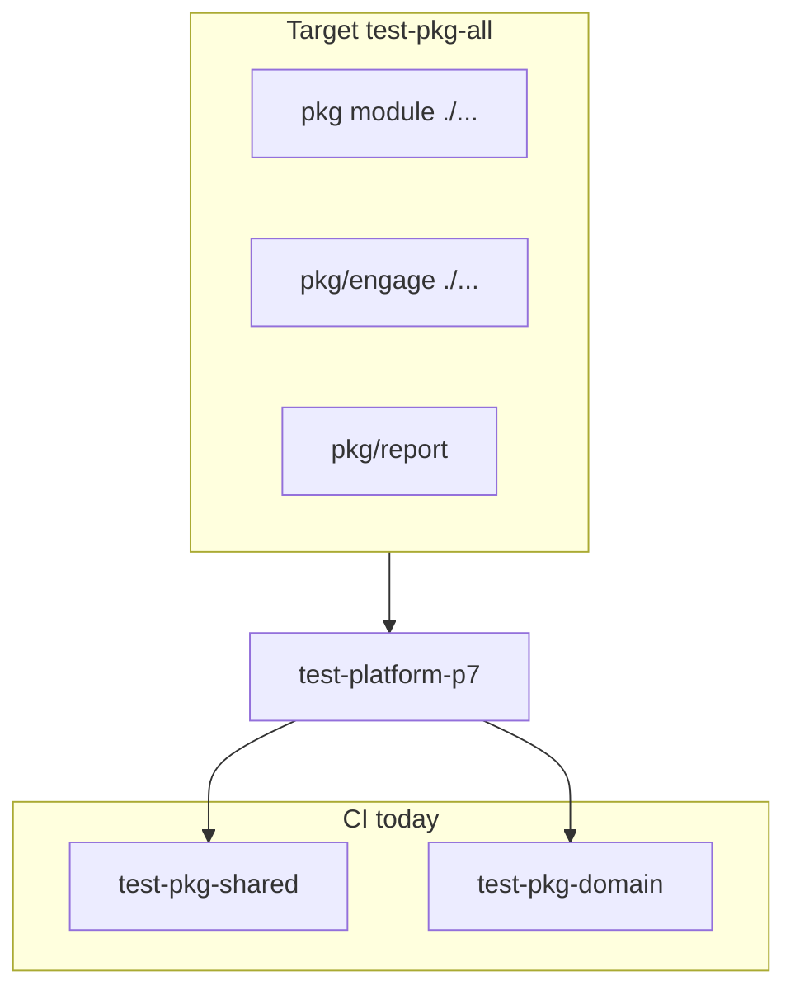

# Полное unit-покрытие `pkg/`

## Baseline (main, `go test ./...` в корневом модуле `pkg/`)

| Пакет | Статус | Покрытие / пробел |
|-------|--------|-------------------|
| `pkg/domain` | OK | ~95% |
| `pkg/ti/{domain,ids,validate,normalize}` | OK | 85–100% |
| `pkg/{sbom,nuclei,ds,coderules}/domain` | только `Test*_zeroSafe` | `[no statements]` — нет JSON/полей |
| `pkg/{lola,vuln,playbook}/domain` | **нет `_test.go`** | 3 пакета без тестов |
| `pkg/commit` | частично | **38.8%** — ~30 `*IdempotencyKey` на 0% |
| `pkg/harvest` | частично | **63.6%** — не все `source`/`kind`, `NewEnvelope`, content keys |
| `pkg/playbook/{procedure,index,framework,cataloglink}` | слабо | **5–30%** — `load.go`, `technique.go`, `ResolveMentions` |
| `pkg/decision` | частично | **43.9%** |
| `pkg/report` | частично | **68.3%** |
| `pkg/natsjet` | частично | **60.5%** — `Connect`, `PublishJSON` edge cases |
| `pkg/mcp` | частично | **31.9%** — `rpc`, `tools`, `framed`, `stdio`, `auth`, `http_sse` |
| `pkg/auth` (+ keycloak) | частично | **45–52%** — `Enforcer`, `Config`, `stack`, `context` |
| `pkg/api` | OK | ~86% |
| `pkg/exec` | есть тесты | sandbox/executor — держать в `test-pkg-shared` |
| **Отдельный модуль** `pkg/engage` | | |
| `engage/domain/job` | **нет тестов** | |
| `engage/domain/report` | слабо | **0%** на `ToFindingEvent` (только const test) |
| `engage/events` | JSON only | **0%** на [`publisher.go`](pkg/engage/events/publisher.go) |
| `engage/contract` | `[no statements]` | decode smoke only |

Сейчас CI гоняет **два среза**, не весь `pkg/`:

- [`make test-pkg-shared`](Makefile) — harvest, commit, natsjet, api, auth, mcp, engage, exec
- [`make test-pkg-domain`](Makefile) — domain, ti, thin domains, decision, playbook, engage/domain (частично)

**`pkg/report` не входит ни в один target** — пробел gate.



## Definition of Done («полное покрытие»)

Три уровня — все обязательны для sign-off:

| Tier | Пакеты | Критерий |
|------|--------|----------|
| **T0 — presence** | все `pkg` + `pkg/engage` import paths с `.go` | У каждого пакета есть `*_test.go` **или** явный `// types-only` + `entity_test` (как [sbom/domain](pkg/sbom/domain/entity_test.go)) |
| **T1 — behavior** | harvest, commit, natsjet, mcp, auth, playbook loaders, engage events | Каждая **exported** pure-функция: table-driven test или JSON round-trip; idempotency keys — golden table |
| **T2 — coverage** | логика (не data-only structs) | **≥70%** statements на пакет (`go test -cover`); исключения: `*/domain` data structs — достаточно T0 |

Не в scope: Docker, live NATS/Keycloak (использовать `nats-server` test embed как в [natsjet/pull_test.go](pkg/natsjet/pull_test.go)), cross-layer adapters.

## Целевая инфраструктура (фаза W0)

**Ветка:** `platform/pkg-tests-w0-harness`

| Изменение | Файл |
|-----------|------|
| `make test-pkg-all` | [Makefile](Makefile) — `cd pkg && go test ./...` + `cd pkg/engage && go test ./...` + явно `./report/...` |
| Baseline matrix | `docs/development/pkg-test-coverage.md` — таблица пакет → tier → % → owner phase |
| Скрипт (опционально) | `scripts/test/pkg-cover.sh` — fail если пакет без тестов или ниже floor |
| Master plan | `.cursor/plans/pkg_unit_tests_master.plan.md` |
| CONTRIBUTING | одна строка: новый `pkg/*` → `_test.go` в том же PR |

Обновить [`.github/workflows/platform.yml`](.github/workflows/platform.yml): добавить `make test-pkg-all` **или** расширить `test-platform-p7` (предпочтительно второе, чтобы не плодить targets).

**DoD:** `make test-pkg-all` green на текущем коде (без новых тестов — только расширение scope).

---

## Волны реализации (субагенты `platform-implementer`)

Одна фаза = одна ветка = один commit = push → critic → merge. Шаблон: [veil-agent-subagents.mdc](.cursor/rules/veil-agent-subagents.mdc).

### W1 — Types-only domain gaps (быстрый ROI)

**Ветка:** `platform/pkg-tests-w1-entity`

| Пакет | Тесты |
|-------|--------|
| [`pkg/vuln/domain`](pkg/vuln/domain/entity.go) | `entity_test.go`: zero-safe, JSON round-trip `Vulnerability`/`CVSS` |
| [`pkg/lola/domain`](pkg/lola/domain/entity.go) | аналогично `Artifact`, `Command` |
| [`pkg/playbook/domain`](pkg/playbook/domain/) | round-trip `ProcedureSpec`, `SkillMeta` (yaml/json tags) |
| [`pkg/engage/domain/job`](pkg/engage/domain/job/job.go) | `Status` enum, `Job` JSON |

**DoD:** `make test-pkg-all`; `go list` — 0 NOTEST в domain packages.

---

### W2 — Wire contracts (harvest + commit)

**Ветка:** `platform/pkg-tests-w2-wire`

По образцу [P7b](.cursor/plans/archive/veil_platform_p7_tests_then_pkg_domain.plan.md) и [ingest-contract.md](docs/contracts/ingest-contract.md):

| Файл | Добавить |
|------|----------|
| [`pkg/harvest/envelope_test.go`](pkg/harvest/envelope_test.go) | table: все `Source*` + `Kind*` из [envelope.go](pkg/harvest/envelope.go); `NewEnvelope` errors; `DSContentKey`, `BrowserContentKey` |
| [`pkg/commit/envelope_test.go`](pkg/commit/envelope_test.go) | table: **все** `*IdempotencyKey` (сейчас 0%); `Validate` edge cases; engage kinds |
| [`pkg/commit/ti_node_test.go`](pkg/commit/ti_node_test.go) | `ActorNodeID`, `ReportNodeID`, link suffix stability |

Сверка с [`pkg/domain/source_test.go`](pkg/domain/source_test.go) — registry harvest/commit не расходится.

**DoD:** `pkg/commit` ≥70% cover; harvest ≥70%.

---

### W3 — Playbook loaders (самый большой пробел)

**Ветка:** `platform/pkg-tests-w3-playbook`

| Пакет | Фокус |
|-------|--------|
| [`procedure`](pkg/playbook/procedure/) | `load_test.go`: `Open` с `pkg/playbook/testdata/`; `GetSpec`/`GetSummary`/`BySubdomain`; `CatalogToolsForTechnique`; расширить `parse_test` (sections, tool tokens) |
| [`index`](pkg/playbook/index/) | `ReadBody`, `Search`, `ByTechnique` с fixture index JSON |
| [`framework`](pkg/playbook/framework/) | `LoadNavigatorLayer`, `CoverageSummary`, `SkillsForTechnique` |
| [`cataloglink`](pkg/playbook/cataloglink/) | table `ResolveMentions` + catalog fixture (поднять с 0%) |

Использовать [`pkg/playbook/testutil`](pkg/playbook/testutil/) / `VEIL_REPO_ROOT` как в существующих тестах.

**DoD:** playbook packages ≥50% (цель W3), ≥70% к концу W3b если разбить на 2 PR.

*Опционально W3b:* `procedure/native` store — если на main появится `native/` (сейчас в планах playbook, не в минимальном tree).

---

### W4 — Engage module

**Ветка:** `platform/pkg-tests-w4-engage`

| Пакет | Фокус |
|-------|--------|
| `engage/domain/report` | `TestFinding_ToFindingEvent` |
| `engage/domain/tool` | довести `InputSchema` / `DefaultParameters` edge cases до ≥70% |
| `engage/contract` | decode всех request/response types, required field errors |
| `engage/events` | `publisher_test.go` с `nats-server` + mock или skip без NATS (как publish tests) |

**DoD:** `cd pkg/engage && go test ./... -cover` — нет NOTEST; report/tool ≥70%.

---

### W5 — Auth + MCP

**Ветка:** `platform/pkg-tests-w5-auth-mcp`

| Пакет | Фокус |
|-------|--------|
| [`pkg/auth`](pkg/auth/enforcer.go) | table `Enforce` по ролям/permissions; `Config` defaults; `context` subject |
| [`pkg/auth/keycloak`](pkg/auth/keycloak/) | httptest JWT / static verifier paths |
| [`pkg/mcp`](pkg/mcp/) | `BuildResponse`, `ParseToolCallParams`, `ListToolsPayload`, `FramedRW` round-trip, `AuthorizeToolCall`, `WantsSSE` / `ParseInboundMessages` |

**DoD:** auth ≥70%, mcp ≥60% (stdio/run loop — smoke only, не 100%).

---

### W6 — Decision, report, natsjet polish

**Ветка:** `platform/pkg-tests-w6-misc`

| Пакет | Фокус |
|-------|--------|
| [`pkg/decision`](pkg/decision/) | закрыть непокрытые `select`, `effectiveness`, `profile` ветки (parity tests уже есть — дополнить unit) |
| [`pkg/report`](pkg/report/) | включить в `test-pkg-all`; golden HTML/PDF fragments для непокрытых веток |
| [`pkg/natsjet`](pkg/natsjet/jetstream.go) | `Connect` error paths, `PublishJSON` msgID dedup |

**DoD:** `make test-pkg-all`; report/decision ≥70%.

---

### W7 — CI enforce + documentation

**Ветка:** `platform/pkg-tests-w7-ci`

- `test-platform-p7` → зависит от `test-pkg-all` вместо раздельных shared+domain (или shared+domain+all без дублирования)
- `scripts/test/pkg-cover.sh` — exit 1 если NOTEST или tier2 &lt;70% (allowlist types-only)
- [docs/agents/coding-style.md](docs/agents/coding-style.md) PR checklist: `make test-pkg-all`
- [`.cursor/agents/manifest.yaml`](.cursor/agents/manifest.yaml) — phases `pkg-tests-w1`…`w7`

**DoD:** platform workflow green; critic checklist в master plan.

---

## Порядок merge и параллельность

```text
W0 (harness) → W1 (entities) → W2 (wire) ─┐
                    W3 (playbook) ────────┼→ W7 (CI)
                    W4 (engage) ──────────┤
                    W5 (auth/mcp) ────────┤
                    W6 (misc) ────────────┘
```

- **W1** и **W0** serial (W0 first).
- **W2** после W1 (idempotency tests use domain types).
- **W3**, **W4**, **W5** параллельны после W2 (разные пути).
- **W6** после W3–W5 (меньше конфликтов в Makefile).
- **W7** последний.

Субагент: `./scripts/agents/render-task-prompt.sh platform-implementer --phase pkg-tests-wN`.

---

## Critic checklist (каждая фаза)

- Diff сфокусирован на `pkg/` (+ docs/Makefile/CI в W0/W7)
- `make test-pkg-all` green
- Нет cross-import discovery/pipeline/knowledge/engage
- Не менять `docs/schemas/` / graph version unless wire payloads change (W2 не меняет JSON)

---

## Связь с другими планами

- [pkg_domain_umbrella](.cursor/plans/pkg_domain_umbrella_master.plan.md) — meta-layer **done**; W2 дополняет registry тестами
- [veil_cleanup T2d](.cursor/plans/veil_cleanup_domain_pkg_master.plan.md) — закрывается W1
- Playbook 100% / native pilot — **не блокирует** W3 (testdata минимальный)

## Оценка объёма

| Wave | ~новых LOC тестов | PR |
|------|-------------------|-----|
| W0 | 50 | 1 |
| W1 | 120 | 1 |
| W2 | 200 | 1 |
| W3 | 250–400 | 1–2 |
| W4 | 150 | 1 |
| W5 | 200 | 1 |
| W6 | 150 | 1 |
| W7 | 80 | 1 |

Итого **8–9 PR**, каждый reviewable (&lt;400 LOC).
