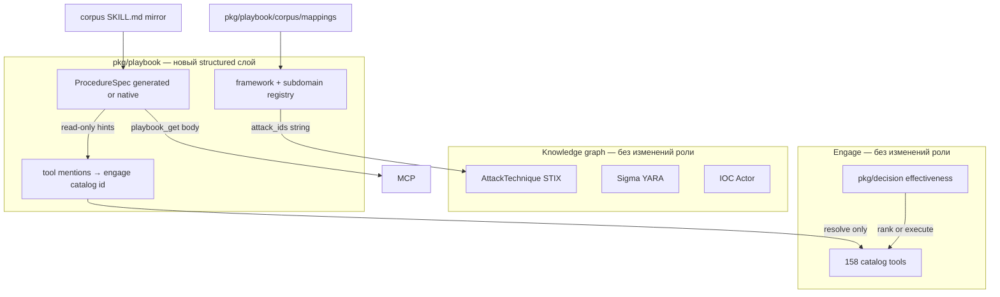

# Переход skills → Knowledge domain (структурированный, DRY)

## Принцип: три слоя, не «754 файла на Go»

Сейчас работает **read mirror** ([corpus/](corpus/anthropic-cybersecurity-skills/skills/), [docs/skills-index/cyber-skills.json](docs/skills-index/cyber-skills.json), veil-api `playbook_*`). Следующий шаг — **обогатить домен**, не вытеснить существующие контуры.



| Слой | SOT | Что **не** делаем |
|------|-----|-------------------|
| **Ontology** | [pkg/playbook/corpus/mappings/](pkg/playbook/corpus/mappings/) + Go [pkg/playbook/framework](pkg/playbook/framework) | Не merge STIX из skills repo |
| **Procedure** | Generated `procedures-index.json` + опционально `pkg/playbook/procedures/<id>.yaml` для «promoted» | Не копировать 8KB body в Neo4j |
| **Execution** | [pkg/decision](pkg/decision) + engage catalog | Не дублировать effectiveness tables из markdown |
| **Narrative** | [corpus/.../SKILL.md](corpus/anthropic-cybersecurity-skills/skills/) до promote | Не удалять mirror в волнах 1–4 |

**Переписывание на Go** = типы, парсеры, резолверы, индексы, тесты — **не** построчный порт prose workflow в `func Step1()`.

---

## Целевая модель в pkg (Veil style)

Расширить [docs/architecture/domain-contour.md](docs/architecture/domain-contour.md) секцией `pkg/playbook`:

| Пакет / тип | Назначение |
|-------------|------------|
| `pkg/playbook/domain` | `SkillMeta`, `ProcedureSpec`, `ProcedureStep`, `FrameworkRef` (уже частично есть) |
| `pkg/playbook/framework` | Navigator, CSF/subdomain registry (из mappings + index) |
| `pkg/playbook/procedure` | Load `procedures-index.json`; `ParseSkillMD(path)`; `Get(id)` |
| `pkg/playbook/cataloglink` | `ResolveTools(mentions []string) → []catalog.ToolID` (fuzzy match к engage catalog) |
| `pkg/playbook/contract` | HTTP/MCP DTO: `ProcedureSummary`, `ProcedureDetail`, `ToolRecommendation` |

**ProcedureSpec** (из типового SKILL.md):

- `WhenToUse []string`
- `Prerequisites []string`
- `Steps []ProcedureStep` (`title`, `kind`: shell|manual|tool, `body`, `catalog_tools[]`)
- `Scenarios []string`
- `AttackIDs`, `NISTCSF`, `Subdomain` — из frontmatter (уже в index)

Генератор: `scripts/knowledge/extract-procedures-index.py` (аналог [generate-cyber-skills-index.py](scripts/knowledge/generate-cyber-skills-index.py)) → [docs/skills-index/procedures-index.json](docs/skills-index/procedures-index.json).

---

## Связь с decision layer

| Concern | Owner |
|---------|--------|
| «Какой **catalog tool** запустить на web_target?» | [pkg/decision](pkg/decision) + [engage intelligence](engage/serve/internal/usecase/intelligence/select_tools.go) |
| «**Как** делать disk imaging по процедуре IR?» | `pkg/playbook/procedure` + `playbook_get` |
| «Какие tools **упомянуты** в skill и есть в catalog?» | `pkg/playbook/cataloglink` → **boost** для `RankToolsWithBoost`, не новая effectiveness table |

**DRY:** одна effectiveness matrix в `pkg/decision`; skills дают **дополнительные candidate IDs** и **procedure context** в ответе veil-api/engage hints, не вторую матрицу.

Пример bridge (волна I4, engage):

```go
// псевдокод: boost[id] += 0.1 если id в playbook.CatalogToolsForTechnique(T1059.001)
```

---

## Матрица постепенного импорта (рабочая таблица)

Файл-трекер: **[docs/playbooks/playbook-import-matrix.md](docs/playbooks/playbook-import-matrix.md)** (создать в I0) — колонки:

`subdomain | skills | ontology | procedures_index | catalog_links | graph_seed | native_yaml | status | branch`

Статусы: `mirror` → `indexed` → `structured` → `linked` → `graph` → `native` → `done`.

### Волна 0 — инфраструктура (1 PR)

| ID | Задача | Артефакт |
|----|--------|----------|
| I0 | Матрица + master plan | `docs/playbooks/playbook-import-matrix.md`, [.cursor/plans/playbook_domain_migration_master.plan.md](.cursor/plans/playbook_domain_migration_master.plan.md) |
| I1 | `ProcedureSpec` types | `pkg/playbook/domain/procedure.go` |
| I2 | Extractor script | `scripts/knowledge/extract-procedures-index.py`, `make procedures-index` |
| I3 | CI check | `make check-procedures-index` |

**Ветка:** `feat/playbook-i0-procedure-schema`

**DoD:** 754 записей в `procedures-index.json` с `step_count`, `tool_mentions[]`; unit test на 3 golden skills (DFIR, ransomware hunt, web XSS).

---

### Волна 1 — Ontology в домене (параллельно с I0 после merge mappings)

| ID | Задача |
|----|--------|
| O1 | `pkg/playbook/framework/subdomain.go` — 26 subdomain из [cyber-skills.json](docs/skills-index/cyber-skills.json) + CSF ids из [nist-csf/](pkg/playbook/corpus/mappings/nist-csf/) |
| O2 | `TechniqueToSkills` из Navigator layer + index `attack_ids` |
| O3 | API: `GET /v1/playbooks/ontology/subdomains`, `.../technique/{id}/skills` |

**Ветка:** `feat/pkg-playbook-ontology`

**Не трогать:** `pkg/ti/domain`, lola STIX ingest.

---

### Волна 2 — Structured read path (Knowledge)

| ID | Задача |
|----|--------|
| K1 | `pkg/playbook/procedure` load index + lazy full parse |
| K2 | veil-api: `GET /v1/playbooks/{id}/procedure` (structured), `playbook_get` оставить body |
| K3 | MCP: `playbook_procedure`, `playbook_recommend_tools` |

**Ветка:** `feat/knowledge-playbook-procedure-api`

**Обратная совместимость:** все старые `playbook_*` и paths без изменений.

---

### Волна 3 — Граф (минимальный, без тел в узлах)

| ID | Задача |
|----|--------|
| G1 | `playbook_seed` + props: `step_count`, `subdomain`, `has_structured` |
| G2 | Рёбра `ALIGNS_TO_CSF` (опционально) из `nist_csf[]` |
| G3 | `bump-graph-version.sh patch` |

**Ветка:** `feat/knowledge-playbook-graph-props`

**DoD:** `MATCH (t:AttackTechnique {id:'T1059.001'})-[:HAS_PLAYBOOK]->(s)` + `graph_count` в API > 0.

---

### Волна 4 — Engage bridge (без tools.yaml)

| ID | Задача |
|----|--------|
| E1 | veil-api client: `ProcedureForTechnique`, `RecommendTools` |
| E2 | intelligence: merge catalog boosts + `procedure_summary` в `CorrelateThreatIntelligence` / `CreateAttackChain` |
| E3 | Документ: decision vs playbook в [docs/architecture/cyber-domain-model.md](docs/architecture/cyber-domain-model.md) |

**Ветка:** `engage/phase-playbook-procedure-bridge`

---

### Волна 5 — Promote to native (долгий хвост, по матрице)

Критерии promote в `pkg/playbook/procedures/<id>.yaml` или `.go` constants:

- High traffic subdomain (DFIR, IR, threat-hunting) **или**
- Skill с stable tool mapping (≥1 catalog hit) **или**
- Veil-specific fork (`veil_derived: true`)

**Не promote bulk:** оставить corpus markdown + structured index.

Обновлять строку в `docs/playbooks/playbook-import-matrix.md` per subdomain batch (5–10 skills за PR).

---

## Таблица subdomain (первая версия для матрицы)

Импорт **пакетами по subdomain** (26 строк), порядок по ценности для Veil + покрытию mappings:

| Приоритет | Subdomain | ~skills | Ontology | Procedure | Catalog link | Примечание |
|-----------|-----------|---------|----------|-----------|--------------|------------|
| P1 | digital-forensics | 37 | CSF RS.* | batch 1 | dd/volatility → manual | DFIR smoke |
| P1 | incident-response | 26 | CSF RS/RC | batch 1 | partial | IR workflows |
| P1 | threat-hunting | 56 | ATT&CK heavy | batch 2 | sigma/yara refs → detection cat | overlaps detection graph |
| P2 | malware-analysis | 39 | | batch 2 | | |
| P2 | penetration-testing | 20 | | batch 3 | **high** catalog overlap | engage parity |
| P2 | web-application-security | 42 | OWASP map | batch 3 | nikto/nuclei/burp names | |
| P2 | vulnerability-management | 25 | | batch 4 | | |
| P2 | threat-intelligence | 50 | | batch 4 | MISP/OSINT ≠ ti graph | |
| P3 | cloud-security | 63 | | batch 5–8 | | largest count |
| P3 | … остальные 18 subdomain | … | по матрице | batches | | заполнить в I0 из `subdomain_counts` |

Полная 26-строчная таблица генерируется скриптом в I0 из [cyber-skills.json](docs/skills-index/cyber-skills.json).

---

## Параллельные ветки (master)

Файл: `.cursor/plans/playbook_domain_migration_master.plan.md` — status table, зависимости:

```text
I0 (schema + extractor) ─┬─► K1–K3 (procedure API)
                         ├─► O1–O3 (ontology)     [parallel after V0 corpus merge]
                         └─► G1–G3 (graph)        [after K1]
O1 + K1 ─► E1–E3 (engage bridge)
Волна 5 native — по строкам матрицы, 1 subdomain ≈ 1 PR при необходимости
```

Дисциплина: [.cursor/rules/veil-agent-parallel-branches.mdc](.cursor/rules/veil-agent-parallel-branches.mdc).

---

## Что сохраняем без регрессий

| Функция | Как сохраняем |
|---------|----------------|
| veil-mcp `playbook_search/get/for_technique` | Без breaking changes; добавляем tools |
| MITRE STIX ingest (lola) | Join только по `Txxxx` string |
| engage catalog 158 tools | `cataloglink` resolve, не новые MCP exec tools |
| `pkg/decision` tables | Read-only use; optional boost |
| corpus mirror | До promote — source of truth для body |

---

## Definition of done (программа)

- [ ] `docs/playbooks/playbook-import-matrix.md` с 26 subdomain и статусами
- [ ] `procedures-index.json` + `pkg/playbook/procedure`
- [ ] Ontology API / types из mappings
- [ ] Structured procedure API + MCP
- [ ] Graph seed с `graph_count` > 0 для покрытых T-ids
- [ ] Engage bridge: procedure hints + catalog boost без дубля decision
- [ ] Engage catalog и STIX ingest **без изменений поведения**

---

## Рекомендуемый старт

1. **I0** — schema + extractor + матрица (один PR, ~300 LOC Go/py + generated JSON).
2. Параллельно **O1** (ontology) и **K1** (procedure loader) после merge I0.
3. Прогон API smoke: `procedure` + существующий `playbook_get`.
4. Дальше по матрице — отмечать subdomain `structured` → `linked` → `done`.

Оценка: **4–5 PR** до полного structured read + graph; **native YAML** — отдельный долгий хвост по таблице (десятки маленьких PR, не блокер).
