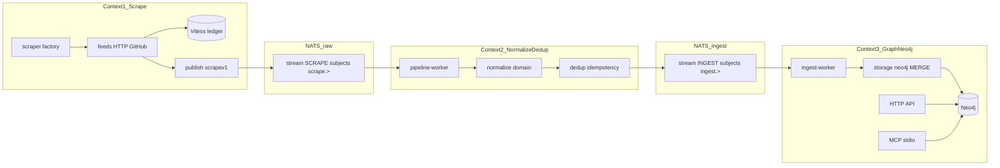

# Veil: три контекста + Vitess ledger + релиз 0.3.1

## Где остановились (план [nats-only_+_graph_pack_0.3.1](.cursor/plans/nats-only_+_graph_pack_0.3.1_3b280ecb.plan.md))

| Этап | Статус |
|------|--------|
| Единый compose, NATS-only, без `direct` | **done** |
| Документация NATS-only, proxy-логи | **done** |
| E2E scrape (`docker compose --profile scrape`) | **in_progress** |
| export → build graph-pack v0.3.1, sha256 ≠ `b4fd360a…` | pending |
| curl API / MCP / deploy LB | pending |
| `gh release v0.3.1-graph-pack` | pending |

**Блокер для «настоящего» v0.3.1 ZIP:** без полного scrape + worker + export новый пак совпадёт по sha256 со старым дампом. Рефакторинг **вставляется перед** полным прогоном scrape/export/release.

---

## Три контекста и два NATS-контура (ключевое уточнение)

**Целевой поток (как задумано):**

```text
scrape  →  NATS (raw)  →  normalize + dedup  →  NATS (ingestv1)  →  ingest-worker  →  Neo4j
                                                                              ↑
                                                                    API + MCP (read)
```



| Контекст | Бинарь / сервис | NATS | Ответственность | Не делает |
|----------|-----------------|------|-----------------|-----------|
| **1. Scrape** | `vuln`, `ti`, `lola`, `ds`, AppSec… | **Publish** `scrape.>` | Fetch, parse → **сырой** payload (`scrapev1`), Vitess ledger, proxy | normalize, idempotency для графа, Cypher |
| **2. Normalize + dedup** | **`pipeline-worker`** (новый) | **Consume** `scrape.>` → **Publish** `ingest.>` | domain types, normalize ([ti/normalize](scrapers/ti/internal/normalize) сюда), `ingestv1` + `Nats-Msg-Id` | HTTP fetch, Bolt |
| **3. Graph** | **`ingest-worker`**, `api`, `mcp` | **Consume** `ingest.>` | MERGE в Neo4j, read API/MCP | внешние API, normalize |

**Отличие от текущего кода:** сейчас скрейперы уже нормализуют и публикуют `ingestv1` напрямую (например [ti/internal/natspub](scrapers/ti/internal/natspub/publisher.go) вызывает `normalize` до publish). Рефакторинг **разрывает** это: producers → только `scrapev1`; весь normalize/dedup — в `pipeline-worker`.

**Границы:**
- ctx1 → ctx2: `scrapev1.Envelope` (новый контракт, см. ниже)
- ctx2 → ctx3: существующий `ingestv1.Envelope` ([pkg/ingestv1](pkg/ingestv1/envelope.go)) — без изменения семантики MERGE в worker

---

## Целевая структура каталогов

Предлагаемый корень ingest (вместо разрозненных `scrapers/{ti,vuln,...}` как «мини-монорепы»):

```
pkg/
  scrapev1/              # raw envelope: source, kind, payload, scraped_at (без graph idempotency)
  ingestv1/              # как сейчас — только из pipeline-worker и для ingest-worker
ingest/
  scrape/
    factory/
    feeds/               # HTTP, GitHub, Vitess hook
    publish/             # JetStream publish scrape.> (бывший «первый hop»)
    sources/             # ti, vuln, lola, ds, sbom, ...
  pipeline/
    cmd/                 # pipeline-worker main
    normalize/           # per-domain normalize (перенос из ti/…)
    dedup/               # idempotency keys → ingestv1
    consume/             # scrapev1 decode + route by source/kind
    publish/             # ingestpub → ingest.>
  graph/
    worker/              # ingest-worker (только ingest.>)
    storage/             # neo4j MERGE
    workeringest/
api/                     # ctx3 read Neo4j
mcp/                     # ctx3 read Neo4j
graph/                   # shared neo4j + query
```

**Compose (profile `scrape`):** добавить сервис **`pipeline-worker`** между producers и `ingest-worker`:

```text
nats → [vuln, ti, lola, ds, sbom, …] → pipeline-worker → ingest-worker → neo4j
```

**Compose/Docker:** обновить `docker/*.Dockerfile` paths и `go.work`; имена сервисов в [docker-compose.yml](docker-compose.yml) можно оставить (`vuln`, `ti`, …) для обратной совместимости, меняется только build context/module path.

**Стиль:** [docs/coding-style.md](docs/coding-style.md) — `cmd` → `usecase` → `repository` → `storage`; `storage/` вне `internal` для cross-module import worker’ом.

---

## Фабрика скрейперов

**Проблема сейчас:** дублирование в [scrapers/lola/internal/usecase/scrape.go](scrapers/lola/internal/usecase/scrape.go), [scrapers/vuln/internal/usecase/scrape.go](scrapers/vuln/internal/usecase/scrape.go), [scrapers/ds/internal/usecase/ingest.go](scrapers/ds/internal/usecase/ingest.go), [scrapers/ti/internal/feeds/runner.go](scrapers/ti/internal/feeds/runner.go) — `githubListDir`, `fetchBytes` + disk cache, proxy pool, backoff.

**Интерфейс (черновик):**

```go
type Source interface {
    Name() string
    Policy() FetchPolicy          // static | periodic | daily | ...
    Run(ctx context.Context, deps ScrapeDeps) error
}

type ScrapeDeps struct {
    Ledger    repository.CrawlLedger
    Publisher repository.RawPublisher   // только scrape.>
    HTTP      *feeds.Client
    Log       *slog.Logger
}
```

- **4× `natspub`** → **`scrapepub`**: публикуют `scrapev1` (сырой CVE blob, сырой IOC, YAML bytes, GH API path + body hash), **без** `normalize.CanonicalID` и **без** `ingestv1` в скрейпере.
- **AppSec** (`sbom`, `coderules`, `nuclei`): OSV JSON / GHSA path / template YAML → `scrapev1` kinds; normalize (CWE id, stable template id) — в `pipeline-worker`.

**Удалить мёртвый код:** [scrapers/vuln/internal/storage/mongo](scrapers/vuln/internal/storage/mongo) не используется в NATS-only path ([components/init.go](scrapers/vuln/internal/components/init.go) → только `natspub`).

---

## Vitess — crawl ledger (только метаданные)

**Выбор пользователя:** Vitess (MySQL-compatible, CNCF). **Не** хранить CVE/IOC/правила — только факт обращения.

**Схема (минимум):**

```sql
CREATE TABLE crawl_resource (
  resource_key   VARCHAR(512) PRIMARY KEY,  -- stable: feed:kev, gh:owner/repo/path, nvd:page:0:2000
  source         VARCHAR(64) NOT NULL,
  url            TEXT NOT NULL,
  etag           VARCHAR(255) NULL,
  content_sha256 CHAR(64) NULL,
  last_fetched_at TIMESTAMP NOT NULL,
  last_changed_at TIMESTAMP NULL,
  fetch_policy   ENUM('static','periodic','daily') NOT NULL
);
CREATE INDEX idx_crawl_last_fetched ON crawl_resource(last_fetched_at);
```

**Env (добавить в compose + [docs/threatintel-runtime.md](docs/threatintel-runtime.md)):**

| Variable | Default | Meaning |
|----------|---------|--------|
| `VITESS_DSN` | — | `user:pass@tcp(vitess:15306)/veil_ledger` |
| `SCRAPE_MIN_REFETCH_AFTER` | `24h` | Не качать URL снова, если `last_fetched_at` новее порога |
| `SCRAPE_FORCE_REFETCH` | `0` | `1` = игнорировать ledger (полный перескрейп) |

**Политики по категориям (классификация для плана):**

| Категория / feed | Policy | Поведение |
|------------------|--------|-----------|
| MITRE CWE zip, ATT&CK STIX, LOLBAS/GTFOBins tree | `static` | Один раз (или при смене etag/sha256) |
| NVD CVE page (по `startIndex`) | `periodic` | Refetch по `SCRAPE_MIN_REFETCH_AFTER`; отдельно CVE record immutable → skip re-parse если hash совпал |
| CISA KEV, URLhaus recent, ThreatFox, Feodo, OpenPhish | `daily` | Частый refetch |
| OSV per-CVE (`sbom`) | `periodic` | Ledger key `osv:CVE-…`; CVE без изменений в OSV — skip publish |
| GHSA JSON files | `periodic` | Ledger по path |
| Semgrep/CodeQL/Nuclei GitHub paths | `static`/`periodic` | Path-level ledger |
| Exploit-DB CSV, Metasploit listing | `periodic` | |
| TI JSONL file | bypass ledger | Локальный input |

**Интеграция в fetch:** обёртка `feeds.FetchIfDue(ctx, key, url, policy)` → Vitess `ShouldFetch` / `RecordFetch`; disk cache (`*_CACHE_DIR`) остаётся как L1, Vitess — L2 политики между запусками.

**Compose:** сервис `vitess` (или `mysql` + vtgate для dev) в profile `scrape`; volume для данных ledger.

---

## NATS: два stream / subject tree

| Stream | Subjects | Producers | Consumers |
|--------|----------|-----------|-----------|
| **`SCRAPE`** | `scrape.>` | все scrapers | **`pipeline-worker`** |
| **`INGEST`** | `ingest.>` | **`pipeline-worker`** | **`ingest-worker`** |

Env (добавить к [docs/ingest-contract.md](docs/ingest-contract.md)):

| Variable | Default | Meaning |
|----------|---------|--------|
| `NATS_SCRAPE_SUBJECT` | `scrape.>` | pipeline-worker pull filter (input) |
| `NATS_SCRAPE_DURABLE` | `pipeline-worker` | durable consumer SCRAPE |
| `NATS_INGEST_SUBJECT` | `ingest.>` | ingest-worker pull filter (unchanged) |
| `NATS_DURABLE` | `ingest-worker` | durable consumer INGEST |

Dedup на **втором** hop: `Nats-Msg-Id` = `ingestv1.idempotency_key` (как сейчас в [ingestpub](scrapers/ingestpub/publish.go)). На **первом** hop — опционально `scrapev1` content-hash как msg-id, чтобы pipeline не обрабатывал дубликаты сырья.

---

## Контекст 2: `pipeline-worker` (normalize + dedup)

**Сейчас (нужно убрать из scrapers):**
- TI normalize в [natspub](scrapers/ti/internal/natspub/publisher.go) до publish.
- `ingestv1` publish из всех producers → [ingest-worker](scrapers/ingest-worker/cmd/main.go).

**Цель:**
- Новый long-running binary `ingest/pipeline/cmd` (compose: **`pipeline-worker`**).
- Pull loop на `scrape.>` (аналог ingest-worker: errgroup, SIGTERM, batch fetch).
- Per `scrapev1.source` + `kind`: decode → **normalize** → build **`ingestv1.Envelope`** → publish `ingest.{domain}.*`.
- Перенести логику из `pkg/ingestv1` idempotency helpers + [ti/internal/normalize](scrapers/ti/internal/normalize) + ad-hoc vuln CVE normalize.

**`scrapev1` (черновик полей):**
- `schema_version`, `source`, `kind`, `payload` (JSON), `scraped_at`
- kinds зеркалят сырые артефакты: `scrape_nvd_page`, `scrape_ti_kev_row`, `scrape_lolbas_yaml`, `scrape_sbom_osv_json`, …

**TI JSONL:** scraper публикует `scrape_ti_jsonl_line` (raw line); pipeline → разбор JSONL → один или несколько `ingestv1` (как сейчас `KindTIJSONLRecord` в [ti/workeringest](scrapers/ti/workeringest/handler.go), но разбор переносится в pipeline).

**Vitess + dedup:** ledger остаётся в ctx1 (skip fetch). Dedup для графа — в ctx2 (не публиковать `ingestv1`, если payload hash не изменился — опционально второй уровень в Vitess или in-memory bloom; минимум — JetStream dedup на ingest hop).

---

## Контекст 3: Graph / Neo4j (без смешения со scrape)

**Оставить и сгруппировать:**
- [scrapers/ingest-worker](scrapers/ingest-worker) → `ingest/graph/worker`
- `*/storage/neo4j` + `*/workeringest` → `ingest/graph/storage/{sbom,ti,vuln,...}`
- [api/](api/), [mcp/](mcp/), [graph/query](graph/query) — **только чтение** Bolt; не импортируют scrape/feeds/Vitess.

**ingest-worker** — единственный writer **Neo4j**; читает **только** `ingest.>` (без изменения MERGE-семантики). [docs/ingest-contract.md](docs/ingest-contract.md): два контракта (`scrapev1` + `ingestv1`) и матрица kind→handler.

---

## Документация и брендинг Veil

- [README.md](README.md): заголовок **Veil (Vulnerability Exploitation Intelligence Layer)**; краткое описание; Mermaid с тремя слоями; сохранить MIT/license ссылки.
- [docs/coding-style.md](docs/coding-style.md): секция «три контекста» + Vitess env; пути `ingest/…`.
- [AGENTS.md](AGENTS.md), [scrapers/README.md](scrapers/README.md) → `ingest/README.md` или redirect.
- Имя репозитория/go module (`github.com/butbeautifulv/threat_intelligence`) — **не менять** в этом PR (breaking); опционально подзаголовок Veil в README.

---

## Фаза выполнения (порядок)

### A. Контракты NATS + skeleton
1. `pkg/scrapev1` + stream `SCRAPE`; расширить [ingestpub](scrapers/ingestpub/publish.go) → `scrapepub` + `pipeline/publish` (ingest).
2. `ingest/` skeleton (scrape / pipeline / graph).
3. **`pipeline-worker` MVP:** consume `scrape.>` → pass-through или один kind (например `ds`) → publish `ingest.>`; compose-сервис.
4. Переключить **один** scraper (`ds`) на `scrapev1` only; ingest-worker без изменений.

### B. Scrape factory + все producers
5. Общий `scrape/feeds` + factory; мигрировать lola, vuln, ti, AppSec на `scrapepub`.
6. Удалить `natspub` + normalize из scrapers; удалить mongo vuln.
7. Расширить `pipeline-worker` handlers на все source/kind (перенос normalize из ti/vuln).

### C. Vitess ledger (ctx1)
8. Миграции + `storage/vitess`; `FetchIfDue`; политики static/periodic/daily.
9. Compose `vitess` + `VITESS_DSN`.

### D. Graph ctx3 cleanup
10. Перенести ingest-worker + storage в `ingest/graph/`; api/mcp без scrape/pipeline imports.
11. Обновить [docs/ingest-contract.md](docs/ingest-contract.md), runtime, Veil README.

### E. E2E и релиз (после зелёных тестов)
11. `docker compose down -v` (опционально) → `--profile scrape up --build -d` (**включая `pipeline-worker`**).
12. Проверить drain **обоих** stream: `scrape.>` (pipeline lag → 0), `ingest.>` (ingest-worker lag → 0); smoke Cypher.
13. `./scripts/export-graph-cypher.sh` → `GRAPH_PACK_VERSION=v0.3.1 ./scripts/build-graph-pack.sh` → **sha256 ≠** `b4fd360a…`.
14. `curl /health`, `/v1/categories`, MCP smoke; при deploy — LB.
15. `./scripts/graph-dedup-cleanup.sh --dry-run` затем apply при необходимости.
16. `gh release create v0.3.1-graph-pack`; обновить [docker/graph-bootstrap.sh](docker/graph-bootstrap.sh) `DEFAULT_PACK_URL`.

**«Сканирование и обогащение»** = полный **scrape profile**: все producers → **`pipeline-worker`** → **`ingest-worker`** → Neo4j; «обогащение» — рост связей в графе после полного прогона (см. [docs/ontology-appsec.md](docs/ontology-appsec.md)).

---

## Риски

- **Большой diff:** поэтапные PR/commits внутри ветки (A → B → C → D).
- **Vitess в dev:** тяжелее Mongo/Postgres; для локалки допустим `mysql:8` + один shard без полного Vitess cluster, с тем же DSN-контрактом.
- **Переименование путей:** все Dockerfile и CI должны обновиться синхронно.
- **Лимиты compose** (`NVD_MAX_PAGES=1` и т.д.) — для «максимального» графа поднять env осознанно перед export.

---

## Критерии готовности v0.3.1

- [ ] Два NATS-контура: scrapers → `scrape.>` → pipeline-worker → `ingest.>` → ingest-worker; normalize только в pipeline.
- [ ] Нет import scrape → neo4j storage; ingest-worker не читает `scrape.>`.
- [ ] Vitess ledger работает; повторный scrape пропускает due URLs.
- [ ] `go test` зелёный по ingest/graph/pkg.
- [ ] Neo4j node/rel counts выросли vs bootstrap-only.
- [ ] Новый graph-pack sha256; GitHub release + README Veil.
