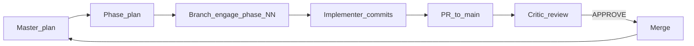

# Veil + Karpathy guidelines

Behavioral guidelines from [Andrej Karpathy's observations](https://x.com/karpathy/status/2015883857489522876), merged with Veil project rules ([AGENTS.md](../../../AGENTS.md), [docs/agents/coding-style.md](../../../docs/agents/coding-style.md)).

**Tradeoff:** Caution over speed on non-trivial work. For trivial one-liners, use judgment.

**Roles:** See [veil-agent-critic.mdc](../../rules/veil-agent-critic.mdc) and [veil-agent-parallel-branches.mdc](../../rules/veil-agent-parallel-branches.mdc).

| Role | Karpathy focus | Veil focus |
|------|----------------|------------|
| **Orchestrator / critic** | Think before merge; surgical diff review | Plan compliance, architecture, tests |
| **Implementer** (branch) | Simplicity + goal-driven loops | Phase plan scope only; commit on branch |

---

## 1. Think before coding

**Don't assume. Don't hide confusion. Surface tradeoffs.**

Before touching code:

1. Read the **master plan** (dependencies, status table) and the **phase plan** (scope, files, acceptance).
2. State assumptions explicitly — layer (`scrape` / `pipeline` / `graph` / `engage`), integration path (NATS vs HTTP veil-api), whether ingest/version bump applies.
3. If the request spans multiple phases or layers, **split** — do not implement in one diff.
4. If the phase plan is ambiguous, stop and ask; do not silently pick an interpretation.
5. If a simpler approach exists within Veil constraints, say so.

**Veil-specific:** Never guess cross-layer imports or `.external/` edits — both are forbidden ([AGENTS.md](../../../AGENTS.md)).

---

## 2. Simplicity first

**Minimum code that solves the phase goal. Nothing speculative.**

Align with [docs/agents/coding-style.md](../../../docs/agents/coding-style.md): CLEAN CODE, DRY, KISS, DDD.

- No features beyond the **phase plan** deliverables.
- No abstractions for single-use code; no extra configurability unless the plan asks.
- `cmd/` is wiring only; domain packages stay free of I/O.
- Shared wire types live in `pkg/*` — do not duplicate envelopes across layers.
- If the change approaches ~200 lines and could be ~50, simplify before pushing.

**Veil-specific:** Four isolated contexts — no “helper” package that bridges `engage` and `graph` in Go.

---

## 3. Surgical changes

**Touch only what the phase plan requires. Clean up only your own orphans.**

- Every changed line should trace to the **phase plan** or an explicit user request in this session.
- Do not drive-by refactor, reformat, or “improve” adjacent files.
- Match existing naming, imports, and patterns in the touched module.
- Unrelated dead code: **mention** in PR notes; do not delete unless the phase plan includes cleanup.
- Remove imports/symbols only if **your** edit made them unused.

**Veil-specific (critic):** Reject PRs that edit files outside the phase plan file list without justification. Reject cross-layer Go imports and root `go.work`.

---

## 4. Goal-driven execution

**Turn the phase plan into verifiable checks. Loop until green.**

Map phase acceptance to concrete commands:

| Phase type | Typical verify |
|------------|----------------|
| Engage feature | `make test-engage`; parity if catalog/routes: `make test-engage-parity` |
| Engage events | `make test-pipeline`; `make test-engage-events-pipeline` |
| Graph ingest | `make test-graph`; `make check-graph-version`; bump `versions.env` if needed |
| CI / smoke phase | Smokes named in phase plan (e.g. `make test-engage-veil-stack-ci`) |
| Deploy only | Compose health + smoke script from plan |

**Plan format** (in phase plan or PR description):

```text
1. [Deliverable Rxxx] → verify: [command or assertion]
2. [Deliverable Rxxx] → verify: [command or assertion]
3. DoD → verify: [phase DoD checklist]
```

Weak criteria (“make CI green”) → break into named smokes and assertions.

**Veil-specific:** Do not mark a phase `done` in the master plan until critic **APPROVE** and merge SHA is recorded.

---

## 5. Planning rhythm (reduces diff size)

Karpathy’s “loop until goals met” at **project** scale:



1. **Master plan** — phases, deps, table: `Phase | Branch | Status | Owner | Critic | Merge SHA`.
2. **Phase plan** — one phase; explicit file list and DoD.
3. **Branch** — `engage/phase-<NN>-<slug>` from latest `main`.
4. **Implement** — principles 1–4; commit on branch; push; open PR.
5. **Critic** — orchestrator session; verdict using sections 1–4 + architecture checklist.
6. **Update master plan** — `done` + merge SHA.

Parallel phases: independent file sets only; rebase after dependency merges.

---

## Critic: Karpathy lens on review

When reviewing a branch, flag:

| Signal | Likely violation | Action |
|--------|------------------|--------|
| Large refactor outside plan files | Surgical / plan scope | REQUEST_CHANGES |
| New abstraction unused by phase | Simplicity | REQUEST_CHANGES |
| No tests for new behavior | Goal-driven | REQUEST_CHANGES |
| Merged interpretation in PR text | Think before coding | Ask implementer to confirm scope |
| `versions.env` unchanged but ingest touched | Veil compliance | BLOCKED until bump |

Use the verdict template in [veil-agent-critic.mdc](../../rules/veil-agent-critic.mdc).

---

## Metacognition on errors (5 Whys + Gemba Kaizen + 1%)

**Rule file:** [veil-agent-kaizen-metacognition.mdc](../../rules/veil-agent-kaizen-metacognition.mdc)

When something fails, **pause implementation** and run this loop before writing more code.

### 1. Metacognition (notice thinking errors)

- Name the symptom and the command that proved it.
- List what you **assumed** vs what logs/tests **showed**.
- If you already tried a fix and it failed again, treat the first fix as treating a symptom only.

### 2. Five Whys (root cause)

| Step | Question |
|------|----------|
| Why 1 | Why did the symptom appear? |
| Why 2 | Why did that happen? |
| Why 3 | Why was that allowed? (often: go to Gemba here) |
| Why 4 | Why wasn’t it caught earlier? |
| Why 5 | Why does the process/plan allow recurrence? |

Stop when you can point to a **single controllable cause** (file + line, missing env, wrong wait, plan gap).

### 3. Gemba Kaizen (fix at the real place)

- **Gemba:** reproduce at the failure site (test, smoke, service log, graph query).
- **Kaizen fix:** smallest change that removes the root cause.
- **Verify:** same failing command → green; then layer tests.

### 4. One percent improvement (compound)

Each error response should leave the repo slightly better:

- Clearer assert, smoke wait, or error message.
- One line in phase plan / PR: **Kaizen note** (symptom → cause → fix → guard).
- Optional follow-up todo in master plan (next slice), not scope explosion in the current phase.

**Not allowed:** blind retries, broad refactors, or hiding red checks without documented SKIP + Why.

---

## Implementer prompt template

```text
You are a Veil implementer on branch engage/phase-NN-slug.
Read: AGENTS.md, docs/agents/coding-style.md, .cursor/skills/veil-karpathy-guidelines/SKILL.md,
       <phase-plan-path>.
Follow Karpathy 1–4 within phase scope only.
On any error: 5 Whys + Gemba Kaizen fix + Kaizen note (1% improvement); no guess-and-check loops.
Do not merge; push branch and return PR link for critic review.
```

---

## Success signals

- Phase PRs are small and map 1:1 to a phase plan.
- Clarifying questions appear **before** large diffs.
- Critic catches out-of-scope and over-engineering before merge.
- Master plan table stays accurate across parallel streams.

**Source upstream:** [.external/andrej-karpathy-skills-main/](../../../.external/andrej-karpathy-skills-main/) (reference only; do not edit).
