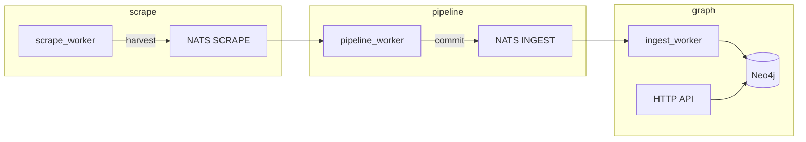

# Veil (Vulnerability Exploitation Intelligence Layer)


[](LICENSE)

**Veil** is a Neo4j-backed threat-intelligence graph: vulnerabilities (CVE, CWE, CPE), LOLbins-style artifacts, detection content (Sigma/YARA/Caldera), TI feeds, SBOM advisories, and code-rule templates. The runtime is split into three isolated layers — **scrape**, **pipeline**, and **graph** — connected by NATS JetStream (`scrape.>` → `ingest.>`).

**License:** [MIT](LICENSE) · **Contributing:** [CONTRIBUTING.md](CONTRIBUTING.md) · **Agents / AI:** [AGENTS.md](AGENTS.md) · **Security:** [SECURITY.md](SECURITY.md) · **Code of conduct:** [CODE_OF_CONDUCT.md](CODE_OF_CONDUCT.md)

## Architecture



| Layer | Path | Role |
|-------|------|------|
| **Scrape** | [scrape/](scrape/) | Fetch feeds, Vitess ledger, publish `harvest` |
| **Pipeline** | [pipeline/](pipeline/) | Normalize/dedup → `commit` (incl. NVD CWE/CPE via [pipeline/pkg/nvd/parse](pipeline/pkg/nvd/parse/)) |
| **Graph** | [graph/](graph/) | MERGE into Neo4j; [serve/](graph/serve/) HTTP API + MCP read Bolt |

Deploy: [deploy/](deploy/) · Contracts: [docs/ingest-contract.md](docs/ingest-contract.md) · Runtime: [docs/threatintel-runtime.md](docs/threatintel-runtime.md)

## Quick start

### Graph only (demo API + optional pack import)

```bash
docker compose up --build -d
```

| Endpoint | Default |
|----------|---------|
| Neo4j Browser | http://localhost:7474 (`neo4j` / `neo4jpassword`) |
| HTTP API | http://localhost:8090 |

`graph-bootstrap` imports the default [veil-graph-v0.4.0](https://github.com/butbeautifulv/veil/releases/tag/veil-graph-v0.4.0) pack when published, unless `GRAPH_PACK_SKIP=1`. Local ZIP: [docker-compose.testpack.yml](docker-compose.testpack.yml).

```bash
curl -sS http://localhost:8090/health
curl -sS http://localhost:8090/v1/categories | jq .
```

### Full scrape pipeline

```bash
./scripts/ops/compose-up-full.sh
```

E2E smoke (minimal sources by default):

```bash
./scripts/test/smoke-scrape-e2e.sh --up
./scripts/test/smoke-scrape-e2e.sh
```

Fast-rich graph pack (~25 min): [scripts/graph-pack/profile-fast-rich.sh](scripts/graph-pack/profile-fast-rich.sh) — [docs/graph-pack.md](docs/graph-pack.md).

## Documentation index

| Document | Contents |
|----------|----------|
| [AGENTS.md](AGENTS.md) | Cursor/agents: read [docs/coding-style.md](docs/coding-style.md) first |
| [docs/threatintel-runtime.md](docs/threatintel-runtime.md) | Compose, ports, env, bootstrap, API, MCP, NATS |
| [deploy/README.md](deploy/README.md) | Per-layer compose, scaling, smoke, graph pack releases |
| [scrape/README.md](scrape/README.md) | Scrape sources and env vars |
| [pipeline/README.md](pipeline/README.md) | Pipeline worker and normalization |
| [graph/README.md](graph/README.md) | Ingest, API, MCP, Neo4j client |
| [graph/ingest/README.md](graph/ingest/README.md) | JetStream → Neo4j consumer |
| [docs/coding-style.md](docs/coding-style.md) | Architecture, layering, PR checklist |
| [docs/ontology-appsec.md](docs/ontology-appsec.md) | Labels, relationships, roadmap |
| [docs/ingest-contract.md](docs/ingest-contract.md) | `harvest` / `commit`, JetStream |
| [graph/serve/](graph/serve/) | HTTP API + stdio MCP |
| [scripts/README.md](scripts/README.md) | Export, packs, smoke, dedup |
| [docs/graph-pack.md](docs/graph-pack.md) | Graph pack export, release, import |

## Graph packs

See [docs/graph-pack.md](docs/graph-pack.md). Quick path:

```bash
./scripts/graph-pack/export-cypher.sh
GRAPH_PACK_VERSION=v0.4.0 ./scripts/graph-pack/build.sh
```

## MCP

```bash
cd graph/serve && go run ./cmd/mcp
```

Details: [graph/serve/](graph/serve/), [docs/threatintel-runtime.md](docs/threatintel-runtime.md#mcp-stdio).

## Smoke Cypher

```cypher
MATCH (n) RETURN labels(n)[0] AS label, count(*) AS c ORDER BY c DESC LIMIT 20;
MATCH (v:Vulnerability)-[:HAS_CWE]->() RETURN count(*) AS has_cwe;
MATCH (v:Vulnerability)-[:AFFECTS]->(:CPE) RETURN count(*) AS affects;
```

## Tests

```bash
make test-scrape
make test-pipeline
make test-graph
```
