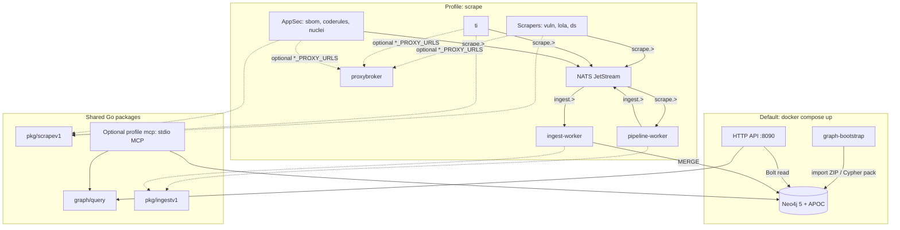

# Veil (Vulnerability Exploitation Intelligence Layer)


[](LICENSE)

**Veil** is a Neo4j-backed threat-intelligence graph: vulnerabilities, LOLbins-style artifacts, detection content (Sigma/YARA/Atomic/Caldera), and TI feeds. The repo is split into three runtime contexts — **scrape**, **pipeline**, and **graph** — connected by two NATS JetStream streams (`scrape.>` → `ingest.>`). See [scrapers/README.md](scrapers/README.md) and [ingest/graph/README.md](ingest/graph/README.md).

**License:** [MIT](LICENSE) · **Contributing:** [CONTRIBUTING.md](CONTRIBUTING.md) · **Agents / AI:** [AGENTS.md](AGENTS.md) · **Security:** [SECURITY.md](SECURITY.md) · **Code of conduct:** [CODE_OF_CONDUCT.md](CODE_OF_CONDUCT.md)

## Architecture

High-level view of the default Compose stack, optional **`scrape`** profile, and shared Go modules (see [docs/threatintel-runtime.md](docs/threatintel-runtime.md) for ports and env vars).



## Quick start

```bash
docker compose up --build
```

Default stack: **Neo4j** → **graph-bootstrap** (imports a [graph pack](docs/threatintel-runtime.md#graph-bootstrap-usage-mode); skip with `GRAPH_PACK_SKIP=1`) → **HTTP API**. Scrapers, **pipeline-worker**, NATS, and **ingest-worker** are **not** started unless you use the **`scrape`** profile.

| Endpoint | Default | Notes |
|----------|---------|--------|
| Neo4j Browser | `http://localhost:7474` | User `neo4j` / `neo4jpassword`; APOC enabled |
| HTTP API | `http://localhost:8090` | `API_PORT` overrides published port |

**Fill the graph by scraping** (NATS `scrape.>` → **pipeline-worker** → `ingest.>` → **ingest-worker** → Neo4j):

```bash
docker compose --profile scrape up --build -d
```

Full service matrix, ports, and environment variables: **[docs/threatintel-runtime.md](docs/threatintel-runtime.md)**.

## Documentation index

| Document | Contents |
|----------|----------|
| [AGENTS.md](AGENTS.md) | **Cursor / agents:** mandatory pointer to [docs/coding-style.md](docs/coding-style.md) before code changes |
| [docs/threatintel-runtime.md](docs/threatintel-runtime.md) | Compose services (including **ingest-worker**), ports, bootstrap, API, MCP, NATS |
| [docs/deploy.md](docs/deploy.md) | **v0.3.1** deploy: nginx LB, scale API / `ingest-worker`, BuildKit cache, GitHub graph-pack release |
| [scrapers/README.md](scrapers/README.md) | Scraper sources matrix, env vars, NATS → worker, local `go run` |
| [scrapers/ingest-worker/README.md](scrapers/ingest-worker/README.md) | JetStream consumer: env, local run, Compose examples |
| [docs/coding-style.md](docs/coding-style.md) | Layering, logging, ingest conventions for PRs |
| [docs/ontology-appsec.md](docs/ontology-appsec.md) | AppSec labels, relationships, roadmap |
| [mcp/README.md](mcp/README.md) | Stdio MCP server tools and env |
| [scripts/README.md](scripts/README.md) | Export, packs, graph housekeeping |
| [CONTRIBUTING.md](CONTRIBUTING.md) | How to contribute, tests, licensing |
| [SECURITY.md](SECURITY.md) | Responsible disclosure for vulnerabilities |
| [CODE_OF_CONDUCT.md](CODE_OF_CONDUCT.md) | Community expectations |

## Repository layout

| Path | Role |
|------|------|
| [graph/](graph/) | Shared Neo4j client + [graph/query](graph/query) (categories, Cypher reads) |
| [api/](api/) | HTTP API (`docker/api.Dockerfile`) |
| [docker/](docker/) | Service Dockerfiles: `api`, `graph-bootstrap`, scrapers, `mcp`, **`ingest-worker`**, `proxybroker`, … |
| [mcp/](mcp/) | MCP server (stdio); uses `graph/query` |
| [pkg/ingestv1/](pkg/ingestv1/) | Versioned JSON envelope for NATS → worker pipeline |
| [scrapers/](scrapers/) | `vuln`, `lola`, `ds`, `ti`, `sbom`, `coderules`, `nuclei`, **`ingest-worker`**, `ingestpub`, `proxybroker`, [cue_schemas/](scrapers/cue_schemas/) |
| [scripts/](scripts/) | Export / pack / import Cypher; [scripts/README.md](scripts/README.md) |
| [docs/](docs/) | Runtime, ontology, OpenAPI sketch, coding style |

## Offline graph packs

After Neo4j has been filled once, ship a versioned ZIP for air-gapped installs. Exports go under `data/neo4j_user_export/` (see `scripts/export-graph-cypher.sh`).

```bash
./scripts/export-graph-cypher.sh
GRAPH_PACK_VERSION=v0.3.1 ./scripts/build-graph-pack.sh
```

Import: [scripts/import-graph-pack.sh](scripts/import-graph-pack.sh) — details in [scrapers/README.md](scrapers/README.md) (*Graph export and packs*).

## MCP

```bash
docker compose --profile mcp run --rm -i mcp
```
Details: [docs/threatintel-runtime.md](docs/threatintel-runtime.md#mcp-stdio) and [mcp/README.md](mcp/README.md).

## Smoke Cypher

```cypher
MATCH (n) RETURN labels(n) AS labels, count(*) AS c ORDER BY c DESC;
MATCH ()-[r]->() RETURN type(r) AS rel, count(*) AS c ORDER BY c DESC;
```

## Further reading

- **[docs/coding-style.md](docs/coding-style.md)** — scraper and worker layering, `slog`, NATS ingest.
- **[scrapers/README.md](scrapers/README.md)** — source matrix, NATS ingest, TI JSONL, roadmap.
- **[docs/ingest-contract.md](docs/ingest-contract.md)** — JetStream stream/subjects, kind matrix, ack policy.

