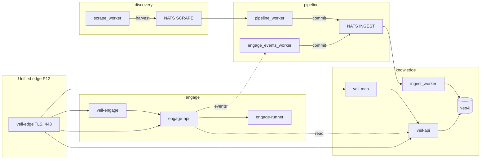

# Veil (Vulnerability Exploitation Intelligence Layer)


[](LICENSE)

**Veil** is a Neo4j-backed threat-intelligence platform with an optional **active security testing** layer. The graph holds CVE/CWE/CPE, LOLbins-style artifacts, detection content (Sigma/YARA/Caldera), TI feeds, SBOM advisories, and code-rule templates. Runtime is **four isolated Go modules** — **discovery**, **pipeline**, **knowledge** (read intel), **engage** (tool execution) — on **NATS JetStream** for ingestion and **dual MCP** servers for agents.

**License:** [MIT](LICENSE) · **Contributing:** [CONTRIBUTING.md](CONTRIBUTING.md) · **Agents / AI:** [AGENTS.md](AGENTS.md) · **Security:** [SECURITY.md](SECURITY.md) · **Code of conduct:** [CODE_OF_CONDUCT.md](CODE_OF_CONDUCT.md)

---

## What you get

| Capability | Description |
|------------|-------------|
| **Threat graph** | Versioned [graph packs](docs/graph-pack.md), HTTP API (`/v1/*`), read-only MCP |
| **Ingestion bus** | Scrape → NED → ingest over NATS (`pkg/harvest`, `pkg/commit`) |
| **Engage toolkit** | **158** catalog tools · **54** bridge handlers · subprocess runner matrix (`make test-engage-executable-matrix`). Workflows (CTF, BB, CVE), Docker sandbox |
| **Closed loop** | Tool runs → `engage.events` → graph (`EngageToolRun`, `EngageFinding`) |
| **Unified edge (P12)** | One TLS host: `/v1/*`, `/api/*`, `/mcp/graph`, `/mcp/engage`; scale tiers **4 / 8 / 16** |
| **Agent-ready** | **veil-mcp** (read) + **veil-engage** (exec), Keycloak RBAC, GAIA eval harness |
| **Prod path** | Terraform + Ansible + Helm; secure overlays; [veil-controls](deploy/security/veil-controls.yaml) |

---

## Architecture



| Layer | Path | Role | MCP |
|-------|------|------|-----|
| **Discovery** | [discovery/](discovery/) | Feeds, Vitess ledger, `harvest` publish | — |
| **Pipeline** | [pipeline/](pipeline/) | NED → `commit`; [engage-events](pipeline/engage-events/) → `ingest.engage.*` | — |
| **Knowledge** | [knowledge/](knowledge/) | Neo4j ingest + [serve](knowledge/serve/) API/MCP | `veil-mcp` (read) |
| **Engage** | [engage/](engage/) | Catalog tools, workflows, reports | `veil-engage` (exec) |

**Shared `pkg/`** (any layer may import): [harvest](pkg/harvest/), [commit](pkg/commit/), [natsjet](pkg/natsjet/), [auth](pkg/auth/), [engage](pkg/engage/), [report](pkg/report/), [decision](pkg/decision/), [exec](pkg/exec/), [api](pkg/api/), [mcp](pkg/mcp/). **No Go imports** across `discovery/`, `pipeline/`, `knowledge/`, `engage/`.

**Agents:** two MCP processes — **veil-graph** (query TI) and **veil-engage** (run tools). Legacy HexStrike (Python `:8888`) is **decommissioned** — [mcp-agents.md](docs/mcp-agents.md), [engage-audit-report.md](docs/engage-audit-report.md).

**Contracts:** [ingest-contract.md](docs/ingest-contract.md) · [threatintel-runtime.md](docs/threatintel-runtime.md) · [engage-runtime.md](docs/engage-runtime.md) · [platform-unified-access.md](docs/platform-unified-access.md) · [deploy/](deploy/)

---

## Quick start

Pick one path. All compose files live under [deploy/](deploy/); stack presets in [deploy/stacks/](deploy/stacks/).

### Graph only (Neo4j + API + optional MCP)

```bash
docker compose -f deploy/knowledge/compose.yml up -d --build
# optional Streamable HTTP MCP:
docker compose -f deploy/knowledge/compose.yml --profile mcp up -d --build mcp
```

| Endpoint | URL |
|----------|-----|
| Neo4j Browser | http://localhost:7474 (`neo4j` / `neo4jpassword`) |
| veil-api | http://localhost:8090 |
| veil-mcp HTTP | http://localhost:8091/mcp |

`graph-bootstrap` loads pack **[versions.env](versions.env)** → `GRAPH_PACK_VERSION` (currently **v0.4.6**) unless `GRAPH_PACK_SKIP=1`.

```bash
curl -sS http://localhost:8090/health
curl -sS http://localhost:8090/v1/categories | jq .
make test-graph-read-smoke   # Docker smoke: API + MCP, no scrape
```

### Unified edge (graph + engage behind one TLS nginx)

Operator contract: [platform-unified-access.md](docs/platform-unified-access.md). Dev TLS (once):

```bash
mkdir -p deploy/platform/nginx/certs
openssl req -x509 -nodes -days 365 -newkey rsa:2048 \
  -keyout deploy/platform/nginx/certs/tls.key \
  -out deploy/platform/nginx/certs/tls.crt \
  -subj '/CN=localhost'
```

Minimal smoke (graph-read + engage + `veil-edge`):

```bash
make test-platform-unified-edge
# or manual bring-up (port 8443 avoids binding :443 as root):
VEIL_EDGE_HTTPS_PORT=8443 ./scripts/test/smoke-unified-edge.sh --up
```

Full data-plane preset (scrape + pipeline + engage on shared NATS/Neo4j): [deploy/stacks/unified-edge.yml](deploy/stacks/unified-edge.yml) — see [deploy/platform/README.md](deploy/platform/README.md).

| Edge path | Backend |
|-----------|---------|
| `/health`, `/v1/*` | veil-api |
| `/api/*` | engage-api |
| `/mcp/graph` | veil-mcp → `/mcp` |
| `/mcp/engage` | engage-mcp → `/mcp` |

```bash
BASE="https://127.0.0.1:${VEIL_EDGE_HTTPS_PORT:-8443}"
curl -skS "$BASE/health"
curl -skS "$BASE/v1/categories" | head -c 200; echo
curl -skS "$BASE/api/tools" | head -c 200; echo
```

Prod secure overlay (single host **:443**, no published Neo4j): [deploy-secure.md](docs/deploy-secure.md), [deploy/stacks/secure-unified.yml](deploy/stacks/secure-unified.yml).

### Engage only (offensive layer)

```bash
docker compose -f deploy/engage/compose.yml up -d --build engage-api engage-mcp
curl -sS http://localhost:8890/health | jq .
curl -sS http://localhost:8890/api/tools | jq .
```

| Service | Port | Notes |
|---------|------|--------|
| engage-api | 8890 | `POST /api/tools/{name}`, workflows |
| veil-engage MCP | stdio or :8892 | [engage.stdio.json.example](examples/mcp/engage.stdio.json.example) |
| engage-runner | — | `docker compose --profile runner` + `ENGAGE_RUNNER_MODE=docker` |

Docs: [engage/README.md](engage/README.md) · [engage-hardening.md](docs/engage-hardening.md). Tools prefixed `ai_*` are stubs today — [engage-llm-stubs.md](docs/engage-llm-stubs.md).

**Events bus (optional):** `ENGAGE_EVENTS_NATS_ENABLED=1` → pipeline → graph ingest:

```bash
docker compose -f deploy/engage/compose.yml -f deploy/engage/compose.events.yml \
  up -d --build nats engage-api engage-events-worker
make test-engage-events-pipeline
```

### Full scrape pipeline

```bash
./scripts/ops/compose-up-full.sh
./scripts/test/smoke-scrape-e2e.sh --up
./scripts/test/smoke-scrape-e2e.sh
```

### MCP for Cursor / Claude (stdio)

| Server | Launcher | Config example |
|--------|----------|----------------|
| veil-mcp (read) | [run-veil-mcp.sh](scripts/mcp/run-veil-mcp.sh) | [cursor.mcp.json.example](examples/mcp/cursor.mcp.json.example) |
| veil-engage (exec) | [run-veil-engage.sh](scripts/mcp/run-veil-engage.sh) | [engage.stdio.json.example](examples/mcp/engage.stdio.json.example) |

Remote HTTP: `https://<host>/mcp/graph` and `https://<host>/mcp/engage` — [mcp-agents.md](docs/mcp-agents.md), [auth-keycloak.md](docs/auth-keycloak.md).

---

## Platform status

| Track | Status | Entry |
|-------|--------|--------|
| **Engage / HexStrike** | **P10 sign-off** — `:8888` decommissioned; catalog/bridge/subprocess gates | [engage-audit-report.md](docs/engage-audit-report.md) |
| **Platform P0–P4b** | Bus tests, closed/full loop, Terraform skeleton | [platform-full-loop-smoke.md](docs/platform-full-loop-smoke.md) |
| **Platform P5–P7** | Hybrid deploy, P6 infra DRY, `pkg/*/domain` + `test-platform-p7` | [deploy-platform-hybrid.md](docs/deploy-platform-hybrid.md), [domain-contour.md](docs/domain-contour.md) |
| **Platform v8** | Layer renames, `pkg/report` · `decision` · `exec` · `api` · `mcp` | [platform-architecture.md](docs/platform-architecture.md) |
| **Platform P12** | **Done** — `veil-edge`, path routing, scale 4/8/16, Neo4j Enterprise 3-core (prod) | [platform-unified-access.md](docs/platform-unified-access.md) |
| **Security** | veil-controls + engage hardening | [external-security-frameworks.md](docs/external-security-frameworks.md) |
| **Agent eval** | GAIA offline harness | [agent-evaluation-gaia.md](docs/agent-evaluation-gaia.md) |

---

## Documentation

### Start here

| Document | Contents |
|----------|----------|
| [AGENTS.md](AGENTS.md) | Rules for Cursor/CI (read [coding-style.md](docs/coding-style.md) first) |
| [docs/threatintel-runtime.md](docs/threatintel-runtime.md) | Compose, ports, env, bootstrap, NATS |
| [docs/mcp-agents.md](docs/mcp-agents.md) | veil-mcp + veil-engage setup |
| [deploy/README.md](deploy/README.md) | Compose chains, scaling, smokes, graph packs |

### Platform & deploy

| Document | Contents |
|----------|----------|
| [docs/platform-architecture.md](docs/platform-architecture.md) | Layers, bus, runner vs factory |
| [docs/platform-unified-access.md](docs/platform-unified-access.md) | P12 edge, paths, scale, Neo4j cluster |
| [docs/platform-closed-loop-pilot.md](docs/platform-closed-loop-pilot.md) | Act → learn → decide |
| [docs/deploy-platform-hybrid.md](docs/deploy-platform-hybrid.md) | Terraform + Ansible + Helm |
| [docs/deploy-secure.md](docs/deploy-secure.md) | TLS nginx, distroless, auth fail-closed |
| [docs/auth-keycloak.md](docs/auth-keycloak.md) | JWT + RBAC |
| [deploy/platform/README.md](deploy/platform/README.md) | `veil-edge` nginx, unified stack |

### Engage

| Document | Contents |
|----------|----------|
| [engage/README.md](engage/README.md) | Catalog, MCP, workflows |
| [docs/engage-runtime.md](docs/engage-runtime.md) | API, runner, jobs |
| [docs/engage-tools.md](docs/engage-tools.md) | YAML catalog, parameters |
| [docs/engage-audit-report.md](docs/engage-audit-report.md) | HexStrike migration sign-off |
| [docs/engage-hardening.md](docs/engage-hardening.md) | Hardening + safe self-test |

### Layer READMEs

[discovery/](discovery/README.md) · [pipeline/](pipeline/README.md) · [knowledge/](knowledge/README.md) · [scripts/](scripts/README.md)

### Agents & security

[docs/engage-agentic-threats.md](docs/engage-agentic-threats.md) · [docs/external-security-frameworks.md](docs/external-security-frameworks.md) · [docs/external-agent-store.md](docs/external-agent-store.md) · [docs/agent-evaluation-gaia.md](docs/agent-evaluation-gaia.md) · [eval/gaia/](eval/gaia/) · [.cursor/agents/manifest.yaml](.cursor/agents/manifest.yaml) (`make agents-render`)

---

## Tests

Run from repo root. CI: [platform.yml](.github/workflows/platform.yml), [engage.yml](.github/workflows/engage.yml), [agent-eval.yml](.github/workflows/agent-eval.yml).

### Shared & platform

```bash
make test-pkg-shared              # harvest, commit, natsjet, auth, engage/events
make test-platform-p7             # pkg domain + layer slices (PR gate)
make test-platform-p0             # bus unit tests (no Docker)
make test-platform-unified-edge   # P12: TLS edge smoke (Docker)
make test-platform-closed-loop    # engage → ingest → Neo4j
make test-platform-full-loop      # scrape + closed loop (heavy)
```

### Layers

```bash
make test-discovery
make test-pipeline
make test-knowledge
make test-knowledge-serve         # knowledge/serve, -race
make test-graph-read-smoke        # Neo4j + API + MCP HTTP only
```

### Engage (sign-off gates)

```bash
make test-engage                  # unit + build
make test-engage-parity           # 158 catalog vs legacy MCP
make test-engage-executable-matrix   # callable matrix (P9f)
make test-engage-route-parity
make test-engage-na-matrix
make test-engage-bridge-coverage
make test-engage-external-guard
make test-engage-hardening
make test-engage-secure           # TLS overlay
make test-engage-compose
make test-engage-events-pipeline
make test-engage-veil-stack-ci
```

### Eval & ops

```bash
make test-agent-eval-pilot
make deploy-helm-template
make deploy-ansible-check
make sync-github-metadata
```

---

## Graph packs

Versioned Neo4j dumps: [docs/graph-pack.md](docs/graph-pack.md). Current default: **v0.4.6** in [versions.env](versions.env).

```bash
make graph-pack-export    # requires running Neo4j
make graph-pack-build
```

---

## Smoke Cypher

After ingest or bootstrap:

```cypher
MATCH (n) RETURN labels(n)[0] AS label, count(*) AS c ORDER BY c DESC LIMIT 20;
MATCH (v:Vulnerability)-[:HAS_CWE]->() RETURN count(*) AS has_cwe;
```
