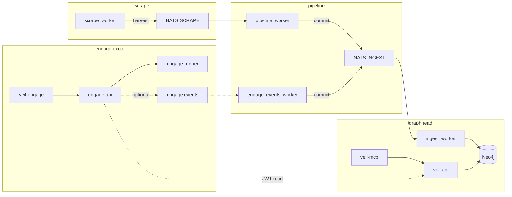

# Veil (Vulnerability Exploitation Intelligence Layer)


[](LICENSE)

**Veil** is a Neo4j-backed threat-intelligence platform with an optional **active security testing** layer. The graph stores vulnerabilities (CVE, CWE, CPE), LOLbins-style artifacts, detection content (Sigma/YARA/Caldera), TI feeds, SBOM advisories, and code-rule templates. Runtime is split into **four isolated contexts** — **scrape**, **pipeline**, **graph** (read intel), and **engage** (tool execution) — connected by NATS for ingestion and HTTP/MCP for agents.

**License:** [MIT](LICENSE) · **Contributing:** [CONTRIBUTING.md](CONTRIBUTING.md) · **Agents / AI:** [AGENTS.md](AGENTS.md) · **Security:** [SECURITY.md](SECURITY.md) · **Code of conduct:** [CODE_OF_CONDUCT.md](CODE_OF_CONDUCT.md)

## Architecture



| Layer | Path | Role | Agent MCP |
|-------|------|------|-----------|
| **Scrape** | [scrape/](scrape/) | Fetch feeds, Vitess ledger, publish `harvest` | — |
| **Pipeline** | [pipeline/](pipeline/) | NED → `commit`; [engage-events/](pipeline/engage-events/) bridges `engage.events.>` → `ingest.engage.*` | — |
| **Graph** | [graph/](graph/) | MERGE into Neo4j; [serve/](graph/serve/) read API + MCP | `veil-mcp` (read-only) |
| **Engage** | [engage/](engage/) | Catalog-driven tool execution, workflows, reports (hardened for secured infra) | `veil-engage` (exec) |

Deploy: [deploy/](deploy/) · Contracts: [docs/ingest-contract.md](docs/ingest-contract.md) · Graph runtime: [docs/threatintel-runtime.md](docs/threatintel-runtime.md) · Engage runtime: [docs/engage-runtime.md](docs/engage-runtime.md) · **Hybrid prod:** [docs/deploy-platform-hybrid.md](docs/deploy-platform-hybrid.md)

**Dual MCP for agents:** use **`veil-graph`** to query TI data and **`veil-engage`** to run security tools — separate processes, separate RBAC roles. Legacy HexStrike (Python `:8888`) is **decommissioned** — see [docs/mcp-agents.md](docs/mcp-agents.md) migration runbook and [docs/engage-audit-report.md](docs/engage-audit-report.md).

## Platform status

| Track | Status | Entry |
|-------|--------|--------|
| **Engage / HexStrike** | Phases 24–30 **done** — catalog parity, CI e2e, refactor | [engage-audit-report.md](docs/engage-audit-report.md) |
| **Platform v3** | P0–P3 **done** — bus tests, closed-loop pilot | [platform-closed-loop-pilot.md](docs/platform-closed-loop-pilot.md) |
| **Platform v4** | P4a CI + P4b full-loop smoke / local Terraform | [platform-full-loop-smoke.md](docs/platform-full-loop-smoke.md) |
| **Platform P5** | Hybrid deploy skeleton (TF + Ansible + Helm) | [deploy-platform-hybrid.md](docs/deploy-platform-hybrid.md) |

## Quick start

### Graph only (demo API + optional pack import)

```bash
docker compose up --build -d
```

| Endpoint | Default (dev compose) |
|----------|------------------------|
| Neo4j Browser | http://localhost:7474 (`neo4j` / `neo4jpassword`) |
| HTTP API | http://localhost:8090 |
| MCP Streamable HTTP | http://localhost:8091/mcp (`--profile mcp`, `MCP_HTTP_ENABLED=1`) |

Production secure overlay (TLS on **443** only, no published Neo4j): [docs/deploy-secure.md](docs/deploy-secure.md).

`graph-bootstrap` imports the default graph pack ([versions.env](versions.env) → `GRAPH_PACK_VERSION`, currently **v0.4.5**) when published, unless `GRAPH_PACK_SKIP=1`.

```bash
curl -sS http://localhost:8090/health
curl -sS http://localhost:8090/v1/categories | jq .
```

### Engage layer (opt-in offensive tooling)

```bash
docker compose -f deploy/engage/compose.yml up -d --build engage-api engage-mcp
curl -sS http://localhost:8890/health | jq .
curl -sS http://localhost:8890/api/tools | jq .
```

| Service | Port | Notes |
|---------|------|--------|
| engage-api | 8890 | `POST /api/tools/{name}`, intelligence, workflows |
| veil-engage MCP | stdio or :8892 | [engage.stdio.json.example](examples/mcp/engage.stdio.json.example) |
| engage-runner | — | `docker compose --profile runner` + `ENGAGE_RUNNER_MODE=docker` |

Docs: [engage/README.md](engage/README.md) · [docs/engage-hardening.md](docs/engage-hardening.md) · [docs/engage-legacy-parity.md](docs/engage-legacy-parity.md)

**Events bus (optional):** tool runs and findings publish to NATS when `ENGAGE_EVENTS_NATS_ENABLED=1`; pipeline bridges to `ingest.engage.*` and graph ingest persists `EngageToolRun` / `EngageFinding` nodes.

```bash
docker compose -f deploy/engage/compose.yml -f deploy/engage/compose.events.yml \
  up -d --build nats engage-api engage-events-worker
make test-engage-events-pipeline
```

### Full scrape pipeline

```bash
./scripts/ops/compose-up-full.sh
```

E2E smoke: `./scripts/test/smoke-scrape-e2e.sh --up` then `./scripts/test/smoke-scrape-e2e.sh`

### Platform integration smokes

```bash
make test-platform-p0              # NATS bus unit tests (no Docker)
make test-platform-closed-loop       # engage → ingest → Neo4j → target-graph
make test-platform-full-loop         # scrape + closed loop (heavy Docker)
```

CI: [`.github/workflows/platform.yml`](.github/workflows/platform.yml). Optional full loop: `workflow_dispatch` with `run_full_loop`.

### Production deploy (hybrid)

| Layer | Path | Role |
|-------|------|------|
| Terraform | [deploy/terraform/](deploy/terraform/README.md) | Cloud foundation + compose env |
| Ansible | [deploy/ansible/](deploy/ansible/README.md) | Data plane VMs (Neo4j, NATS, scrape cron) |
| Helm | [deploy/helm/veil/](deploy/helm/veil/README.md) | Control plane on Kubernetes (api, engage, workers) |

```bash
make deploy-helm-template    # render chart (needs helm)
make deploy-ansible-check    # syntax-check playbooks (needs ansible)
make sync-github-metadata    # push .github/repo-description.txt → GitHub
```

## Documentation index

| Document | Contents |
|----------|----------|
| [AGENTS.md](AGENTS.md) | Cursor/agents: read [docs/coding-style.md](docs/coding-style.md) first |
| [docs/threatintel-runtime.md](docs/threatintel-runtime.md) | Compose, ports, env, bootstrap, graph API/MCP, NATS |
| [docs/engage-runtime.md](docs/engage-runtime.md) | Engage API/MCP, runner isolation, RBAC |
| [docs/deploy-secure.md](docs/deploy-secure.md) | Prod hardening: nginx TLS, distroless, auth fail-closed |
| [docs/auth-keycloak.md](docs/auth-keycloak.md) | Optional JWT + RBAC for API and MCP |
| [deploy/README.md](deploy/README.md) | Per-layer compose, scaling, smoke, graph pack releases |
| [docs/deploy-platform-hybrid.md](docs/deploy-platform-hybrid.md) | P5: Terraform + Ansible + Helm production model |
| [docs/platform-closed-loop-pilot.md](docs/platform-closed-loop-pilot.md) | Act → learn → remember → decide (engage + graph) |
| [docs/platform-full-loop-smoke.md](docs/platform-full-loop-smoke.md) | Scrape + closed loop (P4b) |
| [docs/engage-audit-report.md](docs/engage-audit-report.md) | HexStrike migration sign-off |
| [docs/engage-hardening.md](docs/engage-hardening.md) | Active-defense hardening + safe self-test |
| [docs/external-security-frameworks.md](docs/external-security-frameworks.md) | JCSF / DAF / OWASP → Veil control map |
| [docs/engage-agentic-threats.md](docs/engage-agentic-threats.md) | Agentic AI / MCP threats ↔ mitigations |
| [scrape/README.md](scrape/README.md) | Scrape sources and env vars |
| [pipeline/README.md](pipeline/README.md) | Pipeline worker and normalization |
| [graph/README.md](graph/README.md) | Ingest, API, MCP, Neo4j client |
| [engage/README.md](engage/README.md) | Tool catalog, veil-engage MCP, workflows |
| [docs/coding-style.md](docs/coding-style.md) | Architecture, four contexts, PR checklist |
| [docs/mcp-agents.md](docs/mcp-agents.md) | veil-graph + veil-engage agent setup |
| [docs/engage-tools.md](docs/engage-tools.md) | Catalog YAML, parameters, enable-by-category |
| [scripts/README.md](scripts/README.md) | Export, packs, smoke, engage scripts |

## MCP (agents)

| MCP server | Layer | Transport | Example |
|------------|-------|-----------|---------|
| **veil-mcp** | Graph read | stdio / HTTP :8091 | [run-veil-mcp.sh](scripts/mcp/run-veil-mcp.sh) |
| **veil-engage** | Tool exec | stdio / HTTP :8892 | [run-veil-engage.sh](scripts/mcp/run-veil-engage.sh) |

Setup: [docs/mcp-agents.md](docs/mcp-agents.md). Keycloak: [docs/auth-keycloak.md](docs/auth-keycloak.md). Examples: [examples/mcp/](examples/mcp/).

## Graph packs

See [docs/graph-pack.md](docs/graph-pack.md).

## Tests

```bash
make test-scrape
make test-pipeline
make test-graph              # graph modules + serve build
make test-graph-serve        # graph/serve unit tests (-race)
make test-graph-read-smoke   # Docker: Neo4j + API + MCP HTTP
make test-engage             # engage layer unit tests + build
make test-engage-parity      # catalog 150 tools vs legacy MCP reference
make test-engage-hardening   # safe self-test (no host attacks)
make test-engage-secure      # Docker TLS overlay smoke
make test-engage-compose     # Docker: async jobs + runner profile
make test-engage-events-pipeline  # Docker: engage.events → ingest.engage.*
make test-platform-p0             # Platform bus unit tests
make test-platform-closed-loop    # Platform closed-loop pilot (Docker)
make test-platform-full-loop      # Platform full loop with scrape (Docker, heavy)
make deploy-helm-template         # Helm chart render check
make sync-github-metadata         # Update GitHub repo description from .github/repo-description.txt
```

## Smoke Cypher

```cypher
MATCH (n) RETURN labels(n)[0] AS label, count(*) AS c ORDER BY c DESC LIMIT 20;
MATCH (v:Vulnerability)-[:HAS_CWE]->() RETURN count(*) AS has_cwe;
```
