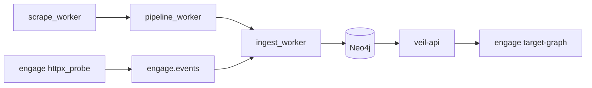

# Platform full loop smoke (P4b)

Extends the [closed-loop pilot](platform-closed-loop-pilot.md) with **discover → enrich** (minimal scrape) before act/learn/decide.

## Flow



1. **Discover / enrich** — `smoke-minimal` profile: `SCRAPE_SOURCES=ti,sbom`, workers exit 0, IOC nodes in Neo4j.
2. **Act** — `POST /api/tools/httpx_probe` on engage-api.
3. **Learn / remember** — engage events → ingest → graph.
4. **Decide** — `GET /api/intelligence/target-graph` shows engage memory.

## Run

```bash
make test-platform-full-loop
```

Heavy Docker smoke (~15–30 min with build). Skips cleanly if Docker is unavailable.

| Env | Default | Meaning |
|-----|---------|---------|
| `SMOKE_SCRAPE_WAIT_SEC` | `900` | Max wait for scrape_worker exit 0 |
| `SMOKE_LOOP_POLL_SEC` | `180` | Poll target-graph after act |
| `SMOKE_ENGAGE_HOST` | `example.com` | Target host for probe + graph |

## CI

Not on every PR. Optional manual workflow: `.github/workflows/platform.yml` job `full-loop` (`workflow_dispatch`).

## IaC

Terraform generates compose env and can drive the same stack: [deploy/terraform/README.md](../deploy/terraform/README.md).
