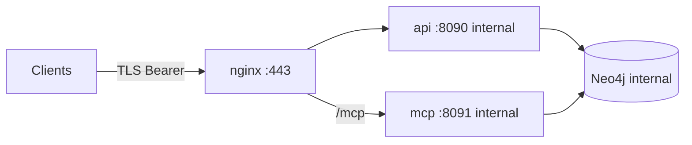

# Secure graph read-path deployment

This guide covers hardening the **graph read layer** (HTTP API, MCP Streamable HTTP, Neo4j) for production-style perimeters. It does not cover scrape/pipeline workers.

## Threat model

| Asset | Risk |
|-------|------|
| Graph data (CVE, TI, SBOM links) | **Exfiltration** via unauthenticated API/MCP |
| Neo4j credentials | **Lateral movement** into the graph DB |
| JWT / Keycloak client secrets | Token forgery or replay if leaked |
| MCP / API containers | RCE → pivot to internal Neo4j |

Mitigations in this repo:

- Optional **Keycloak JWT** + RBAC (`veil-reader`, `veil-admin`)
- **`VEIL_REQUIRE_AUTH=1`** — process refuses to start if auth is disabled
- **Security HTTP middleware** — headers, body limits, timeouts, no `Server` fingerprint
- **Distroless** API/MCP images, non-root, built-in `healthcheck` subcommand
- **nginx** TLS termination, rate limits, method restrictions
- **Prod overlay** — host exposes only **HTTPS (443)**; Neo4j has no published ports

## Network layout

### Development (default `deploy/graph/compose.yml`)

- Neo4j: `7474` (browser), `7687` (Bolt)
- API: `8090`
- MCP HTTP (profile `mcp`): `8091`

### Production (`compose.secure.yml` + `profiles/secure-graph.env`)



Only **nginx** publishes a host port. API and MCP listen on the Docker network; Neo4j is not reachable from the host.

## Quick start (secure overlay)

1. Place TLS material (or use your cert-manager volume):

   ```bash
   mkdir -p deploy/graph/nginx/certs
   openssl req -x509 -nodes -days 365 -newkey rsa:2048 \
     -keyout deploy/graph/nginx/certs/tls.key \
     -out deploy/graph/nginx/certs/tls.crt \
     -subj '/CN=localhost'
   ```

2. Configure Keycloak (see [auth-keycloak.md](auth-keycloak.md)) and set in `deploy/profiles/secure-graph.env` (or inject via secrets):

   - `KEYCLOAK_ISSUER`
   - `KEYCLOAK_AUDIENCE`
   - Strong `NEO4J_AUTH` / `NEO4J_PASS` (not `neo4jpassword`)

3. Bring up the stack:

   ```bash
   docker compose \
     -f deploy/graph/compose.yml \
     -f deploy/graph/compose.secure.yml \
     --profile mcp \
     --env-file deploy/profiles/secure-graph.env \
     up -d --build
   ```

4. Verify only 443 is listening on the host; call `https://localhost/health` with a valid Bearer token for `/v1/*`.

## Graph-only CI smoke (no scrape)

```bash
make test-graph-serve          # unit tests + race
make test-graph-read-smoke     # docker: neo4j + api + mcp HTTP
```

Overlay: `deploy/graph/compose.graph-read.yml` (skips ingest, `GRAPH_PACK_SKIP=1`).

## Hardening checklist

- [ ] `AUTH_ENABLED=1`, `VEIL_REQUIRE_AUTH=1`, Keycloak realm roles assigned
- [ ] Neo4j password rotated; not in compose plaintext in prod
- [ ] TLS certs from PKI or cert-manager; TLS 1.2+ only (nginx config)
- [ ] Host firewall / K8s NetworkPolicy: deny inbound except 443 to nginx
- [ ] `MCP_HTTP_AUTH_STRICT=1` if MCP must not allow unauthenticated discovery
- [ ] Images pinned by digest; regular base image updates
- [ ] Central logging and audit of 401/403 on API/MCP
- [ ] CORS: leave unset unless an explicit browser origin is required (`CORS_ALLOWED_ORIGINS`)

## Environment reference

| Variable | Secure profile | Purpose |
|----------|----------------|---------|
| `VEIL_REQUIRE_AUTH` | `1` | Fail startup if `AUTH_ENABLED=0` |
| `MCP_HTTP_AUTH_STRICT` | `1` | Bearer required on all MCP HTTP routes except `/health` |
| `API_ENV` / `MCP_ENV` | `prod` | Generic error messages |
| `MCP_HTTP_BIND_LOCAL` | `0` in Docker | Use `1` only when nginx runs on the same host as MCP |

See also [SECURITY.md](../SECURITY.md) and [auth-keycloak.md](auth-keycloak.md).
