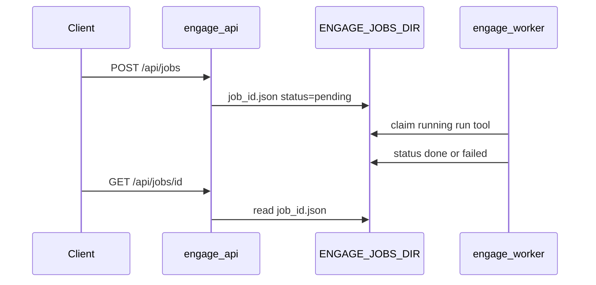

# Engage runtime

**Engage** is the fourth Veil layer: authorized offensive security tooling, workflows, and reports. It is separate from the graph read path.

## Threat model

| Risk | Mitigation |
|------|------------|
| Unauthenticated tool execution | Keycloak JWT, `VEIL_REQUIRE_AUTH`, nginx TLS |
| Collateral damage / illegal use | Lab/VPN only; RBAC roles `veil-engage-runner`, `veil-engage-admin` |
| Graph exfiltration via engage | Engage uses veil-api with service account (`veil-reader`), not direct Neo4j |

## Ports (dev)

| Service | Port |
|---------|------|
| engage-api | 8890 |
| engage-mcp HTTP (optional) | 8892 |
| nginx (secure overlay) | 8443 |

## Environment

| Variable | Default | Role |
|----------|---------|------|
| `ENGAGE_API_LISTEN` | `:8890` | API bind |
| `ENGAGE_CATALOG_PATH` | `catalog/tools.yaml` | Tool registry |
| `ENGAGE_RUNNER_WORKDIR` | `/tmp/engage` | Subprocess cwd |
| `ENGAGE_RUNNER_MODE` | `local` | `local` or `docker` (exec in `engage-runner` container) |
| `ENGAGE_RUNNER_CONTAINER` | — | Container name when `ENGAGE_RUNNER_MODE=docker` |
| `ENGAGE_VEIL_API_URL` | `http://localhost:8090` | Graph read API |
| `ENGAGE_VEIL_CLIENT_ID` / `SECRET` / `TOKEN_URL` | — | OAuth2 client credentials |
| `AUTH_ENABLED` | `0` | Keycloak JWT |
| `ENGAGE_JOBS_MODE` | `memory` | `memory` (API runs jobs in-process) or `file` (worker polls shared dir) |
| `ENGAGE_JOBS_DIR` | `/tmp/engage/jobs` | JSON job files when `ENGAGE_JOBS_MODE=file` |
| `ENGAGE_JOBS_POLL_SEC` | `1` | Worker poll interval (file mode) |
| `ENGAGE_METRICS_ENABLED` | `0` | Expose Prometheus `GET /metrics` |
| `ENGAGE_AUDIT_WEBHOOK_URL` | — | Optional audit batch POST target |
| `ENGAGE_AUDIT_WEBHOOK_SECRET` | — | HMAC secret for `X-Engage-Signature` |
| `ENGAGE_AUDIT_DIR` | `/var/veil/engage/audit` | JSONL audit log |
| `ENGAGE_AUDIT_POSTGRES_URL` | — | Optional Postgres audit mirror + retention |
| `ENGAGE_AUDIT_RETENTION_DAYS` | `0` | Prune Postgres rows older than N days (when URL set) |
| `ENGAGE_EVENTS_NATS_ENABLED` | `0` | Publish audit events to NATS (`engage.events.audit`) |
| `ENGAGE_PLAYBOOKS_PATH` | — | Override bug bounty playbook YAML |
| `ENGAGE_PDF_ENGINE` | `gofpdf` | `wkhtml` uses `wkhtmltopdf` for PDF export |
| Pipeline engage bridge | `pipeline/engage-events` | Consumes `engage.events.>` → `ingest.engage.tool_run` / `ingest.engage.finding` |
| Graph ingest (engage) | `graph/ingest` `SourceEngage` | Persists `EngageToolRun` / `EngageFinding` in Neo4j (`GRAPH_PACK_VERSION` ≥ v0.4.3) |

### Async jobs (API + worker)



| Mode | Executor | Use case |
|------|----------|----------|
| `memory` | `engage-api` goroutine | Local dev, unit tests |
| `file` | `engage-worker` | Compose (`engage_jobs` volume shared with API) |

## Compose

```bash
docker compose -f deploy/engage/compose.yml up -d --build engage-api
curl -sS http://localhost:8890/health | jq .
```

Secure overlay: `deploy/engage/compose.secure.yml` + `deploy/profiles/secure-engage.env`.

### Runner profile (docker exec, lab only)

Isolated toolbox runs in `engage-runner`; API uses `docker exec` when `ENGAGE_RUNNER_MODE=docker`. The API image must include the Docker CLI and mount the host socket — **root-equivalent on the host**; use only in lab/VPN, not in the distroless secure profile.

```bash
docker compose -f deploy/engage/compose.yml \
  -f deploy/engage/compose.runner.yml \
  --profile runner up -d --build engage-runner engage-api

curl -sS -X POST http://localhost:8890/api/tools/nmap_scan \
  -H 'Content-Type: application/json' \
  -d '{"target":"127.0.0.1","parameters":{"scan_type":"-sn","ports":"","additional_args":"-T4"}}'
```

| File | Role |
|------|------|
| `deploy/engage/compose.runner.yml` | Overlay: `api-runner.Dockerfile`, socket mount, `ENGAGE_RUNNER_MODE=docker` |
| `deploy/engage/docker/api-runner.Dockerfile` | API + Docker CLI (dev/lab) |
| `engage-runner` | `container_name: engage-runner`, profile `runner` |

Tool execution smoke (opt-in): `make test-engage-smoke-tool` or `ENGAGE_SKIP_TOOL_SMOKE=1` in CI without Docker.

### Events bus e2e (NATS → ingest)

```bash
make test-engage-events-pipeline
```

The smoke script uses `--profile graph-ingest` and fails if `MATCH (r:EngageToolRun)` count is zero in Neo4j.

Overlay: `deploy/engage/compose.events.yml` (NATS + `engage-events-worker`). Neo4j + `ingest_worker` via profile `graph-ingest`:

```bash
docker compose -f deploy/engage/compose.yml -f deploy/engage/compose.events.yml \
  --profile graph-ingest up -d --build nats engage-api engage-events-worker ingest_worker
```

Smart-scan findings publish to `engage.events.finding` when `ENGAGE_EVENTS_NATS_ENABLED=1`; the bridge maps them to `ingest.engage.finding`.

## MCP

- **stdio:** `veil-engage` — [examples/mcp/engage.stdio.json.example](../examples/mcp/engage.stdio.json.example)
- **HTTP (optional):** `ENGAGE_MCP_HTTP_ENABLED=1` on `:8892`, or [engage.http.json.example](../examples/mcp/engage.http.json.example)

Engage is a greenfield Go rewrite of the MIT tool server in `.external/` (attribution in [engage/NOTICE.hexstrike](../engage/NOTICE.hexstrike)).

## Related

- [engage-legacy-parity.md](engage-legacy-parity.md)
- [deploy-secure.md](deploy-secure.md) (graph)
- [auth-keycloak.md](auth-keycloak.md)
