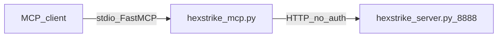

# Legacy tool server (`.external`) — reference only

The directory [`.external/hexstrike-ai-master/`](../.external/hexstrike-ai-master/) contains a vendored copy of **HexStrike AI v6.0** (MIT). It is **not** part of the Veil runtime and is **not** started by Veil compose.

Operational default: agents and services use **`veil-engage` + engage-api** only — **no Flask `:8888`**. Migration steps: [mcp-agents.md — Migration runbook](mcp-agents.md#migration-runbook-hexstrike-flask-8888--veil-engage).

## Reference architecture

**Legacy-only diagram** (historical HexStrike topology). Veil deployments do not run this stack.

- **MCP process:** Python `hexstrike_mcp.py` (FastMCP, stdio).
- **Backend:** `hexstrike_server.py` on port **8888** (~150 tools, per-route HTTP handlers).
- **No authentication** on MCP or HTTP API.

## When `.external/` is optional

You can omit the vendored tree from a checkout **only if you do not** need workflows that **read legacy sources on disk**:

| You are… | Need `.external/`? |
|----------|---------------------|
| Running scans / MCP tools against **veil-engage** only | **No** |
| Contributing to parity extract / catalog regeneration | **Yes** — `scripts/engage/extract-hexstrike-catalog.py`, `make catalog-engage` |
| Running **`make test-engage-parity`** or decision/route parity tied to `@mcp.tool` / Flask route lists | **Yes** |
| Updating golden fixtures **from** legacy JSON snapshots | **Yes** |

For **extract-only** or audit use, treat `.external/` as a **specification volume**: clone or mount it when regenerating artifacts; do not run `hexstrike_server.py` **`:8888`** in production stacks.

### Deprecation checklist (dev / staging)

Use after moving agents to veil-engage:

- [ ] HexStrike MCP entry removed from IDE / agent configs (`hexstrike_mcp.py`).
- [ ] No automation or MCP `env` points tool calls at **`localhost:8888`** (Flask API).
- [ ] **`veil-engage`** MCP configured (`./scripts/mcp/run-veil-engage.sh` or Compose `engage-mcp`); **`veil-mcp`** still configured for graph read if needed.
- [ ] Operators understand `.external/` is **optional except** extract, parity CI, golden refresh — see table above.

## Veil replacement: engage layer

**Production path:** [engage layer](../engage/README.md) — greenfield **Go** rewrite:

| Legacy (Python) | Veil engage (Go) |
|-----------------|------------------|
| `hexstrike_mcp.py` stdio | `veil-engage` ([engage/serve/cmd/mcp](../engage/serve/cmd/mcp)) |
| `hexstrike_server.py` :8888 | `engage-api` :8890 |
| Per-tool Flask routes | `POST /api/tools/{name}` + YAML catalog |
| No auth | Keycloak JWT + RBAC |

Catalog parity (158 catalog tool names): [engage-legacy-parity.md](engage-legacy-parity.md). Regenerate: `make catalog-engage`.

**Graph read** remains separate: `veil-mcp` → Neo4j ([mcp-agents.md](mcp-agents.md)). Agents should configure **two** MCP servers: `veil-mcp` (read) and `veil-engage` (exec) — **not** a third Python HexStrike MCP.

Do not run the Python reference stack alongside engage in production without network isolation. Use `.external/` only as a **specification** for tool names and parameters and for **extract-only** regeneration of catalog / parity evidence.
