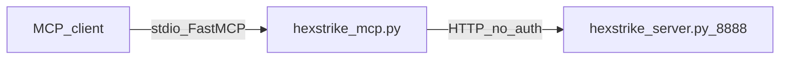

# Legacy tool server (`.external`) — reference only

The directory [`.external/hexstrike-ai-master/`](../.external/hexstrike-ai-master/) contains a vendored copy of **HexStrike AI v6.0** (MIT). It is **not** part of the Veil runtime and is **not** started by Veil compose.

## Reference architecture

- **MCP process:** Python `hexstrike_mcp.py` (FastMCP, stdio).
- **Backend:** `hexstrike_server.py` on port **8888** (~150 tools, per-route HTTP handlers).
- **No authentication** on MCP or HTTP API.

## Veil replacement: engage layer

**Production path:** [engage layer](../engage/README.md) — greenfield **Go** rewrite:

| Legacy (Python) | Veil engage (Go) |
|-----------------|------------------|
| `hexstrike_mcp.py` stdio | `veil-engage` ([engage/serve/cmd/mcp](../engage/serve/cmd/mcp)) |
| `hexstrike_server.py` :8888 | `engage-api` :8890 |
| Per-tool Flask routes | `POST /api/tools/{name}` + YAML catalog |
| No auth | Keycloak JWT + RBAC |

Catalog parity (150 MCP tool names): [engage-legacy-parity.md](engage-legacy-parity.md). Regenerate: `make catalog-engage`.

**Graph read** remains separate: `veil-mcp` → Neo4j ([mcp-agents.md](mcp-agents.md)). Agents should configure **two** MCP servers: `veil-mcp` (read) and `veil-engage` (exec).

Do not run the Python reference stack alongside engage in production without network isolation. Use `.external/` only as a **specification** for tool names and parameters.
