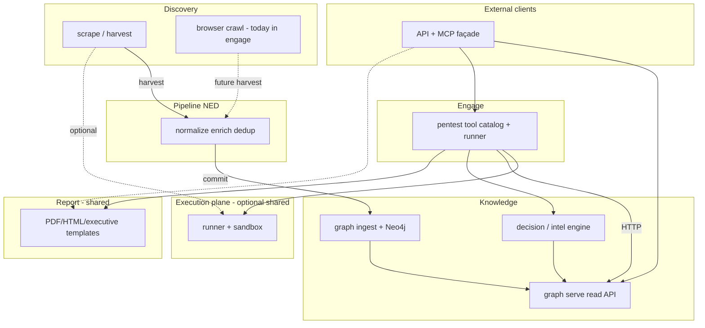

# Veil platform architecture (current + target)

**Current runtime (2026-05):** four isolated Go modules — `scrape/`, `pipeline/`, `graph/`, `engage/` — plus shared `pkg/*`. Integration: NATS (`harvest` / `commit` / `engage.events`) and HTTP (engage → veil-api only).

**Target (v8):** same deployment boundaries, clearer **logical layers** and more code in `pkg/` (domain, report, decision, API/MCP façade, optional execution plane).

---

## Current state (what is done)

| Track | Status | Proof |
|-------|--------|--------|
| HexStrike → Engage | **Done** (Phases 16–30) | [engage-audit-report.md](engage-audit-report.md) |
| Tool catalog | **158** names, **150** legacy parity | `make test-engage-parity` |
| Live runner tools | **113** enabled in `tools.live.yaml` | `make test-engage-na-matrix` |
| Catalog merge bug | **Fixed** (`634e067`) — load order `tools.yaml` → `tools.live.yaml` → `tools.enabled.yaml` | `TestLoadCatalog_productionMergeOrder` |
| Platform P0–P4b | Bus tests, closed/full loop, Terraform skeleton | [platform-full-loop-smoke.md](platform-full-loop-smoke.md) |
| Platform P5 | Hybrid deploy skeleton | [deploy-platform-hybrid.md](deploy-platform-hybrid.md) |
| Platform P6 | Infra DRY (events, auth, scrapepub, stacks, natsjet publish) | [veil_platform_refactor_p6.plan.md](../.cursor/plans/veil_platform_refactor_p6.plan.md) |
| Platform P7 | Tests + `pkg/*/domain` SOT + `make test-platform-p7` CI | [domain-contour.md](domain-contour.md), [veil_platform_p7_tests_then_pkg_domain.plan.md](../.cursor/plans/veil_platform_p7_tests_then_pkg_domain.plan.md) |

**Engage compose (default):** `ENGAGE_CATALOG_PATH=/app/catalog/tools.yaml` but **InitAPI merges live on top** — runner profile may set `tools.live.yaml` directly ([compose.runner.yml](../deploy/engage/compose.runner.yml)).

---

## Target logical layers (v8)

These are **roles**, not necessarily one repo folder each. Go modules stay isolated; shared logic moves to `pkg/`.



| Layer | Responsibility | Today | Target `pkg/` / module |
|-------|----------------|-------|-------------------------|
| **Discovery** | Fetch raw intel from networks/repos; ledger; optional browser | `scrape/harvest`, `factory`, `feeds` | `scrape/` + optional `pkg/exec` for isolated fetch jobs |
| **Pipeline** | Normalize, enrich, dedup; wire envelopes | `pipeline/ned`, `engage-events` | `pipeline/` + `pkg/ti/normalize`, `pkg/commit` |
| **Knowledge** | Persist + query graph; TI reasoning | `graph/ingest`, `graph/serve`, engage `intelligence/` | `graph/` + `pkg/decision` (extract from engage) |
| **Engage** | Offensive tool catalog, workflows, target guard | `engage/serve` | Slim `engage/` — tools + MCP bridge only |
| **Report** | Findings → HTML/PDF/executive (any consumer) | `engage/.../report/` | **`pkg/report`** |
| **API + MCP** | HTTP + MCP for agents; compose graph + optional engage | `graph/serve`, `engage/serve` transports | **`pkg/api`**, **`pkg/mcp`** thin wiring in `cmd/` |

**Hard rules (unchanged):** no Go imports between `scrape`, `pipeline`, `graph`, `engage`. Cross-layer data via NATS + documented JSON; engage → graph via HTTP only.

---

## Runner vs factory (important)

They solve **different** problems today. Unifying the **name** without splitting concerns would blur security boundaries.

| | **Scrape `factory`** | **Engage `runner`** |
|--|----------------------|---------------------|
| **Purpose** | Register scheduled **sources**; inject `ScrapeDeps` (ledger, feeds, NATS publishers) | Execute **catalog tools** (subprocess) with audit, cache, target guard |
| **Unit of work** | `Source.Run(ctx, deps)` per feed (ti, vuln, ds, …) | `Runner.Run(ctx, toolName, args)` per tool invocation |
| **I/O** | HTTP/GitHub via `feeds.Client`; publish `harvest` | `docker exec` into **engage-runner** image (or local PATH) |
| **Isolation** | Trust boundary = egress + rate limits; **no** subprocess sandbox | **Sandbox** (`runner.Sandbox`): allowlisted binaries, timeouts, `ProcessTracker` |
| **Analogue** | Cron + plugin registry | CI job runner + container isolation |

**Recommendation:** add a **cross-cutting execution plane** in `pkg/exec` (name TBD), not rename factory to runner.

| `pkg/exec` capability | Engage (now) | Scrape (future) |
|----------------------|--------------|-----------------|
| `Sandbox` (docker/local) | yes | optional **discovery-fetcher** container for untrusted CLI (e.g. headless browser, `git` clone) |
| `Executor` interface | `runner.Executor` | thin wrapper for rare scrape subprocesses |
| Audit / timeout / allowlist | tool audit store | harvest job audit (optional) |

**Keep `factory`** as discovery orchestration (which sources, policies, NATS subjects). **Keep engage `Runner`** as security-tool orchestration. Share only **primitives** underneath.

**Browser today:** `engage/cmd/browser-agent` — logically **discovery**, not pentest. v8 moves browser crawl under discovery; engage keeps a thin API if needed.

---

## What moves out of engage (v8 backlog)

| Component | Today | Target |
|-----------|-------|--------|
| Decision / attack chain / tool selection | `engage/.../intelligence/` | `pkg/decision` (+ graph client interface) |
| Report generation | `engage/.../report/` | `pkg/report` |
| Browser automation | `engage/.../browser/` | `discovery/` worker or `scrape/.../browser/` |
| HTTP route tables / MCP handlers | duplicated graph vs engage | `pkg/api`, `pkg/mcp` + small `cmd/` wiring |
| Domain entities | mostly `pkg/engage/domain`, `pkg/ti/domain` | finish P7 contour ([domain-contour.md](domain-contour.md)) |

---

## Verification commands (handoff)

```bash
make test-platform-p7      # pkg domain + bus slices
make test-pkg-domain
make test-engage-parity    # 150 HexStrike names
make test-engage-na-matrix   # 113 live
make test-engage             # unit + build
make check-graph-version     # after ingest/schema changes
```

Pentest prod reference: [eval/results/veil-pentest-prod-latest.md](../eval/results/veil-pentest-prod-latest.md) (0 HIGH / 0 MEDIUM after hardening).
