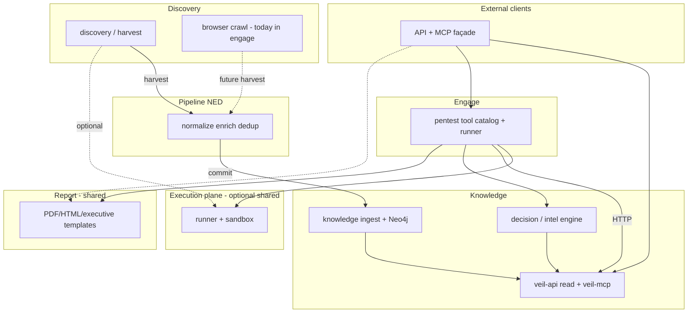

# Veil platform architecture (current + target)

**Current runtime (2026-05):** four isolated Go modules — `discovery/`, `pipeline/`, `knowledge/`, `engage/` — plus shared `pkg/*`. Integration: NATS (`harvest` / `commit` / `engage.events`) and HTTP (engage → veil-api only).

**Target (v8):** five logical layer names (**Discovery**, **Pipeline**, **Knowledge**, **Engage**, **Report**) with **top-level rename** `knowledge/` → **`knowledge/`** (phase P8i; **P8h** `discovery/` done); more code in `pkg/`; shared API/MCP and `pkg/exec`.

---

## Current state (what is done)

| Track | Status | Proof |
|-------|--------|--------|
| HexStrike → Engage | **Done** (Phases 16–30) | [engage-audit-report.md](engage-audit-report.md) |
| Tool catalog | **158** names, **150** legacy parity | `make test-engage-parity` |
| Live runner tools | **113** enabled in `tools.live.yaml` | `make test-engage-na-matrix` |
| Catalog merge bug | **Fixed** (`634e067`) — load order `tools.yaml` → `tools.live.yaml` → `tools.enabled.yaml` | `TestLoadCatalog_productionMergeOrder` |
| Platform P0–P4b | Bus tests, closed/full loop, Terraform skeleton | [platform-full-loop-smoke.md](platform-full-loop-smoke.md) |
| Platform P5 | Hybrid deploy skeleton | [deploy-platform-hybrid.md](deploy-platform-hybrid.md) |
| Platform P6 | Infra DRY (events, auth, scrapepub, stacks, natsjet publish) | [veil_platform_refactor_p6.plan.md](../.cursor/plans/veil_platform_refactor_p6.plan.md) |
| Platform P7 | Tests + `pkg/*/domain` SOT + `make test-platform-p7` CI | [domain-contour.md](domain-contour.md), [veil_platform_p7_tests_then_pkg_domain.plan.md](../.cursor/plans/veil_platform_p7_tests_then_pkg_domain.plan.md) |

**Engage compose (default):** `ENGAGE_CATALOG_PATH=/app/catalog/tools.yaml` but **InitAPI merges live on top** — runner profile may set `tools.live.yaml` directly ([compose.runner.yml](../deploy/engage/compose.runner.yml)).

---

## Target logical layers (v8)

These are **roles**, not necessarily one repo folder each. Go modules stay isolated; shared logic moves to `pkg/`.



| Layer | Responsibility | Path today | Path target |
|-------|----------------|------------|-------------|
| **Discovery** | Fetch raw intel; ledger; optional browser | `discovery/` | `discovery/` (**P8h done**) |
| **Pipeline** | Normalize, enrich, dedup | `pipeline/` | `pipeline/` |
| **Knowledge** | Neo4j ingest + read API + reasoning | `knowledge/` | **`knowledge/`** (P8i) |
| **Engage** | Pentest catalog, runner, guard | `engage/` | `engage/` |
| **Report** | HTML/PDF/executive | engage `report/` | **`pkg/report`** (P8b) |
| **API + MCP** | Agent HTTP/MCP façade | per-layer servers | **`pkg/api`**, **`pkg/mcp`** (P8d) |

**Hard rules:** no cross-import between runtime modules (`discovery`, `pipeline`, `knowledge`, `engage` after rename). NATS wire and `pkg/harvest` / `pkg/commit` **schemas unchanged** in P8h/P8i (subjects may still say `scrape.>` / `ingest.>`). Engage → knowledge read path: HTTP **veil-api** only.

---

## Layer renames (P8h / P8i)

| Rename | Scope | Keep stable (compat) |
|--------|--------|----------------------|
| ~~`scrape/`~~ → **`discovery/`** (P8h **done**) | Go module path, `deploy/discovery/`, Makefile `test-discovery`, docs | NATS `scrape.>`; `pkg/harvest`; envelope `source` values; binary `scrape_worker` one release |
| `knowledge/` → **`knowledge/`** | Go module, `deploy/graph/`, Makefile `test-graph*` | NATS `ingest.>`; `GRAPH_PACK_VERSION`; Neo4j labels; URLs `/v1/*`; product names **veil-api**, **veil-mcp** |

**Order:** merge **P8h + P8i** to `main` before large P8b–g refactors (or rebase feature branches once). Details: [veil_platform_v8_layers_master.plan.md](../.cursor/plans/veil_platform_v8_layers_master.plan.md) § P8h, P8i.

**Docs:** use **Discovery** / **Knowledge** in prose immediately; link to legacy paths until rename lands.

---

## Runner vs factory (important)

They solve **different** problems today. Unifying the **name** without splitting concerns would blur security boundaries.

| | **Discovery `factory`** (today `discovery/harvest/internal/factory`) | **Engage `runner`** |
|--|----------------------|---------------------|
| **Purpose** | Register scheduled **sources**; inject `ScrapeDeps` (ledger, feeds, NATS publishers) | Execute **catalog tools** (subprocess) with audit, cache, target guard |
| **Unit of work** | `Source.Run(ctx, deps)` per feed (ti, vuln, ds, …) | `Runner.Run(ctx, toolName, args)` per tool invocation |
| **I/O** | HTTP/GitHub via `feeds.Client`; publish `harvest` | `docker exec` into **engage-runner** image (or local PATH) |
| **Isolation** | Trust boundary = egress + rate limits; **no** subprocess sandbox | **Sandbox** (`runner.Sandbox`): allowlisted binaries, timeouts, `ProcessTracker` |
| **Analogue** | Cron + plugin registry | CI job runner + container isolation |

**Recommendation:** add a **cross-cutting execution plane** in `pkg/exec` (name TBD), not rename factory to runner.

| `pkg/exec` capability | Engage (now) | Scrape (future) |
|----------------------|--------------|-----------------|
| `Sandbox` (docker/local) | yes | optional **discovery-fetcher** container for untrusted CLI (e.g. headless browser, `git` clone) |
| `Executor` interface | `runner.Executor` | thin wrapper for rare scrape subprocesses |
| Audit / timeout / allowlist | tool audit store | harvest job audit (optional) |

**Keep `factory`** as discovery orchestration (which sources, policies, NATS subjects). **Keep engage `Runner`** as security-tool orchestration. Share only **primitives** underneath.

**Browser today:** `engage/cmd/browser-agent` — logically **discovery**, not pentest. v8 moves browser crawl under discovery; engage keeps a thin API if needed.

---

## What moves out of engage (v8 backlog)

| Component | Today | Target |
|-----------|-------|--------|
| Decision / attack chain / tool selection | `engage/.../intelligence/` | `pkg/decision` (+ graph client interface) |
| Report generation | `engage/.../report/` | `pkg/report` |
| Browser automation | `engage/.../browser/` | `discovery/` worker (after P8h) |
| HTTP route tables / MCP handlers | duplicated knowledge vs engage | `pkg/api`, `pkg/mcp` + small `cmd/` wiring |
| Domain entities | mostly `pkg/engage/domain`, `pkg/ti/domain` | finish P7 contour ([domain-contour.md](domain-contour.md)) |

---

## Shared transports (`pkg/api` vs `pkg/mcp`) — P8d

Layer `serve` binaries keep **route tables and tool handlers**; shared wire plumbing lives under `pkg/*` only (no cross-import between discovery, pipeline, knowledge, engage).

| Package | Responsibility | Used by |
|---------|----------------|---------|
| **`pkg/api`** | JSON responses, prod-safe `WriteError`, `RegisterHealth`, `PostJSON`, JWT middleware wrapper (delegates to `pkg/auth/httpmiddleware`) | `knowledge/serve`, `engage/serve` HTTP routers |
| **`pkg/mcp`** | JSON-RPC message types, stdio framing, streamable HTTP POST/SSE, `tools/list` payload helper, `tools/call` param parse, tool-call RBAC helper | `knowledge/serve` veil-mcp, `engage/serve` MCP |

Each layer passes its RBAC permission (`PermGraphRead` vs `PermEngageToolRun`) and registers domain routes on `http.ServeMux`; MCP `Server` types implement `mcp.Processor` for layer-specific tool catalogs.

---

## Verification commands (handoff)

```bash
make test-platform-p7      # pkg domain + bus slices
make test-pkg-domain
make test-engage-parity    # 150 HexStrike names
make test-engage-na-matrix   # 113 live
make test-engage             # unit + build
make check-graph-version     # after ingest/schema changes
```

Pentest prod reference: [eval/results/veil-pentest-prod-latest.md](../eval/results/veil-pentest-prod-latest.md) (0 HIGH / 0 MEDIUM after hardening).
