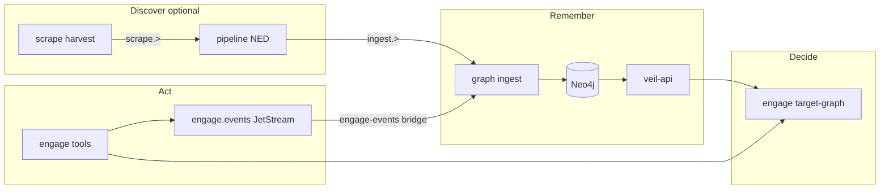

# Platform closed-loop pilot (v3 P3)

Pilot **target class:** **web host** — URLs like `https://example.com` or hostname `example.com`, normalized via [`pkg/engage/hostnorm`](../pkg/engage/hostnorm) (same as graph `EngageTarget.name`).

## Loop



| Step | Layer | Mechanism |
|------|-------|-----------|
| Discover (optional) | scrape → pipeline | `scrape.>` harvest → NED → `ingest.>` |
| Enrich | pipeline | NED dedup / TI transforms |
| Remember | graph | ingest worker → Neo4j |
| Act | engage | catalog tool run (e.g. `httpx_probe`) |
| Learn | engage + pipeline | audit → `engage.events.>` → `ingest.engage.tool_run` / `ingest.engage.finding` |
| Decide | engage | `LoadTargetGraph` → veil-api search + `/v1/categories/engage/context` |

Layers do **not** import each other; integration is **NATS** and **HTTP veil-api** only.

## Minimal pilot (no scrape)

Validates **act → learn → remember → decide** for one host:

1. Stack: scrape + pipeline + graph compose, plus engage + [`compose.veil-stack.yml`](../deploy/engage/compose.veil-stack.yml) (shared NATS, `ENGAGE_VEIL_API_URL=http://api:8090`, events worker).
2. `POST /api/tools/httpx_probe` with `{"target":"https://example.com"}` (audit event even if binary missing in distroless image).
3. Poll until `GET /api/intelligence/target-graph?target=https://example.com` shows `graph_enabled` and engage hits or `engage_found`.
4. Confirm `GET /v1/categories/engage/context?q=example.com` on veil-api returns 200.

## Run

```bash
make test-platform-closed-loop
```

Environment:

| Variable | Default | Purpose |
|----------|---------|---------|
| `SMOKE_ENGAGE_HOST` | `example.com` | Pilot host |
| `SMOKE_LOOP_POLL_SEC` | `180` | Wait for ingest + target-graph |
| `GRAPH_PACK_SKIP` | `1` | Skip graph pack bootstrap in CI smokes |

Related smokes: `make test-engage-veil-stack-ci`, `make test-engage-events-pipeline`, `make test-graph-engage-category`.

**CI:** GitHub Actions [`.github/workflows/platform.yml`](../.github/workflows/platform.yml) runs `make test-platform-p0` on every matching PR; `make test-platform-closed-loop` on push to `main`/`master`. Optional P4b full loop (scrape + engage): `workflow_dispatch` with `run_full_loop` — see [platform-full-loop-smoke.md](platform-full-loop-smoke.md).

## Full loop (with discovery)

To include **discover → enrich** for the same host class, run the full stack (`./scripts/ops/compose-up-full.sh` or merged compose files), publish TI/vuln harvest for indicators matching the host, then run engage workflows. Policy: enrich graph first when `TargetGraph` shows `ti`/`vuln` hits; act when surface score or objective requires validation.

## Agent API

| Endpoint | Role |
|----------|------|
| `GET /api/intelligence/target-graph` | Unified graph state for decisions |
| `GET /api/intelligence/target-timeline` | Audit + graph timeline |
| MCP `target_graph_context` | Same state for tool agents |

See [veil_platform_v3_test_then_dedup.plan.md](../.cursor/plans/veil_platform_v3_test_then_dedup.plan.md) for phase history.

**Agents:** after changing this flow, update this doc and [.cursor/rules/veil-agent-documentation.mdc](../.cursor/rules/veil-agent-documentation.mdc); closed-loop verification is part of the post-merge checklist in [AGENTS.md](../AGENTS.md).
