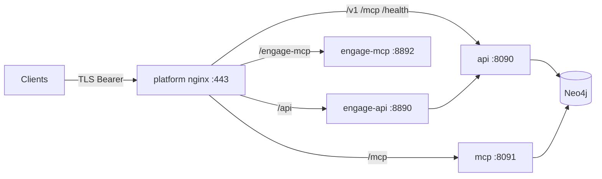

# Unified platform access (secure edge)

Single HTTPS entry for **graph read** (`veil-api`, `veil-mcp`) and **engage exec** (`veil-engage`) when using the [secure-unified](../deploy/stacks/secure-unified.yml) stack. Nginx config: [deploy/platform/nginx/](../deploy/platform/nginx/) (P12b).

## Network layout



Only **platform nginx** publishes a host port (`UNIFIED_NGINX_HTTPS_PORT`, default `443`). Internal services use the Docker network; Neo4j has no host publish in the secure overlays.

## Path prefixes

| Path prefix | Upstream | Layer | Typical client |
|-------------|----------|-------|----------------|
| `/health` | `api:8090` | Graph | Liveness (no auth at app; still may send Bearer) |
| `/v1/*` | `api:8090` | Graph | REST clients, browsers |
| `/kinds` | `api:8090` | Graph | Legacy discovery |
| `/mcp` | `mcp:8091` | Graph | Streamable HTTP MCP (`veil-mcp`) |
| `/api/*` | `engage-api:8890` | Engage | Tool HTTP, workflows |
| `/engage/health` | `engage-api:8890` | Engage | Engage liveness via edge |
| `/engage-mcp/*` | `engage-mcp:8892` | Engage | Streamable HTTP MCP (`veil-engage`) |

Nginx forwards `Authorization: Bearer …` on **every** `proxy_pass` location (see [veil-unified.conf](../deploy/platform/nginx/veil-unified.conf)). JWT validation and RBAC run in each Go service; the edge does not terminate OIDC.

## Keycloak roles by path

Use one realm (e.g. `veil`) and map AD/LDAP groups to realm or client roles. Veil services read roles from the access token (`realm_access.roles`, `resource_access.<client>.roles`).

| Path prefix | Required roles (when `RBAC_ENABLED=1`) | Env overrides |
|-------------|--------------------------------------|-----------------|
| `/v1/*`, `/kinds`, `/mcp` | `veil-reader` and/or `veil-admin` | `RBAC_ROLE_READER`, `RBAC_ROLE_ADMIN` |
| `/health` | None at API (public liveness) | — |
| `/api/*`, `/engage-mcp/*` | `veil-engage-runner` and/or `veil-engage-admin` | `RBAC_ROLE_ENGAGE_RUNNER`, `RBAC_ROLE_ENGAGE_ADMIN` |
| `/engage/health` | None at API (public liveness) | — |

Recommended Keycloak realm roles:

| Role | Use |
|------|-----|
| `veil-reader` | Analysts / agents: graph read only |
| `veil-admin` | Graph admins (same read scope today; reserved for future admin APIs) |
| `veil-engage-runner` | Pentest operators: catalog tools + engage MCP `tools/call` |
| `veil-engage-admin` | Engage operators with admin routes (reserved; same runner scope today) |

**Separation of duties:** grant `veil-reader` without `veil-engage-runner` for read-only TI access; grant engage roles only to execution principals. A token with both role families can use all path prefixes.

Clients and audience:

| Layer | Keycloak client (typical) | `KEYCLOAK_AUDIENCE` / notes |
|-------|---------------------------|-----------------------------|
| Graph API/MCP | `veil-api` | `KEYCLOAK_AUDIENCE=veil-api`, `KEYCLOAK_CLIENT_ID=veil-api` |
| Engage API/MCP | `veil-api` or dedicated `veil-engage` | Engage accepts same issuer; optional `ENGAGE_VEIL_CLIENT_ID` for veil-api calls from engage |

See [auth-keycloak.md](auth-keycloak.md) for issuer setup, token examples, and MCP stdio tokens.

## Bring-up

```bash
mkdir -p deploy/platform/nginx/certs
openssl req -x509 -nodes -days 365 -newkey rsa:2048 \
  -keyout deploy/platform/nginx/certs/tls.key \
  -out deploy/platform/nginx/certs/tls.crt \
  -subj '/CN=localhost'

set -a
source deploy/profiles/secure-graph.env
source deploy/profiles/secure-engage.env
set +a

docker compose \
  -f deploy/knowledge/compose.yml \
  -f deploy/knowledge/compose.secure.yml \
  -f deploy/engage/compose.yml \
  -f deploy/engage/compose.secure.yml \
  -f deploy/platform/compose.secure-unified.yml \
  --profile mcp \
  up -d --build
```

Verify host binding: only `443` (or `UNIFIED_NGINX_HTTPS_PORT`). Call graph and engage paths with the appropriate role-bearing JWT.

## Related

- [deploy/stacks/secure-unified.yml](../deploy/stacks/secure-unified.yml) — stack SSOT
- [deploy-secure.md](deploy-secure.md) — graph hardening checklist
- [engage-runtime.md](engage-runtime.md) — engage secure profile
- [mcp-agents.md](mcp-agents.md) — dual MCP client configuration
